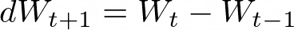

google colab 환경으로 진행

# Artificial Neural Network

- 인공 신경망


- Perceptron

​        

- 은닉층(Hidden Layer)

    

- Multi Layer Perceptron
  - 여러 Layer의 Perceptron(함수)으로 이루어진 신경망
  - Fully Connected : 모두가 이어져 있는 신경망
  - 경사하강법을 사용하여 W, b 학습
  - [ipynb](01-01_Multi_Layer_Perceptron_XOR_CPU.ipynb)
- Softmax
  - 전체 출력값의 합=1 > 학습 효과 증가 (다중 분류 수행)
  - [ipynb](01-04_Softmax_Activation_CPU.ipynb)


# Error Backpropagation

- 각 학습 단계의 parameter (W, b)를 update하기 위하여 마다의 편미분값 필요
  - 데이터 수가 많을 수록, 노드가 많을 수록, layer가 깊어질수록 그 수는 늘어나기 때문에 연산 시간이 오래 걸림 [(ipynb)](01-02_MLP_Gradient_Descent_CPU.ipynb)

## Backpropatation

- 편미분값 계산 없이 경사값 계산


- WS : Weight Sum, y : output
- [ipynb](02-02_Error_Backpropagation_CPU.ipynb)

## Vanishing Gradient

- 시그모이드 함수를 미분하면 최대치가 0.25
- 은닉층이 증가하면 그 값이 계속 곱해져 기울기가 0이 되는 문제 발생
- 대응책 : 다른 함수 사용
  - Tanh, ReLU, Leaky ReLU

    

# Optimization Method

- 기존 Gradient Descent의 단점을 보완하는 방법
  - Local Minimum에서 빠져나오지 못하고 Global Minimum을 찾지 못하는 문제 등
- 수식은 외우지 못하더라도 이런 방법들이 있다는 것은 꼭 기억해둘 것

## Stochastic Gradient Descent(SGD)

- 전체 데이터 대신 일부 데이터 사용
- 전체를 이용한 것보다 부정확할 수 있으나 계산 속도가 훨씬 빠름


## Momentum

- 이동 과정에 관성을 반영
- 바로 직전 시점의 가중치 업데이트 변화량을 적용




## Adaptive Gradient (Adagrad)

- 학습 횟수가 증가함에 따라 학습률을 조절하는 옵션 추가

## RMSProp

- Root Mean Square Propagation
- Adagrad의 단점인 Gradient 제곱합을 지수평균으로 대체

## Adam

- Adaptive Moment Estimation
- RMSProp과 Momentum 방식의 장점을 합친 알고리즘

# Tensorflow

```python
from tensorflow.keras import models, layers

Model_iris = models.Sequential()

# 첫 번째 hidden layer의 개수=16, input의 shape 명시
Model_iris.add(layers.Dense(16, activation='relu', input_shape=(4,))) 
# 두 번째 hidden layer의 개수=8
Model_iris.add(layers.Dense(8, activation='relu')) 
# output layer의 개수=3=output의 shape, 다중분류이므로 softmax
Model_iris.add(layers.Dense(3, activation='softmax')) 
```

```python
Model_iris.compile(loss='categorical_crossentropy',
                   optimizer='adam',
                   metrics=['accuracy'])
```

```python
History_iris = Model_iris.fit(X_train, y_train,
                              epochs=500, # propagation 반복 횟수 (학습 횟수)
                              batch_size=7, # 105개의 train data를 7개씩 나누어서 15번 반복
                              validation_data=(X_test, y_test))
```

- batch_size : 컴퓨터 메모리의 한계로, 나눠서 계산할 data의 수
- epochs : propagation 반복 횟수
- 전체 데이터 수가 105개, epochs=500, batch_size=7일 때
  - 데이터를 7개씩 학습, 파라미터 update하는 것을 15번 반복 = 1epoch
  - 다시 데이터의 7개씩 나누어진 데이터 그룹을 학습, update하는 과정을 epochs 수만큼 500번 반복
- steps_per_epoch : epoch 1회당 iteration 횟수
  - 이 값은 보통 (전체 데이터 수)/(batch size)로 결정
  - epoch 중간 중간 결과를 알고 싶을 때 사용 - https://github.com/keras-team/keras/issues/10164

## Initializer

- 학습 결과는 매번 달라진다.
  - 초기 parameter값이 random으로 할당 (주 원인)
  - batch와 validation split이 random으로 할당

```python
from tensorflow.keras import models
from tensorflow.keras import layers
from tensorflow.keras.initializers import HeNormal

initializer = HeNormal()

mnist = models.Sequential()
mnist.add(layers.Dense(512, activation = 'relu', input_shape = (28 * 28,), kernel_initializer = initializer))
mnist.add(layers.Dense(256, activation = 'relu', kernel_initializer = initializer))
mnist.add(layers.Dense(10, activation = 'softmax', kernel_initializer = initializer))
```

- kernel_initialier를 명시하여 초기 parameter값을 준다.
  - https://keras.io/ko/initializers/ 에서 다양한 초기화 방법이 소개되어 있음
- 초기 parameter를 정해준다고 모델의 성능이 개선되거나 하지는 않는다.
- [ipynb](05-06_DNN_mnist_Categorical_Classification_HeNormal_GPU.ipynb)

# DNN

- **D**eep **N**eural **N**etwork
- layer의 수가 2개 이상일 때
- 입력값이 1차원이어야 함

```python
mnist = models.Sequential()

# Hidden Layers
mnist.add(layers.Dense(512, activation='relu', input_shape=(28*28,)))
mnist.add(layers.Dense(256, activation='relu'))

# Output Layer : 10개의 categories 분류
mnist.add(layers.Dense(10, activation='softmax'))
```

## Overfitting Issue

1. 더 많은 Train Data

2. Model Capacity 낮추기

- 너무 많은 parameters가 문제
  - Input Size : 줄일 수 있으나 웬만하면 건들지 않기
  - Output Layer : 줄일 수 없음
  - Hidden Layer : 줄이면 Overfitting도 줄일 수 있으나 성능에 부정적인 영향

```python
mnist = models.Sequential()
mnist.add(layers.Dense(512, activation='relu', input_shape=(28*28,)))
mnist.add(layers.Dense(10, activation='softmax'))
```

- L2 Regularization
  - 마찬가지로 Overfitting은 줄일 수 있으나 성능에 부정적인 영향 (loss가 0이 되지 않음)

```python
from tensorflow.keras import regularizers

mnist = models.Sequential()
mnist.add(layers.Dense(512, activation='relu', input_shape=(28*28,),
                       kernel_regularizer=regularizers.l2(0.00001)))
mnist.add(layers.Dense(256, activation='relu',
                       kernel_regularizer=regularizers.l2(0.00001)))
mnist.add(layers.Dense(10, activation='softmax'))
```

- Dropout
  - 학습 과정에서 일부 연결을 무작위로 제외 시킴

```python
mnist = models.Sequential()
mnist.add(layers.Dense(512, activation='relu', input_shape=(28*28,)))
mnist.add(layers.Dropout(0.4)) # dropout할 연결의 비율
mnist.add(layers.Dense(256, activation='relu'))
mnist.add(layers.Dropout(0.2))
mnist.add(layers.Dense(10, activation='softmax'))
```

- Batch Normalization
  - 활성화 함수(ReLU 등)에 값을 넣기 전에 표준화 진행
  - Loss가 증가하지 않으면서 overfitting도 줄임
  - 구현할 때, activation 함수를 `Dense` 바깥으로 빼주는 것이 중요

```python
mnist = models.Sequential()
mnist.add(layers.Dense(512, input_shape=(28*28,)))
mnist.add(layers.BatchNormalization())
mnist.add(layers.Activation('relu'))
mnist.add(layers.Dense(256))
mnist.add(layers.BatchNormalization())
mnist.add(layers.Activation('relu'))
mnist.add(layers.Dense(10, activation='softmax'))
```

- [ipynb](05-02_DNN_mnist_Categorical_Classification_Overfitting_GPU.ipynb)


|                     | train_loss | validation_loss | eval_loss | eval_accuracy |
|---------------------|:----------:|:---------------:|:---------:|:-------------:|
| Original            | 2.0563e-09 |      0.4062     |  0.32649  |    0.98220    |
| Remove Layer        | 5.4985e-09 |      0.1934     |  0.15929  |    0.98260    |
| L2 Regularization   |   0.0102   |      0.1519     |  0.13205  |    0.97950    |
| Drop Out            |   0.0154   |      0.2392     |  0.21450  |    0.98200    |
| Batch Normalization | 8.9677e-04 |      0.1840     |  0.15993  |    0.98140    |
| L2 + Drop Out       |   0.0516   |      0.1050     |  0.09672  |    **0.98460**    |
| L2 + Batch          |   0.0168   |      0.1602     |  0.15973  |    0.98020    |
| Drop Out + Batch    |   0.0166   |      **0.0942**     |  **0.08306**  |    0.98140    |

- 할 때마다 결과는 달라질 수 있다.
- mnist 데이터에는 L2+Drop Out을 섞은 모델이 성능이 가장 좋았으나, 분석 데이터마다 바뀔 수 있다.

## Early Stopping

- 학습을 반복할수록 train data에 과적합되어, validation 또는 test data에 대한 성능이 낮아지는 것을 막기 위하여 학습을 빨리 끝내는 것

### EarlyStopping()

```python
from tensorflow.keras.callbacks import EarlyStopping

es = EarlyStopping(monitor='val_mae',
                   mode='min',
                   patience=50,
                   verbose=1)
```

- monitor : 모니터링 대상 성능
- mode : 모니터링 대상을 최대/최소화
  - mae, mse 등은 min, accuracy, recall, precision 등은 max
- patience : 성능이 개선되지 않는 epochs 횟수

### ModelCheckpoint()

```python
from tensorflow.keras.callbacks import ModelCheckpoint

mc = ModelCheckpoint('best_boston.h5',
                     monitor='val_mae',
                     mode='min',
                     save_best_only=True,
                     verbose=1)
```

- 'best_boston.h5' : 최적 모델이 저장될 경로
- save_best_only : 최적 모델만 저장할지 결정

### Fit

```python
hist_model = model.fit(X_train, y_train, epochs=500, 
                         batch_size=1, validation_data=(X_valid, y_valid),
                         callbacks=[es, mc], verbose=1)
```

# CNN

- Convolutional Neural Network
- 입력값이 matrix (n by m)여도 가능 (DNN은 불가능)
- Convolution(합성곱) Filter를 통해 특징을 추출한 뒤 DNN(Fully Connected) Network을 통해 분류, 예측을 위한 학습을 한다.
- 가중치의 수를 줄이고 연산량을 감소
- [ipynb](06-01_CNN_mnist_Modeling_GPU.ipynb)

|                     | train_loss | validation_loss |  eval_loss  | eval_accuracy |
| ------------------- | :--------: | :-------------: | :---------: | :-----------: |
| Original            | 2.0563e-09 |     0.4062      |   0.32649   |    0.98220    |
| Remove Layer        | 5.4985e-09 |     0.1934      |   0.15929   |    0.98260    |
| L2 Regularization   |   0.0102   |     0.1519      |   0.13205   |    0.97950    |
| Drop Out            |   0.0154   |     0.2392      |   0.21450   |    0.98200    |
| Batch Normalization | 8.9677e-04 |     0.1840      |   0.15993   |    0.98140    |
| L2 + Drop Out       |   0.0516   |     0.1050      |   0.09672   |    0.98460    |
| L2 + Batch          |   0.0168   |     0.1602      |   0.15973   |    0.98020    |
| Drop Out + Batch    |   0.0166   |   **0.0942**    | **0.08306** |    0.98140    |
| CNN+DNN             | 4.3449e-04 |     0.2226      |   0.20209   |  **0.99150**  |

- DNN만 했을 때의 파라미터 수가 CNN+DNN보다 더 많지만, 정확도는 CNN+DNN에서 가장 좋게 나옴

## Convolution

- 원본 이미지가 가지고 있는 특징을 함축적으로 만들어내는 수학적인 연산
- 합성곱 필터는 꼭 정방행렬일 필요는 없다.
- 특징을 한 번만 뽑는 것이 아닌, 다른 종류(같은 크기)의 필터로 k번 뽑아냄
- RGB 데이터 (n x m x 3)의 경우 R, G, B 각각에 합성곱을 한 뒤 합한다.

    

## Stride

- Convolution Filter 계산 시 이동하는 위치의 간격 (일반적으로 1에서 바꾸지 않음)

## Pooling

- 가로, 세로 방향으로 크기를 줄이는 연산
- 일반적으로 2 x 2의 Max Pooling을 사용
  - Stride는 pooling 크기와 같음 (2)
- Max/Min Pooling
- Average Pooling

    

## Padding

- 출력 크기를 조정할 목적으로 합성곱 연산 전 데이터 주변을 0으로 채우는 것
  - 5x5 크기의 데이터를 3x3 합성곱 연산을 할 때, 5x5 데이터 주변에 2칸씩의 0을 붙여 7x7로 연산을 진행 > 5x5의 output이 나옴

    

## Channel

- k차원의 데이터를 k차원 filter로 합성곱 연산 진행

## Example

    

## Image Classification

### ImageDataGenerator

```python
from tensorflow.keras.preprocessing.image import ImageDataGenerator

train_datagen = ImageDataGenerator(rescale = 1./255)
valid_datagen = ImageDataGenerator(rescale = 1./255)

train_generator = train_datagen.flow_from_directory(
                train_dir,
                target_size=(150, 150),
                batch_size = 20,
                class_mode = 'binary')

valid_generator = valid_datagen.flow_from_directory(
                valid_dir,
                target_size=(150, 150),
                batch_size = 20,
                class_mode = 'binary')
```

- train_dir : 사진이 들어있는 폴더 경로
- target_size : 모든 사진의 크기를 일괄적으로 150x150으로 변경
- batch_size : 이미지를 한 번에 불러올 개수
  - 나중에 fit할 때의 batch_size를 여기서 미리 지정하는 역할
- class_mode : 이진 분류는 binary, 다중 분류는 categorical
  - 경로 안에 각 label별로 폴더가 있어 분류가 되어있어야 한다.

```python
from tensorflow.keras import layers, models

from tensorflow.keras import models, layers

model = models.Sequential()
model.add(layers.Conv2D(filters=128, kernel_size=(3,3), padding='same', activation='relu', input_shape=(32, 32, 3)))
model.add(layers.MaxPool2D(pool_size=(2,2)))
model.add(layers.Conv2D(filters=128, kernel_size=(3,3), activation='relu'))
model.add(layers.MaxPool2D(pool_size=(2,2)))
model.add(layers.Conv2D(filters=128, kernel_size=(3,3), activation='relu'))

model.add(layers.Flatten())
model.add(layers.Dense(units=256, activation='relu'))
model.add(layers.Dropout(0.5))
model.add(layers.Dense(units=100, activation='softmax'))
```

- Conv2D(filters=128, kernel_size=(3,3), padding='same') : 합성곱 필터를 128개를 만들며 그 크기가 3x3, padding을 넣어 input size와 output size를 동일하게 유지
  - Conv2D(128, (3, 3), ...)으로 줄여 써도 됨
- MaxPooling2D((2, 2)) : 2x2의 max pooling을 만듬
- Flatten() : CNN에서 DNN으로 넘어갈 때, 1차원 데이터로 바꿔주는 역할

```python
Hist_model = model.fit(train_generator,
                       steps_per_epoch = 100,
                       epochs = 100,
                       validation_data = valid_generator,
                       validation_steps = 50)
```

- steps_per_epoch를 꼭 명시할 필요는 없음
  - [Tensorflow](#Tensorflow) 참고
- [ipynb](06-02_CNN_Dogs_and_Cats_Mount_GPU.ipynb)

### Augmentation

- 이미지 수가 부족하여 과적합이 일어날 때, 훈련 이미지를 회전, 반전, 이동을 시켜 새로운 데이터를 생성하여 과적합을 막는 것
- 과적합을 막을 뿐만 아니라 모델의 성능도 좋아질 가능성이 있다.
- 훈련 이미지에만 적용하며 검증용, 테스트용 이미지는 변환하지 않는다.
  - 훈련 이미지라도, 이미지의 종류에 따라 변환하지 않아야할 때도 있다.
  - 수식 인식 학습에서의 6과 9, 8과 무한대 기호 등은 방향도 올바르게 된 상태여야한다.
- [ipynb](06-02_CNN_Dogs_and_Cats_Image_Augmentation_GPU.ipynb)

```python
from tensorflow.keras.preprocessing.image import ImageDataGenerator

datagen = ImageDataGenerator(rotation_range = 40,
                             width_shift_range = 0.2,
                             height_shift_range = 0.2,
                             shear_range = 0.2,
                             zoom_range = 0.2,
                             horizontal_flip = True,
                             vertical_flip = True,
                             fill_mode = 'nearest')
```

* rotation_range = 40 : 0도에서 40도 사이에서 임의의 각도록 회전
* width_shift_range = 0.2 : 20% 픽셀 내외로 좌우 이동
* height_shift_range = 0.2 : 20% 픽셀 내외로 상하 이동
* shear_range = 0.2 : 0.2 라디안 내외로 시계 반대방향으로 변형
* zoom_range = 0.2 : 80%에서 120% 범위에서 확대/축소
* horizontal_flip = True : 수평방향 뒤집기
* vertical_flip = True : 수직방향 뒤집기
* fill_mode = 'nearest' : 주변 픽셀로 이미지 채우기

