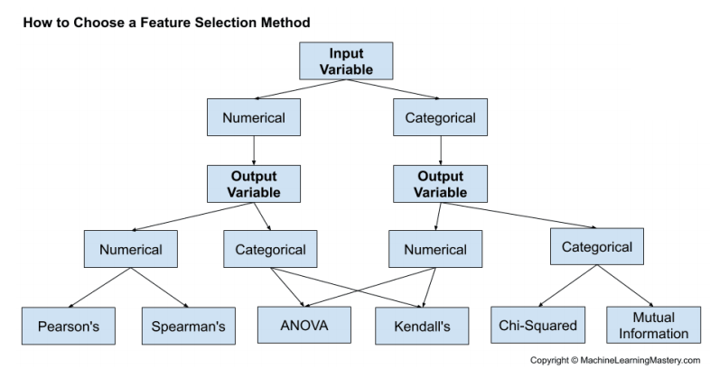

210610

- [Preprocessing](#preprocessing)
  * [NaN](#nan)
    + [Imputer](#imputer)
  * [RFE](#rfe)
  * [PCA](#pca)
    + [PCA와 RFE](#pca--rfe)
  * [Normalization](#normalization)
  * [Standardization](#standardization)
    + [Example](#example)
- [Scikit Learn](#scikit-learn)
  * [Fit & Transform](#fit---transform)


- 분석방법론에 따라 데이터 분석을 진행했다는 것을 명시해야한다. (KDD, CRISP-DM 등)

# Preprocessing

- 전처리된 데이터를 가져와 쓴다면 어떤 pre-trained data를 쓰는지 명시를 해야한다.
  - 전처리 데이터마다 다른 bias를 가지고 있기 때문
  - bias 원인으로는 원래의 데이터로부터 새롭게 만들어진 파생변수가 있다.


## NaN

```python
dataframe = read_csv(url, header=None, na_values='?')
```

- `na_values='?'` : 원래 데이터 파일의 ?를 `NaN`으로 가져온다.

```python
dataframe.isnull().sum() # 각 열의 결측치 개수 확인
```

- `.isnull()` : 데이터 프레임의 결측치(`NaN`)를 `True`/`False`로 반환
- `.sum()` : 각 행의 값을 모두 합친다.
  - 디폴트 값은 `axis='rows'`이며 열의 값을 합치려면 `axis='columns'`를 넣어주면 된다.


### Imputer

```python
from sklearn.impute import SimpleImputer

imputer = SimpleImputer(stratege='mean')
# imputer = SimpleImputer(stratege='median')
# imputer = SimpleImputer(stratege='most_frequent')
```

```python
X = df.values # DataFrame -> numpy array
```

```python
imputer.fit(X) # X 각 열의 평균(또는 중앙값, 최빈값)을 찾는다.
```

```python
Xtrans = imputer.transform(X) # 위에서 만들어낸 fit을 X의 NaN에 대입
```

- `fit`의 역할 : 훈련 데이터만이 아닌 실제 데이터에도 대입해야할 값일 수 있기 때문에 만들어 놓는 것.
  - 자세한 내용은 아래 [Scikit Learn](#scikit-learn)에서 확인


변수간의 상관관계를 확인하는 메서드



## RFE

- Recursive Feature Elimination (특징 추출)
- 입력 변수를 줄여 모델링 계산 비용을 줄이고 모델의 성능을 향상시킬 수 있다.

```python
from sklearn.datasets import make_classification
from sklearn.feature_selection import RFE
from sklearn.tree import DecisionTreeClassifier
```

```python
# define dataset
X, y = make_classification(n_samples=1000, n_features=10, n_informative=5, n_redundant=5,
random_state=1)
```

- `X` : Input Parameter (학습 데이터)
- `y` : Target Variable (목표 데이터), 기본값으로 0과 1로 이루어진 array를 반환한다.

- `n_samples` : 생성할 데이터 개수
- `n_features` : 전체 독립변수 개수
- `n_informative` : y에 영향을 미치는 독립변수 개수
- `random_state` : 랜덤값 생성 시드, 디폴트는 `np.random`

```python
# define RFE
rfe = RFE(estimator=DecisionTreeClassifier(), n_features_to_select=5)
```

- `n_features_to_select` : y에 영향을 미친다고 생각하는 독립변수 개수
- `estimator` : 분류 방법을 설정, 여기서는 의사결정나무를 사용

```python
# fit RFE
rfe.fit(X, y)
```

```python
# summarize all features
for i in range(X.shape[1]):
  print('Column: %d, Selected=%s, Rank: %d' % (i, rfe.support_[i], rfe.ranking_[i]))
```

```
Column: 0, Selected=False, Rank: 4
Column: 1, Selected=False, Rank: 6
Column: 2, Selected=True, Rank: 1
Column: 3, Selected=True, Rank: 1
Column: 4, Selected=True, Rank: 1
Column: 5, Selected=False, Rank: 5
Column: 6, Selected=True, Rank: 1
Column: 7, Selected=False, Rank: 3
Column: 8, Selected=True, Rank: 1
Column: 9, Selected=False, Rank: 2
```

- Selected=True는 골라서 쓰고 False는 버리는 선택을 한다.
- 결과적으로 차원축소를 할 수 있게 된다.


## PCA

- 주성분분석(Principal Component Analysis)

  - https://blog.naver.com/a_tte/222330245286

- 차원 감소를 통해 차원의 저주(많은 입력 변수로 인한 모델링의 어려움)를 없애고 데이터 세트를 단순화하는 것.
- 요약

  1. 데이터로부터 공분산행렬을 만든다.

  2. 공분산행렬에서 eigen value, eigen vector를 계산한다.

     - 이 때, SVD 방법이 사용된다.

  3. eigen value의 값이 클수록 대응하는 eigen vector의 중요도가 커진다. (분산의 방향을 잘 설명한다.)

  4. PCA 이후 반환되는 X_trans는 원래의 모든 X의 변수들의 선형결합이며 원래 데이터를 새로운 축으로 사영시키는 것이다.

     - 설명력 : (각 eigen value의 값) / (전체 eigen value의 합)
- 누적 설명력 90% 이상이 되게 하는 설명변수 또는 직접 설정한 설명변수의 개수가 n이고 전체 독립변수(Xi)가 p일 때, 새로운 X_trans은 다음과 같다.

|      | Z1   | Z2   | ...  | Zn   |
| ---- | ---- | ---- | ---- | ---- |
| 1    | z11  | z21  |      | zn1  |
| 2    | z12  | z22  |      | zn2  |
| ...  |      |      | ...  |      |
| N    | z1n  | z2n  |      | znn  |

$$
Z_i=a_{i1}X_1+a_{i2}X_2+...+a_{ip}X_p \ (i=1,\ 2,\  ...,\ n) \\
where \ eigen \ vector \ v_i=[a_{i1},\ a_{i2},\ ...,\ a_{ip}] \\
(\lambda_1 >\lambda_2>...>\lambda_n)
$$

```python
from sklearn.datasets import make_classification
from sklearn.decomposition import PCA

# define dataset
X, y = make_classification(n_samples=1000, n_features=10, n_informative=3, n_redundant=7,
random_state=1)
```

```python
# define the transform
# n_components를 주어주지 않으면 누적 설명력 90%가 되는 성분들을 뽑는다.
trans = PCA(n_components=3)

# transform the data
X_dim = trans.fit_transform(X)
```

- RFE와 달리 필요없다고 생각하는 열을 버린 후 값을 반환해준다.


### PCA와 RFE

- RFE : 변수 선택 기법
- PCA : 차원 축소 (변수들의 정보를 유지하면서 변수의 개수를 줄이는 기법)


## Normalization

- 관측값을 [0, 1]의 값으로 변환하는 것이다.
- 주로 Min Max Scaler가 사용된다.

$$
{x-x_{min}} \over {x_{max}-x_{min}}
$$

```python
from sklearn.datasets import make_classification
from sklearn.preprocessing import MinMaxScaler

X, _ = make_classification(n_samples=1000, n_features=5, n_informative=5, n_redundant=0,
random_state=1)
```

```python
# define the scaler
trans = MinMaxScaler()

# transform the data
X_norm = trans.fit_transform(X)

# summarize data after the transform
print(X_norm[:3, :])
```

- 단점 : outlier에 민감하다.


## Standardization

- 관측값을 표준화(평균이 0, 표준편차가 1)하는 것이다.

$$
{x-\mu} \over {\sigma}
$$

- 사용할 기법에 따라 표준화를 하지 않을 수도 있다.

```python
from sklearn.datasets import make_classification
from sklearn.preprocessing import StandardScaler

X, _ = make_classification(n_samples=1000, n_features=5, n_informative=5, n_redundant=0,
random_state=1)
```

```python
sc = StandardScaler()
X = sc.fit_transform(X)
```


### Example

데이터 표준화를 거치지 않고 RFE를 실행한 `RFE-cards.ipynb`의 결과와 데이터 표준화를 거친 `RFE-cards-std.ipynb`의 결과를 비교

```python
# RFE-cards.ipynb
AGE, Rank: 1
PAY_0, Rank: 1
BILL_AMT1, Rank: 1
BILL_AMT2, Rank: 1
BILL_AMT3, Rank: 1
BILL_AMT5, Rank: 1
BILL_AMT6, Rank: 1
PAY_AMT2, Rank: 1
PAY_AMT3, Rank: 1
PAY_AMT6, Rank: 1
```

```python
# RFE-cards-std.ipynb
LIMIT_BAL, Rank: 1
AGE, Rank: 1
PAY_0, Rank: 1
BILL_AMT1, Rank: 1
BILL_AMT2, Rank: 1
BILL_AMT4, Rank: 1
BILL_AMT6, Rank: 1
PAY_AMT2, Rank: 1
PAY_AMT3, Rank: 1
PAY_AMT6, Rank: 1
```

표준화를 거친 뒤에 결과가 다른 것을 확인할 수 있다.


## Categorization

### KBinsDiscretizer

```python
# discretize numeric input variables
from sklearn.datasets import make_classification
from sklearn.preprocessing import KBinsDiscretizer
```

```python
# define dataset
X, y = make_classification(n_samples=1000, n_features=5, n_informative=5, n_redundant=0,
random_state=1)

# summarize data before the transform
X.max(), X.min()

# (5.994383947517616, -6.0167462574529615)
```

```python
# define the transform
trans = KBinsDiscretizer(n_bins=10, encode='ordinal', strategy='uniform')
```

- `n_bins` : 분류할 개수 (범주의 수)

- `encode` : 인코드 방법 설정

  - `ordinal` : 눈으로 보기에는 쉽지만 대소관계로 판단하여 잘못된 모델링을 만들 수 있다. (실수형에 사용은 OK)

  | RED   | >>   | 2    |
  | ----- | ---- | ---- |
  | GREEN | >>   | 1    |
  | BLUE  | >>   | 0    |

  - `onehot` : 카테고리 수가 증가할수록 메모리 소모가 크다.

  | RED   | >>   | 0    | 0    | 1    |
  | ----- | ---- | ---- | ---- | ---- |
  | GREEN | >>   | 0    | 1    | 0    |
  | BLUE  | >>   | 1    | 0    | 0    |

- `stragegy` : 범주의 간격 설정

  - `uniform` : 모든 범주가 같은 간격을 갖는다.
  - `quantile` : 모든 범주가 같은 퍼센티지를 갖는다.

```python
# transform the data
X_discrete = trans.fit_transform(X)

X_discrete.max(), X_discrete.min()

# (9.0, 0.0)
```

- 주의점 : 각 열마다 max, min이 다르기 때문에 같은 값이라도 다른 범주로 정해질 수 있다.

### Ordinal Encoder

- 개수만큼 0, 1, ... 로 표현

```python
# https://machinelearningmastery.com/one-hot-encoding-for-categorical-data/

from numpy import asarray
from sklearn.preprocessing import OrdinalEncoder
from sklearn.preprocessing import OneHotEncoder

# define data
data = asarray([['red'], ['green'], ['blue']])
print(data)
# define ordinal encoding
encoder = OrdinalEncoder()
# transform data
result = encoder.fit_transform(data)
print(result)
'''
[['red']
 ['green']
 ['blue']]
[[2.]
 [1.]
 [0.]]
'''
```


### OneHot Encoder

- 바이너리로 표현

```python
# one-hot-encode.ipynb

from pandas import read_csv
from sklearn.preprocessing import OneHotEncoder
# define the location of the dataset
url = "https://raw.githubusercontent.com/jbrownlee/Datasets/master/breast-cancer.csv"
# load the dataset
dataset = read_csv(url, header=None)
dataset.head()
```

```python
dataset[0].unique()
# array(["'40-49'", "'50-59'", "'60-69'", "'30-39'", "'70-79'", "'20-29'"], dtype=object)
```

```python
# separate into input and output columns
X = data[:, :-1].astype(str)
y = data[:, -1].astype(str)
```

#### `sparse=False`

: 출력 결과를 압축하지 않고 날것 그대로 보여준다.

```python
# define the one hot encoding transform
encoder = OneHotEncoder(sparse=False)
# fit and apply the transform to the input data
X_oe = encoder.fit_transform(X)
# summarize tratransformed data
print(X_oe[:1, :])
'''
[[0. 0. 1. 0. 0. 0. 0. 0. 1. 0. 0. 1. 0. 0. 0. 0. 0. 0. 0. 0. 1. 0. 0. 0.
  0. 0. 0. 0. 1. 0. 0. 0. 1. 0. 1. 0. 0. 1. 0. 0. 0. 1. 0.]]
'''
```

#### `sparse=True`

: 출력 결과를 압축하여 메모리 공간에 여유를 준다.

```python
encoder = OneHotEncoder() # OneHotEncoder(sparse=True)
# fit and apply the transform to the input data
X_oe = encoder.fit_transform(X)
# summarize tratransformed data
print(X_oe[:1, :])
'''
  (0, 2)	1.0
  (0, 8)	1.0
  (0, 11)	1.0
  (0, 20)	1.0
  (0, 28)	1.0
  (0, 32)	1.0
  (0, 34)	1.0
  (0, 37)	1.0
  (0, 41)	1.0
'''
```

위 출력 결과 (p, k)는 p번째 관측값의 k번째 인덱스가 1이라는 것을 표시하는 것이다.


### LabelEncoder

- 기능적으로 Ordinal Encoder와 같으나 1D array만 가능하다.

```python
import pandas as pd
fruit = pd.DataFrame({'name':['apple', 'banana', 'cherry', 'durian'],
                      'color':['red', 'yellow', 'red', 'green']})   
fruit
```

|      | name   | color  |
| ---- | ------ | ------ |
| 0    | apple  | red    |
| 1    | banana | yellow |
| 2    | cherry | red    |
| 3    | durian | green  |

```python
from sklearn.preprocessing import LabelEncoder

le = LabelEncoder()
le.fit(fruit['name'])
fruit['name'] = le.transform(fruit['name'])
fruit
```

|      | name | color  |
| ---- | ---- | ------ |
| 0    | 0    | red    |
| 1    | 1    | yellow |
| 2    | 2    | red    |
| 3    | 3    | green  |

```python
fruit['color'] = le.fit_transform(fruit['color'])
fruit
```

|      | name | color |
| ---- | ---- | ----- |
| 0    | 0    | 1     |
| 1    | 1    | 2     |
| 2    | 2    | 1     |
| 3    | 3    | 0     |


#### Compare with Ordinal Encoder

```python
fruit = pd.DataFrame({'name':['apple', 'banana', 'cherry', 'durian'],
                      'color':['red', 'yellow', 'red', 'green']}) 
encoder = OrdinalEncoder()
onehot = encoder.fit_transform(fruit)
onehot
'''
array([[0., 1.],
       [1., 2.],
       [2., 1.],
       [3., 0.]])
'''
```


## Classification

```python
# ANOVA feature selection for numeric input and categorical output
from sklearn.datasets import make_classification
from sklearn.feature_selection import SelectKBest
from sklearn.feature_selection import f_classif
# generate dataset
X, y = make_classification(n_samples=100, n_features=20, n_informative=2)
# define feature selection
fs = SelectKBest(score_func=f_classif, k=2)
# apply feature selection
X_selected = fs.fit_transform(X, y)
print(X_selected.shape)
```

- `score_func` : `f_classif`, `chi2`, `mutual_info_classif`
- `f_classif` : 분산분석(ANOVA) F검정 통계량
  - input이 범주형, output이 연속형 변수이며 셋 이상일 때 사용
- `chi2` : 카이제곱 검정 통계량
  - input, ouput 모두 범주형 변수일 때 사용
- 사용하는 의의

> 상관관계 계산에 앞서 특징데이터의 값 자체가 표본에 따라 그다지 변하지 않는다면 종속데이터 예측에도 도움이 되지 않을 가능성이 높다. 따라서 **표본 변화에 따른 데이터 값의 변화 즉, 분산이 기준치보다 낮은 특징 데이터는 사용하지 않는 방법**이 분산에 의한 선택 방법이다.
>
> (중략)
>
> **각각의 독립변수를 하나만 사용한 예측모형의 성능을 이용하여 가장 분류성능 혹은 상관관계가 높은 변수만 선택하는 방법이다.**
>
> > [데이터 사이언스 스쿨 - 특징 선택]: https://datascienceschool.net/03%20machine%20learning/14.03%20%ED%8A%B9%EC%A7%95%20%EC%84%A0%ED%83%9D.html	"test"
> >
> > 

# Scikit Learn

## Fit & Transform

```python
# 1번 코드
fit(train_data)
transform(train_data)
transform(test_data)
```

```python
# 2번 코드
fit_transform(data)
```

2번 코드를 사용하면 fit, transform을 한줄로 편하게 쓸 수 있으나 테스트 데이터에는 사용하면 안 되므로 1번 코드를 사용하거나, 훈련데이터와 테스트 데이터를 나누기 이전에 fit_transform을 해준다.

https://www.inflearn.com/questions/19038

