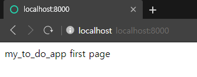

도서 : Django 한그릇 뚝딱

[Chapter 1_준비하기](Chapter%201)

[Chapter 2_ToDoList 만들기](Chapter%202)

# Secret Key 가리기

https://inma.tistory.com/83

- `project/project/settings.py`

```python
# project/project/settings.py
import os
import json
from django.core.exceptions import ImproperlyConfigured

secret_file = os.path.join(BASE_DIR, 'secrets.json')
with open(secret_file) as f:
    secrets = json.loads(f.read())

def get_secret(setting, secrets=secrets):
    try:
        print('check :', secrets[setting])
        return secrets[setting]
    except KeyError:
        error_msg = 'Set the {} environment variable'.format(setting)
        raise ImproperlyConfigured(error_msg)
SECRET_KEY = get_secret("SECRET_KEY")
```

- `project/secrets.json`

```json
{
    "SECRET_KEY":"secret key"
}
```

- `.gitignore`

```notepad
secrets.json
```


# Django

## Chapter 1

- 프런트엔드(Front-end) : 클라이언트가 직접 보게 되는 화면
  - HTML, CSS, Java Script
- 백엔드(Back-end) : 클라이언트가 볼 수 없는 뒤에서 어떠한 논리적 처리를 담당하거나 웹 사이트의 구조를 담당하는 분야
- 풀스택(Full-Stack) : 프런트엔드 + 백엔드
- 프레임워크(Framework) : 특정 기능들을 빠르게 구현할 수 있도록 미리 만들어진 틀
- Django : python 기반 웹 프로그래밍 프레임워크

## Chapter 2

### 1.1 Create Project

Prompt(cmd)에서

- `django-admin startproject ToDoList`
  - `ToDoList` : 본인이 만들 프로젝트명을 입력

### 1.2 Configure Application

- `python manage.py startapp my_to_do_app`
  - `my_to_do_app` : 본인이 구성할 어플리케이션명을 입력

```python
# ToDoList/ToDoList/settings.py
INSTALLED_APPS = [
    'django.contrib.admin',
    'django.contrib.auth',
    'django.contrib.contenttypes',
    'django.contrib.sessions',
    'django.contrib.messages',
    'django.contrib.staticfiles',
    'my_to_do_list' # 추가해야할 코드
]
```

- 새로운 app을 만들 때마다 꼭 추가해야함

### 1.3 Set URL

- `python manage.py runserver`
  - 기본적으로 127.0.0.1:8000 or localhost:8000 으로 접속

```python
# ToDoList/ToDoList/urls.py
from django.contrib import admin
from django.urls import path, include # 추가해야할 코드

urlpatterns = [
    path('', include('my_to_do_app.urls')), # 추가해야할 코드
    path('admin/', admin.site.urls),
]
```

- localhost:8000/admin/ 이라는 주소로 접근했을 때, `admin.site.urls` 로 접근하라는 의미
- `admin.site.urls` 와 달리 `include('my_to_do_app.urls')`로 쓰는 이유 : 내가 직접 새롭게 추가한 app이기 때문

```python
# 직접 urls.py 파일을 생성해야함
# ToDoList/my_to_do_app/urls.py
from django.urls import path
from . import views

urlpatterns = [
    path('', views.index)
]
```

- 같은 폴더의 `views.py`의 `index` 함수를 처리하도록 함

```python
# ToDoList/my_to_do_app/views.py
from django.shortcuts import render
from django.http import HttpResponse # 추가해야할 코드

# Create your views here.
# 추가해야할 index 함수
def index(request):
    return HttpResponse('my_to_do_app first page')
```

- 이후 cmd로 ToDoList 폴더에서 `python manage.py runserver`를 한 뒤 localhost:8000/에 접속하면 아래와 같은 화면이 뜬다.



### 1.4 Use HTML Template

- `my_to_do_app` 폴더에 `templates` 폴더를 생성한 뒤 그 안에 또다시 `my_to_do_app` 폴더를 생성한다.
- HTML 파일을 템플릿으로 사용하려면 해당 앱의 `templates` 폴더의 앱과 동일한 이름을 가진 폴더의 html 파일을 불러온다.
- html 파일을 생성한 이후 `views.py` 파일을 수정해야한다.

```python
# ToDoList/my_to_do_app/views.py

# 수정한 코드
def index(request):
    return render(request, 'my_to_do_app/index.html')
```

- 사용자가 특정 url에 접근해서 index 함수를 실행할 때, request를 받아와 user나 session과 같은 값들을 참조, render를 통해 사용자가 그대로 받아볼 수 있게 된다.

# Django (docs)

## Environment

`conda deactivate`

`conda create --name django python=3.8.3`

`conda env list`

`conda activate django`

`pip install ipykernel`

`python -m ipykernel install --user --name django --display-name "Python Django"`

`conda install -c conda-forge jupyterlab`

## Installation

`pip install Django==3.2.4`

## Create Project

https://docs.djangoproject.com/ko/3.2/intro/tutorial01/

`django-admin startproject mysite`

- cmd창에 `python manage.py runserver` 입력 후 http://127.0.0.1:8000/ 로 접속했을 때 아래 화면이 나오면 설치 완료


## Create App

- `manage.py`가 있는 폴더에서 `python manage.py startapp <appname>` 명령어를 실행하여 `<appname>` 앱을 생성한다.

- ```python
  # appname/views.py
  from django.http import HttpResponse
  
  def index(request):
      return HttpResponse("Hello, world. You're at the polls index.")
  ```

- ```python
  # appname/urls.py
  from django.urls import path
  from . import views
  
  urlpatterns = [
      path('', views.index, name='index'),
  ]
  ```

- ```python
  # mysite/urls.py
  from django.contrib import admin
  from django.urls import include, path
  
  urlpatterns = [
      path('polls/', include('polls.urls')),
      path('admin/', admin.site.urls),
  ]
  ```

## Connect DB

https://docs.djangoproject.com/en/3.2/ref/settings/#databases

```python
# mysite/settings.py
# Database
DATABASES = {
    'default': {
        'ENGINE': 'django.db.backends.mysql',
        'NAME': 'tips',
        'USER': 'root',
        'PASSWORD': '3756',
        'HOST': '127.0.0.1',
        'PORT': '3306',
    }
}
```

- mysql에 등록되어 있는 `tips` 데이터베이스를 가져온다.

### Migration

- `pip install mysqlclient` 후 `python manage.py migrate`를 통해 mysql과 연결한다.

```mysql
# mysql
use tips;
show tables;
```


성공했으면 위와 같은 테이블이 생성된다.


## Administration

1. `python manage.py createsuperuser` 로 admin id와 email, password를 등록하고 http://127.0.0.1:8000/admin/ 에 접속하여 등록한 id와 pw로 로그인하면 Django 관리창이 뜬다.
2. Add Users로 새로운 유저를 등록하면(꼭 하지 않아도 된다.) 서버와 연결된 mysql 데이터베이스 테이블의 `auth.user`에 유저 데이터가 등록되어 있는 것을 확인할 수 있다.


## Model

https://docs.djangoproject.com/ko/3.2/intro/tutorial02/

`views.py`, `urls.py` 등을 위 링크를 보고 수정을 거친 뒤

```shell
python manage.py shell
```

```python
from polls.models import Choice, Question
from django.utils import timezone

q = Question(question_text="Q", pub_date=timezone.now())

q.choice_set.create(choice_text='V1', votes=0)
q.choice_set.create(choice_text='V2', votes=0)
```

위와 같은 과정을 거치면 url에 투표창이 생성된다.

