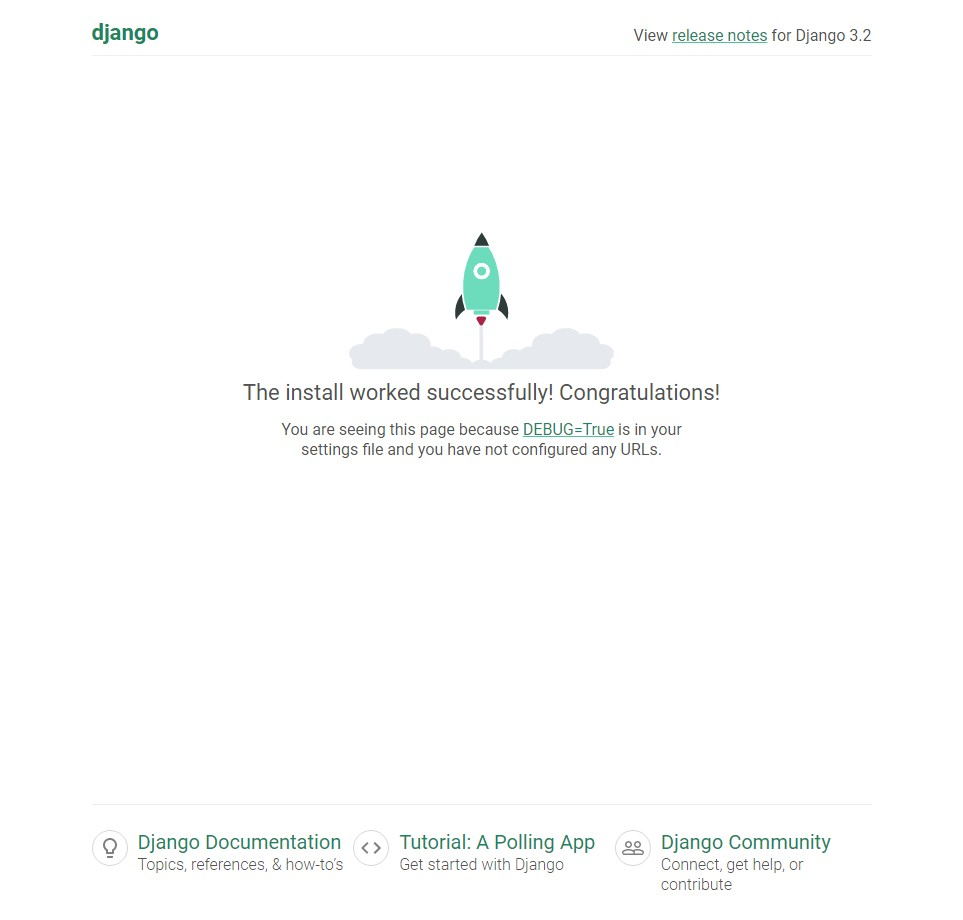
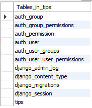

도서 : Django 한그릇 뚝딱

[Chapter 1_준비하기](Chapter%201)

[Chapter 2_ToDoList 만들기](Chapter%202)

[Chapter 3_맛집 공유 사이트 만들기](Chapter%203)

[Chapter 4_엑셀 계산 사이트 만들기](Chapter%204)

[Chapter 5_실전 프로젝트 해결하기](Chapter%205)

# Hide Secret Key

https://inma.tistory.com/83

- `project/project/settings.py`

```python
# project/project/settings.py
from pathlib import Path
import os
import json
from django.core.exceptions import ImproperlyConfigured

BASE_DIR = Path(__file__).resolve().parent.parent

secret_file = os.path.join(BASE_DIR, 'secrets.json')
with open(secret_file) as f:
    secrets = json.loads(f.read())

def get_secret(setting, secrets=secrets):
    try:
        print('check :', secrets[setting])
        return secrets[setting]
    except KeyError:
        error_msg = 'Set the {} environment variable'.format(setting)
        raise ImproperlyConfigured(error_msg)
SECRET_KEY = get_secret("SECRET_KEY")
```

- `project/secrets.json`

```json
{
    "SECRET_KEY":"secret key"
}
```

- `.gitignore`

```notepad
secrets.json
```

# Django

## Chapter 1

- 프런트엔드(Front-end) : 클라이언트가 직접 보게 되는 화면
  - HTML, CSS, Java Script
- 백엔드(Back-end) : 클라이언트가 볼 수 없는 뒤에서 어떠한 논리적 처리를 담당하거나 웹 사이트의 구조를 담당하는 분야
- 풀스택(Full-Stack) : 프런트엔드 + 백엔드
- 프레임워크(Framework) : 특정 기능들을 빠르게 구현할 수 있도록 미리 만들어진 틀
- Django : python 기반 웹 프로그래밍 프레임워크


# Django (docs)

## Environment

`conda deactivate`

`conda create --name django python=3.8.3`

`conda env list`

`conda activate django`

`pip install ipykernel`

`python -m ipykernel install --user --name django --display-name "Python Django"`

`conda install -c conda-forge jupyterlab`

## Installation

`pip install Django==3.2.4`

## Create Project

https://docs.djangoproject.com/ko/3.2/intro/tutorial01/

`django-admin startproject mysite`

- cmd창에 `python manage.py runserver` 입력 후 http://127.0.0.1:8000/ 로 접속했을 때 아래 화면이 나오면 설치 완료




## Connect DB

https://docs.djangoproject.com/en/3.2/ref/settings/#databases

```python
# mysite/settings.py
# Database
DATABASES = {
    'default': {
        'ENGINE': 'django.db.backends.mysql',
        'NAME': 'tips',
        'USER': 'root',
        'PASSWORD': '3756',
        'HOST': '127.0.0.1',
        'PORT': '3306',
    }
}
```

- mysql에 등록되어 있는 `tips` 데이터베이스를 가져온다.

### Migration

- `pip install mysqlclient` 후 `python manage.py migrate`를 통해 mysql과 연결한다.

```mysql
# mysql
use tips;
show tables;
```



성공했으면 위와 같은 테이블이 생성된다.


## Administration

1. `python manage.py createsuperuser` 로 admin id와 email, password를 등록하고 http://127.0.0.1:8000/admin/ 에 접속하여 등록한 id와 pw로 로그인하면 Django 관리창이 뜬다.
2. Add Users로 새로운 유저를 등록하면(꼭 하지 않아도 된다.) 서버와 연결된 mysql 데이터베이스 테이블의 `auth.user`에 유저 데이터가 등록되어 있는 것을 확인할 수 있다.

