- [Data Leakage](#data-leakage)
  * [Target Leakage](#target-leakage)
  * [Train-Test Contamination](#train-test-contamination)
- [Visualization](#visualization)
  * [Scatter Plots](#scatter-plots)
    + [scatterplot](#scatterplot)
    + [regplot](#regplot)
    + [lmplot](#lmplot)
    + [swarmplot](#swarmplot)
  * [Distributions](#distributions)
    + [distplot](#distplot)
    + [kdeplot](#kdeplot)
    + [jointplot](#jointplot)
  * [Custom Styles](#custom-styles)
- [Creating Features](#creating-features)
  * [Mathematical Transform](#mathematical-transform)
  * [Counts](#counts)
  * [Building-Up and Breaking Down Features](#building-up-and-breaking-down-features)
  * [Group Transforms](#group-transforms)
- [Principal Component Analysis](#principal-component-analysis)
- [SQL](#sql)
  * [Select, From & Where](#select--from---where)
  * [Group By, Having & Count](#group-by--having---count)
  * [Order By](#order-by)
  * [As & With](#as---with)
  * [Joining Data](#joining-data)
  * [JOINs and UNIONs](#joins-and-unions)
  * [Analytic Functions](#analytic-functions)
  * [Nested and Repeated Data](#nested-and-repeated-data)
  * [Writing Efficient Queries](#writing-efficient-queries)
- [Stochastic Gradient Descent](#stochastic-gradient-descent)
- [Computer Vision](#computer-vision)
  * [Convolution and ReLU](#convolution-and-relu)
  * [Maximum Pooling](#maximum-pooling)
- [Time Series](#time-series)
  * [Trend](#trend)
  * [Seasonality](#seasonality)
  * [Cycle](#cycle)
  * [Hybrid Models](#hybrid-models)
  * [Forecasting With Machine Learning](#forecasting-with-machine-learning)
    + [Multistep Forecasting Strategies](#multistep-forecasting-strategies)
- [Data Cleaning](#data-cleaning)
  * [Handling Missing Values](#handling-missing-values)
  * [Scaling and Normalization](#scaling-and-normalization)
  * [Parsing Dates](#parsing-dates)
  * [Character Encodings](#character-encodings)
  * [Inconsistent Data Entry](#inconsistent-data-entry)
- [AI Ethics](#ai-ethics)
  * [Human-Centered Design for AI](#human-centered-design-for-ai)
  * [Identifying Bias in AI](#identifying-bias-in-ai)
  * [AI Fairness](#ai-fairness)
  * [Model Cards](#model-cards)
- [Geospatial Analysis](#geospatial-analysis)
  * [Reading and ploting data](#reading-and-ploting-data)
  * [Coordinate Reference System](#coordinate-reference-system)
  * [Interactive Maps](#interactive-maps)
  * [Manipulating Geospatial Data](#manipulating-geospatial-data)
  * [Proximity Analysis](#proximity-analysis)
- [Machine Learning Explinability](#machine-learning-explinability)
  * [Use Cases for Model Insights](#use-cases-for-model-insights)
  * [Permutation Importance](#permutation-importance)
  * [Partial Plots](#partial-plots)
  * [SHAP Values](#shap-values)
  * [Advanced Uses of SHAP Values](#advanced-uses-of-shap-values)
- [Natural Language Processing](#natural-language-processing)
  * [Intro to NLP](#intro-to-nlp)
  * [Text Classification](#text-classification)
  * [Word Vectors](#word-vectors)
- [Intro to Game AI and Reinforcement Learning](#intro-to-game-ai-and-reinforcement-learning)
  * [One-Step Lookahead](#one-step-lookahead)
  * [N-Step Lookahead](#n-step-lookahead)
  * [Deep Reinforcement Learning](#deep-reinforcement-learning)


# Data Leakage

https://www.kaggle.com/alexisbcook/data-leakage

**데이터 누수**란 **훈련 데이터의 정보를 실제 예측에서 사용할 수 없는 경우** 발생하며 타겟 누수(target leakage)와 훈련-테스트 오염(train-test contamination)이 있다.


## Target Leakage

예측 시점에서 사용할 수 없는 데이터가 데이터 셋에 포함되어 있을 때 발생

| got_pneumonia | age  | weight | male  | took_antibiotic_medicine | ...  |
| :-----------: | :--: | :----: | :---: | :----------------------: | :--- |
|     False     |  65  |  100   | False |          False           | ...  |
|     False     |  72  |  130   | True  |          False           | ...  |
|     True      |  58  |  100   | False |           True           | ...  |

폐렴에 걸렸는지(`got_pneumonia`)를 확인하기 위하여 항생제를 복용하는지(`took_antibiotic_medicine`)를 변수로 사용하는 경우 타겟 누수가 발생했다고 할 수 있다.

왜냐하면 시간 순서 혹은 원인과 결과가 반대이기 때문. 즉 항생제를 복용한 후 폐렴(복용했기 때문에 폐렴)이 아닌, 폐렴이 걸렸기 때문에 항생제를 복용한다고 봐야하기 때문이다.

그러므로 타겟 누수를 방지하려면 타겟 값이 결정된(생성된) 이후 파생된 변수를 제거해야한다.


## Train-Test Contamination

훈련-테스트 데이터로 쪼개기 전 scaling을 하는 경우 등에서 발생

실제 예측을 위한 데이터에 대한 기초 통계 정보(평균, 분산 등)이 없음에도 train_test_split을 하기 전 scaling을 한다는 것 자체가 잘못된 것. 즉, train_test_split 이후 test 데이터는 정말 처음 보는 값으로 생각하고 scaling을 train 데이터에만 적용한 뒤(fit_transform) 이후 test 데이터에 적용(transform)하여야 한다는 것.

같은 논리로, 교차검증을 할 때에도 전체 데이터에 대해 scaling을 하는 것이 아닌, train-validation으로 쪼갠 이후 train 데이터에 fit_transform, validation 데이터에 transform하여야 한다.

이에 대하여 잘 설명해놓은 블로그 : https://blog.naver.com/tjdudwo93/221085844907


# Visualization

## Scatter Plots

### scatterplot

산점도를 확인할 때 사용

```python
sns.scatterplot(data=candy_data, x='sugarpercent', y='winpercent')
```


카테고리별로 색을 다르게 하고 싶을 땐 `hue` 파라미터 이용

```python
sns.scatterplot(data=candy_data, x='pricepercent', y='winpercent', hue='chocolate')
```


### regplot

산점도에 회귀직선까지 함께 나타내고 싶을 때 사용

```python
sns.regplot(data=candy_data, x='sugarpercent', y='winpercent')
```


### lmplot

산점도에 회귀직선을 카테고리별로 따로 나타내고 싶을 때 사용

```python
sns.lmplot(data=candy_data, x='pricepercent', y='winpercent', hue='chocolate')
```


### swarmplot

카테고리 변수마다 수치형 변수가 어떻게 모여있는지 (분포를) 확인하려고 할 때 사용

```python
sns.swarmplot(data=candy_data, x='chocolate', y='winpercent')
```


## Distributions

### distplot

값의 분포를 알아보기 위할 때 사용

```python
sns.distplot(a=iris_data['Petal Length (cm)'], kde=False)
```


### kdeplot

**kernel density estimate (KDE)**, 값의 분포를 부드러운 곡선으로 나타내기 위할 때 사용

```python
sns.kdeplot(data=iris_data['Petal Length (cm)'], shade=True)
```

- `shade=True` : 곡선 아래 면적을 색칠


### jointplot

2개의 분포를 겹쳐 등고선을 그리고자 할 때 사용

```python
sns.jointplot(x=iris_data['Petal Length (cm)'], y=iris_data['Sepal Width (cm)'], kind="kde")
```


## Custom Styles

```python
sns.set_style("dark")
```

- (1) `"darkgrid"`, (2) `"whitegrid"`, (3) `"dark"`, (4) `"white"`, (5) `"ticks"` 등이 있음


# Creating Features

변수 생성(파생 변수 포함)


## Mathematical Transform

수학적 계산으로 새로운 변수 만들기. 간단한 비율 뿐만 아니라 수학/과학적으로 도출된 수식(원기둥의 부피 등)을 기존 특성으로 계산하여 새로운 특성을 만들기

```python
autos["displacement"] = (
    np.pi * ((0.5 * autos.bore) ** 2) * autos.stroke * autos.num_of_cylinders
)
```


또는 `log`를 취하여 값의 분포를 정규분포 형태로 최대한 가깝게 변형

```python
# If the feature has 0.0 values, use np.log1p (log(1+x)) instead of np.log
accidents["LogWindSpeed"] = accidents.WindSpeed.apply(np.log1p)

# Plot a comparison
fig, axs = plt.subplots(1, 2, figsize=(8, 4))
sns.kdeplot(accidents.WindSpeed, shade=True, ax=axs[0])
sns.kdeplot(accidents.LogWindSpeed, shade=True, ax=axs[1]);
```


## Counts

특정 조건을 만족하는 변수의 개수를 새로운 특성으로 사용

아래 예시는 값이 0보다 큰 특성의 개수를 세는 것

```python
components = [ "Cement", "BlastFurnaceSlag", "FlyAsh", "Water",
               "Superplasticizer", "CoarseAggregate", "FineAggregate"]
concrete["Components"] = concrete[components].gt(0).sum(axis=1)

concrete[components + ["Components"]].head(10)
```

- `.gt(0)` : 각 위치의 값이 0보다 크면 True, 아니면 False 반환
- `.sum(axis=1)` : 열 방향으로 합

|      | Cement | BlastFurnaceSlag | FlyAsh | Water | Superplasticizer | CoarseAggregate | FineAggregate | Components |
| :--- | :----- | :--------------- | :----- | :---- | :--------------- | :-------------- | :------------ | ---------- |
| 0    | 540.0  | 0.0              | 0.0    | 162.0 | 2.5              | 1040.0          | 676.0         | 5          |
| 1    | 540.0  | 0.0              | 0.0    | 162.0 | 2.5              | 1055.0          | 676.0         | 5          |
| 2    | 332.5  | 142.5            | 0.0    | 228.0 | 0.0              | 932.0           | 594.0         | 5          |
| 3    | 332.5  | 142.5            | 0.0    | 228.0 | 0.0              | 932.0           | 594.0         | 5          |
| 4    | 198.6  | 132.4            | 0.0    | 192.0 | 0.0              | 978.4           | 825.5         | 5          |
| 5    | 266.0  | 114.0            | 0.0    | 228.0 | 0.0              | 932.0           | 670.0         | 5          |
| 6    | 380.0  | 95.0             | 0.0    | 228.0 | 0.0              | 932.0           | 594.0         | 5          |
| 7    | 380.0  | 95.0             | 0.0    | 228.0 | 0.0              | 932.0           | 594.0         | 5          |
| 8    | 266.0  | 114.0            | 0.0    | 228.0 | 0.0              | 932.0           | 670.0         | 5          |
| 9    | 475.0  | 0.0              | 0.0    | 228.0 | 0.0              | 932.0           | 594.0         | 4          |


## Building-Up and Breaking Down Features

값을 분리하여 새로운 특성을 만들거나 여러 특성을 하나의 특성으로 합하는 것

아래는 분리하는 예시

```python
customer[["Type", "Level"]] = (  # Create two new features
    customer["Policy"]           # from the Policy feature
    .str                         # through the string accessor
    .split(" ", expand=True)     # by splitting on " "
                                 # and expanding the result into separate columns
)

customer[["Policy", "Type", "Level"]].head(10)
```

- `.str.split(' ', expand=True)` : `' '` 값을 기준으로 다른 column으로 찢어 놓음

  - `expand=True` : 새로운 열 생성

    - 그러므로 `.str.split(expand=True)[0]`을 하면 새롭게 생성된 열들 중 첫 번째 열이 반환된다.

  - `expand=False` : 값이 리스트 형태로 되어있는 `pd.Series`

    - 예시

      [['Corporate', 'L3'],

       ['Personal', 'L3'],

       ...]

    - 그러므로 `.str.split(expand=False)[0]`을 할 때 첫 번째 값인 `['Corporate', 'L3']`이 반환된다.

  - `n=1` : 여러 개로 찢어질 경우, 맨 앞의 하나만 분리하기

|      | Policy       | Type      | Level |
| :--- | :----------- | :-------- | ----- |
| 0    | Corporate L3 | Corporate | L3    |
| 1    | Personal L3  | Personal  | L3    |
| 2    | Personal L3  | Personal  | L3    |
| 3    | Corporate L2 | Corporate | L2    |
| 4    | Personal L1  | Personal  | L1    |
| 5    | Personal L3  | Personal  | L3    |
| 6    | Corporate L3 | Corporate | L3    |
| 7    | Corporate L3 | Corporate | L3    |
| 8    | Corporate L3 | Corporate | L3    |
| 9    | Special L2   | Special   | L2    |


아래는 합하는 예시

```python
autos["make_and_style"] = autos["make"] + "_" + autos["body_style"]
autos[["make", "body_style", "make_and_style"]].head()
```

|      | make        | body_style  | make_and_style          |
| :--- | :---------- | :---------- | ----------------------- |
| 0    | alfa-romero | convertible | alfa-romero_convertible |
| 1    | alfa-romero | convertible | alfa-romero_convertible |
| 2    | alfa-romero | hatchback   | alfa-romero_hatchback   |
| 3    | audi        | sedan       | audi_sedan              |
| 4    | audi        | sedan       | audi_sedan              |


## Group Transforms

그룹별로 묶어 해당하는 값에 대하여 새로운 특성 생성

아래는 `State`로 묶어`Income`의 평균을 계산한 예

```python
customer["AverageIncome"] = (
    customer.groupby("State")  # for each state
    ["Income"]                 # select the income
    .transform("mean")         # and compute its mean
)

customer[["State", "Income", "AverageIncome"]].head(10)
```

- `.transform('mean')` : 원래의 데이터에 해당하는 값의 열을 추가할 수 있다
  - `max`, `min`, `median`, `var`, `std`, `count` 등의 메서드가 있으며 함수를 직접 생성하여 넣을 수도 있다.

|      | State      | Income | AverageIncome |
| :--- | :--------- | :----- | ------------- |
| 0    | Washington | 56274  | 38122.733083  |
| 1    | Arizona    | 0      | 37405.402231  |
| 2    | Nevada     | 48767  | 38369.605442  |
| 3    | California | 0      | 37558.946667  |
| 4    | Washington | 43836  | 38122.733083  |
| 5    | Oregon     | 62902  | 37557.283353  |
| 6    | Oregon     | 55350  | 37557.283353  |
| 7    | Arizona    | 0      | 37405.402231  |
| 8    | Oregon     | 14072  | 37557.283353  |
| 9    | Oregon     | 28812  | 37557.283353  |


아래는 값의 등장 빈도를 계산한 예

```python
customer["StateFreq"] = (
    customer.groupby("State")
    ["State"]
    .transform("count")
    / customer.State.count()
)

customer[["State", "StateFreq"]].head(10)
```

|      | State      | StateFreq |
| :--- | :--------- | --------- |
| 0    | Washington | 0.087366  |
| 1    | Arizona    | 0.186446  |
| 2    | Nevada     | 0.096562  |
| 3    | California | 0.344865  |
| 4    | Washington | 0.087366  |
| 5    | Oregon     | 0.284760  |
| 6    | Oregon     | 0.284760  |
| 7    | Arizona    | 0.186446  |
| 8    | Oregon     | 0.284760  |
| 9    | Oregon     | 0.284760  |

주의할 점 : train, valid로 나누었을 때 Data Leakage를 주의하여 train에서 생성한 특성을 valid에 붙여야 한다.


# Principal Component Analysis

PCA를 통해 차원 축소, 잡음(노이즈) 제거 등을 할 수도 있고 '이상치 탐지'도 가능하다.

주택 가격 데이터에서 `"GarageArea"`, `"YearRemodAdd"`, `"TotalBsmtSF"`, `"GrLivArea"` feature로 PCA(n_component=4)를 했을 때 각각의 PCA component로 boxplot을 그려보면 다음과 같다.

```python
sns.catplot(
    y="value",
    col="variable",
    data=X_pca.melt(),
    kind='boxen',
    sharey=False,
    col_wrap=2,
);
```


PC1에 대하여 값이 큰 이상치를 뽑았을 때 다음과 같으며

|      | SalePrice | Neighborhood | SaleCondition | GarageArea | YearRemodAdd | TotalBsmtSF | GrLivArea |
| ---: | --------: | -----------: | ------------: | ---------: | -----------: | ----------: | --------- |
| 1498 |    160000 |      Edwards |       Partial |     1418.0 |         2008 |      6110.0 | 5642.0    |
| 2180 |    183850 |      Edwards |       Partial |     1154.0 |         2009 |      5095.0 | 5095.0    |
| 2181 |    184750 |      Edwards |       Partial |      884.0 |         2008 |      3138.0 | 4676.0    |
| 1760 |    745000 |   Northridge |       Abnorml |      813.0 |         1996 |      2396.0 | 4476.0    |
| 1767 |    755000 |   Northridge |        Normal |      832.0 |         1995 |      2444.0 | 4316.0    |

`Edwards` 이웃의 `Partial` 판매 상태인 것은 여러 명이 공동 소유하는 주택인 경우 일부를 판매하는 것이기 때문에 `SalePrice`가 정상가보다 낮을 수밖에 없으며 이는 이상치이고 제거하는 것이 맞다.


# SQL

## Select, From & Where

- `unit`이 ppm인 모든 행의 `country` 열 출력

  ```mysql
  SELECT country
  FROM `bigquery-public-data.openaq.global_air_quality`
  WHERE unit = 'ppm';
  ```

- `unit`이 ppm인 모든 행의 unique `country` 출력

  ```mysql
  SELECT DISTINCT country
  FROM `bigquery-public-data.openaq.global_air_quality`
  WHERE unit = 'ppm';
  ```

- `value`가 0인 모든 열과 행 출력

  ```mysql
  SELECT *
  FROM `bigquery-public-data.openaq.global_air_quality`
  WHERE value = 0;
  ```

- **LIKE** - 특정 텍스트 필터링

  ```mysql
  SELECT *
  FROM `bigquery-public-data.pet_records.pets`
  WHERE Name LIKE 'Ripley';
  ```

- **LIKE '%...%'** - 텍스트가 포함된 행 필터링

  ```mysql
  SELECT *
  FROM `bigquery-public-data.pet_records.pets`
  WHERE Name LIKE '%ipl%';
  ```

  


## Group By, Having & Count

- **COUNT()** - 개수 파악

  ```mysql
  SELECT COUNT(ID)
  FROM `bigquery-public-data.pet_records.pets`;
  ```

  - COUNT() 외에 SUM(), AVG(), MIN(), MAX() 등이 있음

- **GROUP BY** - 그룹으로 묶은 뒤 aggregate function 적용

  ```mysql
  SELECT Animal, COUNT(ID)
  FROM `bigquery-public-data.pet_records.pets`
  GROUP BY Animal;
  ```

- **GROUP BY ... HAVING** - 그룹으로 묶고 함수를 적용한 결과에 대해 필터링

  ```mysql
  SELECT Animal, COUNT(ID)
  FROM `bigquery-public-data.pet_records.pets`
  GROUP BY Animal
  HAVING COUNT(ID) > 1;
  ```

- COUNT column 명을 `NumPosts`로 바꾸고, 같은 column 명(`author`)을 반복하지 않기 위해 다음과 같이 사용할 수 있음

  ```mysql
  SELECT author, COUNT(1) AS NumPosts
  FROM `bigquery-public-data.hacker_news.comments`
  GROUP BY 1
  HAVING COUNT(1) > 10000;
  ```

  - SELECT와 HAVING 문의 **COUNT(1)**은 **COUNT(\*)**와 같다.
  - GROUP BY 문의 **1**은 선택한 **첫 번째 열**을 뜻한다.

## Order By

- **ORDER BY** - `Animal`에 대하여 오름차순 정리

  ```mysql
  SELECT ID, Name, Animal
  FROM `bigquery-public-data.pet_records.pets`
  ORDER BY Animal;
  ```

- **ORDER BY ... DESC** - `Animal`에 대하여 내림차순 정리

  ```mysql
  SELECT ID, Name, Animal
  FROM `bigquery-public-data.pet_records.pets`
  ORDER BY Animal DESC;
  ```

- **EXTRACT(DAY from ...)** - 년-월-일(YYYY-[M]M-[D]D) 데이터에서 일 데이터 추출

  ```mysql
  SELECT Name, EXTRACT(DAY from Date) AS DAY
  FROM `bigquery-public-data.pet_records.pets_with_date`;
  ```

  - `YEAR` : 년도 추출
  - `MONTH` : 월 추출
  - `DAY` : 일 추출
  - `WEEK` : 1년 중 몇 번째 주인지 추출
  - `DAYOFWEEK` : 요일 추출

  요일별로 사고 횟수를 확인하고 많은 순서대로 내림차순 정렬

  ```mysql
  SELECT COUNT(consecutive_number) AS num_accidents, 
         EXTRACT(DAYOFWEEK FROM timestamp_of_crash) AS day_of_week
  FROM `bigquery-public-data.nhtsa_traffic_fatalities.accident_2015`
  GROUP BY day_of_week
  ORDER BY num_accidents DESC;
  ```

- WHERE, GROUP BY ... HAVING과 ORDER BY를 함께 쓰는 경우

  ```mysql
  SELECT indicator_code, indicator_name, COUNT(1) AS num_rows
  FROM `bigquery-public-data.world_bank_intl_education.international_education`
  WHERE year = 2016
  GROUP BY 1, 2
  HAVING num_rows >= 175
  ORDER BY 3 DESC;
  ```

  

## As & With

- **WITH ... AS** - CTE(common table expression)으로 임시 테이블을 일컫는다.

  `Seniors`라는 새로운 TABLE 생성

  ```mysql
  WITH Seniors AS
  (
    SELECT ID, NAME
    FROM `bigquery-public-data.pet_records.pets`
    WHERE Years_old > 5
  )
  SELECT ID
  FROM Seniors;
  ```

  쿼리가 너무 길어질 경우를 생각하여 CTE를 생성한다.

  주의점 : 쿼리 내에서만 호출할 수 있으며 다른 쿼리에서는 호출할 수 없다.

- **DATE()** - 년월일-시간 데이터에서 년월일만 추출

- 아래처럼 복잡할 때 주로 사용한다.

  특정 조건에 해당하는 날짜에 대하여 시간, 마일, 초 데이터를 뽑아낸 뒤 시간으로 묶어서 새로운 데이터 생성

  ```mysql
  WITH RelevantRides AS
  (
     SELECT EXTRACT(HOUR FROM trip_start_timestamp) AS hour_of_day, trip_miles, trip_seconds
     FROM `bigquery-public-data.chicago_taxi_trips.taxi_trips`
     WHERE trip_seconds > 0
       AND trip_miles > 0
       AND trip_start_timestamp > '2017-01-01'
       AND trip_start_timestamp < '2017-07-01'
  )
  SELECT hour_of_day,
  	   COUNT(1) AS num_trips,
  	   3600 * SUM(trip_miles) / SUM(trip_seconds) AS avg_mph
  FROM RelevantRides
  GROUP BY 1
  ORDER BY 1;
  ```

  

## Joining Data

아래와 같이 `owners` 테이블의 `Pet_ID`와 `pets` 테이블의 `ID`가 서로 이어져 있을 때 join을 사용하여 합칠 수 있다.


- **JOIN**

  ```mysql
  SELECT p.Name AS Pet_Name, o.Name AS Owner_Name
  FROM `bigquery-public-data.pet_records.pets` AS p
  INNER JOIN `bigquery-public-data.pet_records.owners` AS o
  	ON p.ID = o.Pet_ID;
  ```


## JOINs and UNIONs

- **JOINs** - 데이터를 (공통)행 기준으로 합침

  - `INNER JOIN` : 공통인 데이터 기준으로 합침
  - `LEFT JOIN` : 왼쪽(FROM 다음에 오는) 테이블 기준으로 합침
  - `FULL JOIN` : 양쪽 테이블 모든 데이터에 대하여 합침

- **UNIONs** - 데이터를 (공통)열(이름) 기준으로 합침

  ```mysql
  SELECT Age FROM `bigquery-public-data.pet_records.pets`
  UNION ALL
  SELECT Age FROM `bigquery-public-data.pet_records.onwers`;
  ```

  - 중복되는 데이터를 제거하고 싶은 경우 `UNION ALL` 대신 `UNION DISTINCT` 사용

- JOIN을 여러 번 반복할 수 있음

  

  ```mysql
  SELECT o.Name AS Owner_Name,
  	   p.Name AS Pet_Name,
  	   t.Treat AS Fav_Treat
  FROM `bigquery-public-data.pet_records.pets` AS p
  FULL JOIN `bigquery-public-data.pet_records.owners` AS o
  	ON p.ID = o.Pet_ID
  LEFT JOIN `bigquery-public-data.pet_records.treats` AS t
  	on p.ID = t.Pet_ID;
  ```

  


## Analytic Functions


- **Syntax** - **OVER** 문을 사용하며 세 가지 파트가 있다.
  - **PARTITION BY** : 서로 다른 그룹으로 나눔
  - **ORDER BY** : 정렬
  - **window frame** : 계산에 쓰이는 행을 정의


- **(More on) window frame clauses**
  - 아래 예시 모두 `partition by`로 나뉜 그룹 내에서 계산
  - `ROWS BETWEEN 1 PRECEDING AND CURRENT ROW` - 현재 행과 그 행 기준 하나 전 값에 대한 결과. 위의 예시에서 두 번째 행의 `avg_time`(28) = 현재 행의 값(26)과 이전 하나 행의 값(30)의 평균. 세 번째 행도 같은 논리로 24 = 26과 22의 평균
  - `ROWS BETWEEN 3 PRECEDING AND 1 FOLLOWING` - 현재 행 기준 세 개의 전 값과 다음 하나 값에 대한 결과
  - `ROWS BETWEEN UNBOUNDED PRECEDING AND UNBOUNDED FOLLOWING` - 모든 행
  - `ROWS BETWEEN UNBOUNDED PRECEDING AND CURRENT ROW` - 누적 행(기본값)
- **Three types of anayltic functions**
  1. **Analytic aggregate functions**
     - **MIN()** (or **MAX()**)
     - **AVG()** (or **SUM()**)
     - **COUNT()**
  2. **Analytic navigation functions**
     - **FIRST_VALUE()** (or **LAST_VALUE()**)
     - **LEAD()** (and **LAG()**) - 다음(또는 이전) 행의 값 반환
       - `LAG(column_name, 1)`처럼 얼마나 이전인지 표기를 해줘야 한다.
       - `LAG(column_name, 1, 'value')`로 쓰면 `NaN` 대신 `'value'`를 채운다.
  3. **Analytic numbering functions**
     - **ROW_NUMBER()** - 몇 번째 행인지 반환(`1`부터 시작)
     - **RANK()** - 순위 반환(같은 값이면 같은 순위, 다음은 그 수만큼 더해진 값)


## Nested and Repeated Data

- **Nested Data** : python의 dictionary처럼 중괄호(\{\})로 이루어진 데이터

  

  - 데이터를 불러올 땐 `Toy.Name`처럼 "Toy" 열의 "Name" 값을 참조한다.

    

- **Repeated Data** : python의 list처럼 대괄호(\[\])로 이루어진 데이터

  

  - 데이터를 불러올 땐 repeated data를 **UNNEST()** 함수로 감싸준다.

    

- **Nested and repeated data**

  

  - 데이터를 불러오는 방식은 nested와 repeated를 섞어놓은 것과 같다.

    

  - Nested 안에 또다른 Nested가 있는 경우

    - "hits" 열이 repeated 되어 있고
    - "hits" 열 안에 "hitNumber", "page", "type"이 nested 되어 있으며
    - "page" 필드 안에 "pagePath"가 nested 되어 있음

    ```mysql
    SELECT hits.page.pagePath as path,
    	COUNT(hits.page.pagePath) as counts
    FROM `bigquery-public-data.google_analytics_sample.ga_sessions_20170801`, 
    	UNNEST(hits) as hits
    WHERE hits.type="PAGE" and hits.hitNumber=1
    GROUP BY path
    ORDER BY counts DESC;
    ```

    |      | path                                        | counts |
    | :--- | :------------------------------------------ | ------ |
    | 0    | /home                                       | 1257   |
    | 1    | /google+redesign/shop+by+brand/youtube      | 587    |
    | 2    | /google+redesign/apparel/mens/mens+t+shirts | 117    |
    | 3    | /signin.html                                | 78     |
    | 4    | /basket.html                                | 35     |

- 장점 : 수행 비용이 비싼 JOIN에 비하여 가볍다.


## Writing Efficient Queries

- SELECT * FROM ... 대신 필요한 column만 출력하기

- 적은 데이터만 불러오기

  - `station_id`와 `station_name`이 1:1로 이루어진 데이터인 경우, 둘 중 무언가를 요청했다면 다음에도 불러왔던 것에 대하여 계산하도록 해야함

  ```mysql
  # 좋지 않은 예시
  # station_name column을 선택했으면서 where와 group by에서 station_id로 검색하여 불필요한 데이터를 호출하였음
  SELECT MIN(start_station_name) AS start_station_name,
  	MIN(end_station_name) AS end_station_name,
  	AVG(duration_sec) AS avg_duration_sec
  FROM `bigquery-public-data.san_francisco.bikeshare_trips`
  WHERE start_station_id != end_station_id 
  GROUP BY start_station_id, end_station_id
  LIMIT 10;
  
  # 올바른 예시
  SELECT start_station_name,
  	end_station_name,
  	AVG(duration_sec) AS avg_duration_sec                  
  FROM `bigquery-public-data.san_francisco.bikeshare_trips`
  WHERE start_station_name != end_station_name
  GROUP BY start_station_name, end_station_name
  LIMIT 10;
  ```

- N:N JOIN을 피하기

  - 1:1 JOIN이나 1:N JOIN의 수행시간은 짧은 편이지만 N:N JOIN은 길기 때문에 주의

  

  - JOIN하기 이전에 필터링할 수 있다면 우선적으로 필터링하기(특정 ID의 데이터만 뽑아낸 뒤 JOIN하기)


# Stochastic Gradient Descent

**learning rate**와 **batch size**를 바꿔가며 학습했을 때 어떤 차이가 있는지 확인

- `steps=50`, `true_w=3.0`, `true_b=2.0`

1. **learning rate**를 바꿔가며 학습
   - 값이 너무 작으면 오랜 학습 시간이 걸리며 너무 크면 학습이 이루어지지 않음(발산)

| `learning_rate` | `batch_size` | `num_examples` | animate_sgd                                               | 원본과의 차이                                                |
| --------------- | ------------ | -------------- | --------------------------------------------------------- | ------------------------------------------------------------ |
| 0.05            | 32           | 256            |                    | -                                                            |
| 0.02            | 32           | 256            |  | 학습률을 낮춤<br />→ W와 b를 찾는데 오래 걸림                |
| 0.2             | 32           | 256            |  | 학습률을 약간 높임<br />→ W와 b를 찾는 것은 빠르지만 불안정함 |
| 1               | 32           | 256            |    | 학습률을 매우 높임<br />→ 매우 불안정하여 어느 순간 loss가 매우 커짐 |


2. **learning rate**를 바꿔가며 학습 (다른 예시)
   - 두 번째와 세 번째는 학습률이 0.09 차이인데 결과가 많이 다름(불안정하지만 학습이 됨 vs 매우 불안정하여 학습이 되지 않음)

| `learning_rate` | `batch_size` | `num_examples` | animate_sgd                                                  | 원본과의 차이 |
| --------------- | ------------ | -------------- | ------------------------------------------------------------ | ------------- |
| 0.05            | 4096         | 8192           |                    | -             |
| 0.9             | 4096         | 8192           |   |               |
| 0.99            | 4096         | 8192           |  |               |


3. **batch size**를 바꿔가며 학습

- 배치 사이즈는 크면 클수록 안정적이고 약간 빨리 학습하기 때문에 클수록 좋다. (그러나 메모리의 제약이 있다.)

| `learning_rate` | `batch_size` | `num_examples` | animate_sgd                                              | 원본과의 차이                                         |
| --------------- | ------------ | -------------- | -------------------------------------------------------- | ----------------------------------------------------- |
| 0.05            | 32           | 256            |                   | -                                                     |
| 0.05            | 2            | 256            |     | 배치 사이즈를 줄임<br />→ 학습이 되긴 하지만 불안정함 |
| 0.05            | 128          | 256            |  | 배치 사이즈를 늘림<br />→ 안정적으로 학습             |
| 0.05            | 256          | 256            |  | 배치 사이즈=샘플 사이즈<br />→ 매우 안정적으로 학습   |


# Computer Vision

## Convolution and ReLU

**Feature extraction**의 구성 요소

1. **Filter** - 이미지로부터 특정한 요소를 걸러냄 (convolution)
2. **Detect** - 필터링된 이미지로부터 특징을 찾음 (ReLU)
3. **Condense** - 특징을 강조하기 위하여 이미지를 응축 (maximum pooling)


## Maximum Pooling

**Translation Invariance** : Maxpooling을 하면서 **zero-pixels**를 제거하기 때문에 특성 맵에서 위치 정보도 같이 제거하여, input의 위치가 달라져도 output은 같음을 의미한다.

**Global Average Pooling** : `Flatten()` 대신 `GlobalAvgPool2D()`를 하는 경우도 있다. Filter마다 평균값을 내어 그 값에 따라 특정 feature의 유무를 파악할 수 있다(크면 존재, 작으면 존재하지 않음 등)는 관점에서 `Flatten()` 대신 종종 쓰인다고 함.


# Time Series

## Trend

시계열에 대하여 고차원 다항 회귀 테이블을 만들어주는 메서드

```python
from statsmodels.tsa.deterministic import DeterministicProcess

dp = DeterministicProcess(
    index=tunnel.index,  # dates from the training data
    constant=True,       # dummy feature for the bias (y_intercept)
    order=1,             # the time dummy (trend)
    drop=True,           # drop terms if necessary to avoid collinearity
)
# `in_sample` creates features for the dates given in the `index` argument
X = dp.in_sample()

X.head()
```

|            | const | trend |
| :--------- | :---- | :---- |
| Day        |       |       |
| 2003-11-01 | 1.0   | 1.0   |
| 2003-11-02 | 1.0   | 2.0   |
| 2003-11-03 | 1.0   | 3.0   |
| 2003-11-04 | 1.0   | 4.0   |
| 2003-11-05 | 1.0   | 5.0   |

```python
X = dp.out_of_sample(steps=30)
```

훈련 데이터에서 벗어난 날짜만큼 생성


**이동 평균** 계산하기 (pandas의 `rolling` 메서드 이용)

```python
trend = food_sales.rolling(
    window=12, # 평균을 계산할 데이터의 개수
    center=True, # 라벨을 붙일 위치(데이터의 센터)
    min_periods=6, # 계산에 필요한 최소한의 데이터 개수
).mean()
```


**스플라인 곡선(Spline Curve; 각 구간마다 다른 다항식을 적용하여 원래 함수와 최대한 비슷하게 만드는 것)**을 쉽게 구해주는 라이브러리인 `pyearth`로 Trend 계산하기

```python
from pyearth import Earth

# Target and features are the same as before
y = average_sales.copy()
dp = DeterministicProcess(index=y.index, order=1)
X = dp.in_sample()

# Fit a MARS model with `Earth`
model = Earth()
model.fit(X, y)

y_pred = pd.Series(model.predict(X), index=X.index)

ax = y.plot(**plot_params, title="Average Sales", ylabel="items sold")
ax = y_pred.plot(ax=ax, linewidth=3, label="Trend")
```


`order`에 따라 trend의 모양이 달라진다.


## Seasonality

**Furier feature**를 정하기 위한 방법으로 **periodogram**을 이용할 수 있다. x축에 주기를 놓고 a와 b를 각각 sine, cosine 함수의 계수라고 했을 때 y축에 `(a ** 2 + b ** 2) / 2`를 놓은 것이 periodogram으로, 값이 클수록 해당 주기에 영향을 많이 받는 것으로 생각할 수 있다.


(참고) python으로 preiodogram 그리기

```python
def plot_periodogram(ts, detrend='linear', ax=None):
    from scipy.signal import periodogram
    fs = pd.Timedelta("1Y") / pd.Timedelta("1D")
    freqencies, spectrum = periodogram(
        ts,
        fs=fs,
        detrend=detrend,
        window="boxcar",
        scaling='spectrum',
    )
    if ax is None:
        _, ax = plt.subplots()
    ax.step(freqencies, spectrum, color="purple")
    ax.set_xscale("log")
    ax.set_xticks([1, 2, 4, 6, 12, 26, 52, 104])
    ax.set_xticklabels(
        [
            "Annual (1)",
            "Semiannual (2)",
            "Quarterly (4)",
            "Bimonthly (6)",
            "Monthly (12)",
            "Biweekly (26)",
            "Weekly (52)",
            "Semiweekly (104)",
        ],
        rotation=30,
    )
    ax.ticklabel_format(axis="y", style="sci", scilimits=(0, 0))
    ax.set_ylabel("Variance")
    ax.set_title("Periodogram")
    return ax
```


**Furier feature 생성 방법**

1. 직접 만들기

   ```python
   import numpy as np
   
   
   def fourier_features(index, freq, order):
       time = np.arange(len(index), dtype=np.float32)
       k = 2 * np.pi * (1 / freq) * time
       features = {}
       for i in range(1, order + 1):
           features.update({
               f"sin_{freq}_{i}": np.sin(i * k),
               f"cos_{freq}_{i}": np.cos(i * k),
           })
       return pd.DataFrame(features, index=index)
   ```

2. `statsmodels` 라이브러리 이용하기

   ```python
   from statsmodels.tsa.deterministic import CalendarFourier, DeterministicProcess
   
   fourier = CalendarFourier(freq="A", order=10)  # 10 sin/cos pairs for "A"nnual seasonality
   
   dp = DeterministicProcess(
       index=tunnel.index,
       constant=True,               # dummy feature for bias (y-intercept)
       order=1,                     # trend (order 1 means linear)
       seasonal=True,               # weekly seasonality (indicators)
       additional_terms=[fourier],  # annual seasonality (fourier)
       drop=True,                   # drop terms to avoid collinearity
   )
   
   X = dp.in_sample()  # create features for dates in tunnel.index
   ```

   |            | const | trend | s(2,7) | s(3,7) | s(4,7) | s(5,7) | s(6,7) | s(7,7) | sin(1,freq=M) | cos(1,freq=M) | sin(2,freq=M) | cos(2,freq=M) | sin(3,freq=M) | cos(3,freq=M) | sin(4,freq=M) | cos(4,freq=M) |
   | ---------: | ----: | ----: | -----: | -----: | -----: | -----: | -----: | -----: | ------------: | ------------: | ------------: | ------------: | ------------: | ------------: | ------------: | ------------: |
   |       date |       |       |        |        |        |        |        |        |               |               |               |               |               |               |               |               |
   | 2017-01-01 |   1.0 |   1.0 |    0.0 |    0.0 |    0.0 |    0.0 |    0.0 |    0.0 |      0.000000 |      1.000000 |      0.000000 |      1.000000 |      0.000000 |      1.000000 |      0.000000 |      1.000000 |
   | 2017-01-02 |   1.0 |   2.0 |    1.0 |    0.0 |    0.0 |    0.0 |    0.0 |    0.0 |      0.201299 |      0.979530 |      0.394356 |      0.918958 |      0.571268 |      0.820763 |      0.724793 |      0.688967 |
   | 2017-01-03 |   1.0 |   3.0 |    0.0 |    1.0 |    0.0 |    0.0 |    0.0 |    0.0 |      0.394356 |      0.918958 |      0.724793 |      0.688967 |      0.937752 |      0.347305 |      0.998717 |     -0.050649 |
   | 2017-01-04 |   1.0 |   4.0 |    0.0 |    0.0 |    1.0 |    0.0 |    0.0 |    0.0 |      0.571268 |      0.820763 |      0.937752 |      0.347305 |      0.968077 |     -0.250653 |      0.651372 |     -0.758758 |
   | 2017-01-05 |   1.0 |   5.0 |    0.0 |    0.0 |    0.0 |    1.0 |    0.0 |    0.0 |      0.724793 |      0.688967 |      0.998717 |     -0.050649 |      0.651372 |     -0.758758 |     -0.101168 |     -0.994869 |


## Cycle

**Cycle** : 계절성과는 별개로 고정된 빈도가 아닌 형태로 증가나 감소하는 것

- 계절성은 매년 1~2월에 최저기온을 찍는다는 패턴이라면 주기성은 한 번씩 변동이 있으나 그 주기가 일정치 않을 때(19년 1월> 20년 2월 > 20년 12월 등)

**Autocorrelation(자기상관)** : 시계열 데이터에서 과거의 값과 현재의 값이 밀접한 연관을 가질 때를 일컫는다.

**Correlogram** : 자기상관을 그래프로 나타낸 것


파란색 범위는 상관관계가 없다고 가정했을 때 95% 신뢰 구간


## Hybrid Models

```python
series = trend + seasons + cycles + error
```


**모델 설계 시 주의점** : **Feature-transforming algorithm**인지 **target-transforming algorithm**인지에 따라 결과가 달라지므로 주의해야한다.

- Feature-transforming algorithm : feature를 변화시켜 target을 찾는 알고리즘으로 회귀나 신경망 등이 있다.
- Target-transforming algorithm : target에 맞춰 훈련 세트를 그룹화하는 알고리즘으로 랜덤 포레스트나 그레디언트 부스팅 등이 있다.
- 이 때, target-transforming 알고리즘은 target이 한정되어 있기 때문에 훈련 세트의 범위를 넘어서지 못한다는 단점이 있다.
- 의사결정나무로 예측한 CO2 량은 일정 범위를 넘어서지 못한다.


- 결론 : 선형 회귀로 트렌드를 찾고 제거한 뒤 XGBoost 등의 알고리즘을 사용, 또는 어느 하나의 알고리즘 결과를 새로운 feature로 하여 신경망 등으로 학습(**boosted** hybrids 또는 **stacked** hybrids라고 불림)
- 참고 : Linear Regressor는 복수의 output을 예측하도록 학습할 수 있으나 XGBoost는 그렇지 않기 때문에 stack을 하여 하나의 column으로 만든 뒤 학습하여야 함.


Kaggle Hybrid Model 예제

- `X_1` : Linear Regression을 위한 feature(Trend+Seasonality)
- `X_2` : XGBoost를 위한 feature

```python
class BoostedHybrid:
    def __init__(self, model_1, model_2):
        self.model_1 = model_1
        self.model_2 = model_2
        self.y_columns = None  # store column names from fit method
        
def fit(self, X_1, X_2, y):
    self.model_1.fit(X_1, y)

    y_fit = pd.DataFrame(
        # make predictions with self.model_1
        self.model_1.predict(X_1),
        index=X_1.index, columns=y.columns,
    )

    # compute residuals
    y_resid = y - y_fit
    y_resid = y_resid.stack().squeeze() # wide to long

    # fit self.model_2 on residuals
    self.model_2.fit(X_2, y_resid)

    # Save column names for predict method
    self.y_columns = y.columns
    
# Add method to class
BoostedHybrid.fit = fit

def predict(self, X_1, X_2):
    y_pred = pd.DataFrame(
        # predict with self.model_1
        self.model_1.predict(X_1),
        index=X_1.index, columns=self.y_columns,
    )
    y_pred = y_pred.stack().squeeze()  # wide to long

    # add self.model_2 predictions to y_pred
    y_pred += self.model_2.predict(X_2)
    
    return y_pred.unstack()  # long to wide

# Add method to class
BoostedHybrid.predict = predict
```

```python
# Target series
y = family_sales.loc[:, 'sales']


# X_1: Features for Linear Regression
dp = DeterministicProcess(index=y.index, order=1)
X_1 = dp.in_sample()


# X_2: Features for XGBoost
X_2 = family_sales.drop('sales', axis=1).stack()  # onpromotion feature

# Label encoding for 'family'
le = LabelEncoder()  # from sklearn.preprocessing
X_2 = X_2.reset_index('family')
X_2['family'] = le.fit_transform(X_2['family'])

# Label encoding for seasonality
X_2["day"] = X_2.index.day  # values are day of the month
```


## Forecasting With Machine Learning

### Multistep Forecasting Strategies

미래의 어느 특정 일이 아닌 특정 구간의 값을 예측하려고 할 때

1. **Multioutput model** : 선형 회귀나 신경망 등의 여러 output을 내주는 알고리즘을 사용하기

   

   - 장단점 : 간단하고 효율적이나 XGBoost 등의 알고리즘을 사용할 수 없음

2. **Direct strategy** : 구간 각각마다 다른 모델을 세워서 예측하기

   

   - 단점 : 많은 모델을 학습해야하기 때문에 계산 비용이 비싸다.

3. **Recursive strategy** : single one-step 모델을 학습한 뒤 다음 값을 예측하고, 예측한 값을 새로운 feature로 넣어 그 다음 값을 예측하기를 반복

   

   - 장단점 : 하나의 모델로도 만들 수 있으나 단계가 계속될수록 오류(error)가 전파(propagate)되기 때문에 먼 미래에 대한 예측이 부정확할 수 있다.

4. **DirRec strategy** : direct와 recursive를 합친 방법으로, 각 단계에 대한 모델을 학습하고 그에 대한 예측값을 다음 단계에서 *새로운* lag feature로 사용

   

   - 장단점 : Direct보다 serial dependence를 더 잘 파악하지만 recursive처럼 여전히 오류가 전파된다.


# Data Cleaning

## Handling Missing Values

결측치가 "왜" 나왔는지를 파악하기 위해서는 분석하려는 대상의 분야에 대하여 잘 알아야하는 것이 우선이며 다음과 같은 질문을 던질 수 있다.

> **결측치가 발생한 이유가 기록하지 않아서 그런 건지 존재하지 않는 값이라서 그런 건지?**

- 후자의 경우 `NaN`으로 두어야하며 전자의 경우는 **imputation**을 통해 값을 채워야 한다.

1. **Drop missing values** : 시간이 부족하거나 결측치의 원인을 파악할 수 없을 때 사용하는 방법. 그러나 유용한 정보를 잃을 가능성이 높다.

   ```python
   df.dropna() # row 기준
   
   df.dropna(axis=1) # column 기준
   ```

2. **Filling in missing values automatically**

   ```python
   df.fillna(0) # 0으로 채움
   
   df.fillna(method='bfill', axis=0).fillna(0) # 다다음 row의 값으로 채움 # 이전 row 값은 ffill
   ```


## Scaling and Normalization

**Scaling** : 0-100 또는 0-1 등 특정 스케일로 변환하는 작업. SVM이나 KNN 등 알고리즘을 사용하기 위하여 사전 작업을 할 때 사용.

```python
from mlxtend.preprocessing import minmax_scaling

scaled_data = minmax_scaling(original_data, columns=[0]) # columns=컬럼 명 또는 indices
# min_val, max_val로 범위 지정 가능

# plot both together to compare
fig, ax = plt.subplots(1,2)
sns.distplot(original_data, ax=ax[0])
ax[0].set_title("Original Data")
sns.distplot(scaled_data, ax=ax[1])
ax[1].set_title("Scaled data")
```

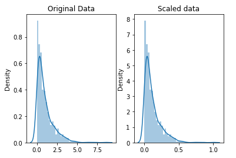


**Normalization** : 일반적으로 데이터가 정규 분포를 따른다고 가정하는 머신 러닝이나 통계 기법을 사용할 때 전처리 작업 용도로 사용. LDA(linear discriminanat analysis)나 Gaussian naive Bayes 등이 있음.

```python
from scipy import stats

normalized_data = stats.boxcox(original_data) # original_data의 모든 값이 0보다 커야함

# plot both together to compare
fig, ax=plt.subplots(1,2)
sns.distplot(original_data, ax=ax[0])
ax[0].set_title("Original Data")
sns.distplot(normalized_data[0], ax=ax[1])
ax[1].set_title("Normalized data")
```

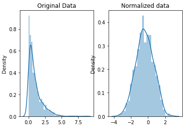


## Parsing Dates

**`datetime`으로 date column을 변경하기**

```python
import pandas as pd

pd.to_datetime(df['date'], format="%m/%d/%y")
```

- 1/17/07의 format은 "%m/%d/%Y"
- 17-1-2007의 format은 "%d-%m-%Y"
- `infer_datetime_format=True` 옵션으로 자동으로 포맷을 찾을 수 있을 수도 있으나 1. 항상 제대로 된 포맷을 찾을 수 있다고 보장할 수 없으며 2. 속도가 느리다.


## Character Encodings

어떤 것으로 인코딩되었는지 확인하는 방법

```python
import chardet

# look at the first ten thousand bytes to guess the character encoding
with open("filename.csv", 'rb') as rawdata:
    result = chardet.detect(rawdata.read(10000))

# check what the character encoding might be
print(result)
```

```
{'encoding': 'Windows-1252', 'confidence': 0.73, 'language': ''}
```

때로는 10000 줄만 읽어서 안 되므로 더 큰 값을 넣어 확인할 필요도 있다.


## Inconsistent Data Entry

데이터에 일관성이 없는 경우에 데이터를 처리하는 방법

- 아래 예시에서 같은 독일이라도 ' Germany', 'Germany', germany'의 세 종류가 있고 한국도 'South Korea'와 'SouthKorea' 두 종류가 있다.

```python
countries = professors['Country'].unique()

countries.sort()
countries
```

```
array([' Germany', ' New Zealand', ' Sweden', ' USA', 'Australia',
       'Austria', 'Canada', 'China', 'Finland', 'France', 'Greece',
       'HongKong', 'Ireland', 'Italy', 'Japan', 'Macau', 'Malaysia',
       'Mauritius', 'Netherland', 'New Zealand', 'Norway', 'Pakistan',
       'Portugal', 'Russian Federation', 'Saudi Arabia', 'Scotland',
       'Singapore', 'South Korea', 'SouthKorea', 'Spain', 'Sweden',
       'Thailand', 'Turkey', 'UK', 'USA', 'USofA', 'Urbana', 'germany'],
      dtype=object)
```

1. 직접 수정

```python
# convert to lower case
professors['Country'] = professors['Country'].str.lower()
# remove trailing white spaces
professors['Country'] = professors['Country'].str.strip()
```

```
array(['australia', 'austria', 'canada', 'china', 'finland', 'france',
       'germany', 'greece', 'hongkong', 'ireland', 'italy', 'japan',
       'macau', 'malaysia', 'mauritius', 'netherland', 'new zealand',
       'norway', 'pakistan', 'portugal', 'russian federation',
       'saudi arabia', 'scotland', 'singapore', 'south korea',
       'southkorea', 'spain', 'sweden', 'thailand', 'turkey', 'uk',
       'urbana', 'usa', 'usofa'], dtype=object)
```


2. `fuzzywuzzy` 패키지를 사용하여 유사한 단어를 하나로 합치기

```python
import fuzzywuzzy
from fuzzywuzzy import process

# get the top 10 closest matches to "south korea"
matches = fuzzywuzzy.process.extract("south korea", countries, limit=10, scorer=fuzzywuzzy.fuzz.token_sort_ratio)

matches
```

```
[('south korea', 100),
 ('southkorea', 48),
 ('saudi arabia', 43),
 ('norway', 35),
 ('austria', 33),
 ('ireland', 33),
 ('pakistan', 32),
 ('portugal', 32),
 ('scotland', 32),
 ('australia', 30)]
```


# AI Ethics

## Human-Centered Design for AI

접근법

1. 문제를 정의하기 위한 요구 사항 이해
   - 주변 사람 인터뷰 등을 통한 배경 지식 이해가 필요한 작업
2. AI가 잠재 해결법에 가치를 더해주는지 확인
   - 달성하려고 하는 것이 좋은 결과물을 낸다고 받아들여지는가?
   - 규칙 기반 해결책처럼 AI 시스템이 아닌 방법보다 AI 시스템이 더 효율적인가?
   - AI를 사용하는 일이 지루하고 반복적이거나 집중하기 어려운 일인가?
   - 과거의 비슷한 경험들로부터 AI 해결책이 다른 방법들보다 더 낫다는 것이 증명되어왔는가?
3. AI 시스템이 유발할 부작용을 고려하기
   - 데이터를 다루는 중 개인 정보 보호가 이루어져야함
   - 에세이를 자동으로 평가하는 AI의 경우, 특정 언어에 편중되거나 AI에 맞춰서 내려는 사람들을 조심해야 하는 등
4. AI가 아닌 해결책으로 프로토타입을 시작하기
   - 사람들과 어떻게 상호작용하는지 프로토타입을 통해 관찰, 발전
   - 영화 추천 시스템이라면 다양한 사람들을 모아 직접 추천하는 시스템 프로토타입을 만든 뒤 그걸 기반으로 모델을 발전시키는 등
5. 사람들이 시스템에 도전할 수 있는 방법을 제공(피드백)
   - 어떤 방법으로 추천했는지 설명을 요청
   - 입력하는 정보를 바꿔서 요청
   - 특정 feature를 제거
   - 소셜 미디어를 통해 제품팀과 대화
6. 안전 대책 마련
   - 의도하지 않은 행동을 하는 유저에 대한 감시를 할 수 있는 팀을 만드는 등의 대책이 필요


## Identifying Bias in AI

**Historical bias** : 편향된 데이터(세계의 현 상태)로 학습하여 편향된 모델이 만들어지는 것. 챗봇을 만들 때 욕설이 섞인 데이터로 학습하면 욕설을 뱉는 챗봇이 만들어지는 문제, 높은 직위에 많은 남성이 있다는 이유로 남성만 채용하는 AI 문제 등

**Representation bias** : 균등하지 못한 데이터로 학습하여 편향된 모델이 만들어지는 것. 얼굴 인식 모델을 만들 때 백인 얼굴 데이터로 학습하여 흑인 얼굴이 인식이 되지 않는 문제, 휴대 전화 데이터를 수집할 때 노인층의 데이터가 적어 대표성에 문제가 생기는 등

**Measurement bias** : 그룹 간 정확도의 차이를 보일 때 나타나는 것

**Aggregation bias** : 특정 그룹에는 성능이 좋으나 나머지에는 좋지 않을 때

**Evaluation bias** : 모델을 평가할 때 벤츠마크 데이터가 모델이 사용할 모집단을 나타내지 않는 경우

**Deployment bias** : 의도한 바와 다르게 모델이 사용되는 문제


## AI Fairness

다양한 기준이 있지만 4가지만 소개(대출 허용/대학 입학 등의 상황을 가정)

1. **Demographic parity / statistical parity** : 데이터와 같은 구성비로 사람을 선발하는 모델. 남:여가 6:4인 지원자 데이터에서 6:4로 사람을 선발하는 등


20명의 지원자 중 50%가 A그룹이므로 승인된 50%도 A그룹 지원자


2. **Equal oppotunity** : 구성비와 관계 없이 동일한 비율(TPR/민감도)로 선발하는 모델


A와 B 모두 같은 TPR을 가짐


3. **Equal accuracy** : 구성비와 관계 없이 동일한 정확도를 가지는 모델


A와 B 모두 같은 정확도를 가짐


4. **Group unaware / "Fairness through unawareness"** : 성별, 나이, 인종 등 그룹을 특정지을 수 있는 데이터를 제거하고 학습한 모델. 특정 인종이 모여사는 주소지도 제거해야할 대상이 될 수 있다.

```python
from sklearn.metrics import confusion_matrix, ConfusionMatrixDisplay
import matplotlib.pyplot as plt

# Function to plot confusion matrix
def plot_confusion_matrix(estimator, X, y_true, y_pred, display_labels=["Deny", "Approve"],
                          include_values=True, xticks_rotation='horizontal', values_format='',
                          normalize=None, cmap=plt.cm.Blues):
    cm = confusion_matrix(y_true, y_pred, normalize=normalize)
    disp = ConfusionMatrixDisplay(confusion_matrix=cm, display_labels=display_labels)
    return cm, disp.plot(include_values=include_values, cmap=cmap, xticks_rotation=xticks_rotation,
                     values_format=values_format)

# Function to evaluate the fairness of the model
def get_stats(X, y, model, group_one, preds):
        
    y_zero, preds_zero, X_zero = y[group_one==False], preds[group_one==False], X[group_one==False]
    y_one, preds_one, X_one = y[group_one], preds[group_one], X[group_one]
    
    print("Total approvals:", preds.sum())
    print("Group A:", preds_zero.sum(), "({}% of approvals)".format(round(preds_zero.sum()/sum(preds)*100, 2)))
    print("Group B:", preds_one.sum(), "({}% of approvals)".format(round(preds_one.sum()/sum(preds)*100, 2)))
    
    print("\nOverall accuracy: {}%".format(round((preds==y).sum()/len(y)*100, 2)))
    print("Group A: {}%".format(round((preds_zero==y_zero).sum()/len(y_zero)*100, 2)))
    print("Group B: {}%".format(round((preds_one==y_one).sum()/len(y_one)*100, 2)))
    
    cm_zero, disp_zero = plot_confusion_matrix(model, X_zero, y_zero, preds_zero)
    disp_zero.ax_.set_title("Group A")
    cm_one, disp_one = plot_confusion_matrix(model, X_one, y_one, preds_one)
    disp_one.ax_.set_title("Group B")
    
    print("\nSensitivity / True positive rate:")
    print("Group A: {}%".format(round(cm_zero[1,1] / cm_zero[1].sum()*100, 2)))
    print("Group B: {}%".format(round(cm_one[1,1] / cm_one[1].sum()*100, 2)))
    
# Evaluate the model    
get_stats(X_test, y_test, model_baseline, X_test["Group"]==1, preds_baseline)
```

그룹마다 허용치(threshold)를 다르게 두어 parity를 조절할 수 있다. A 그룹은 0.11만 넘어도 허용, B 그룹은 0.99를 넘지 못하면 불허 등

```python
# Change the value of zero_threshold to hit the objective
zero_threshold = 0.11
one_threshold = 0.99

# Evaluate the model
test_probs = model_unaware.predict_proba(X_test_unaware)[:,1]
preds_approval = (((test_probs>zero_threshold)*1)*[X_test["Group"]==0] + ((test_probs>one_threshold)*1)*[X_test["Group"]==1])[0]
get_stats(X_test, y_test, model_unaware, X_test["Group"]==1, preds_approval)
```


## Model Cards

**Model Card** : 머신 러닝 모델에 대한 중요한 정보를 담은 짧은 문서로써 청중들에게 투명성을 제공하는 역할을 한다.

예시 : [Open AI’s model card for GPT-3](https://github.com/openai/gpt-3/blob/master/model-card.md), [Model Card - Smiling Detection in Images](https://github.com/Kaggle/learntools/blob/master/notebooks/ethics/pdfs/smiling_in_images_model_card.pdf), [Model Card - Toxicity in Text](https://github.com/Kaggle/learntools/blob/master/notebooks/ethics/pdfs/toxicity_in_text_model_card.pdf)

청중은 모델의 역할에 따라 달라질 수 있으며 많이 읽을 층을 타겟으로 쓰는 것이 좋다. 누구나 쉽게 이해할 수 있는 수준과 기술적인 정보 사이에 균형이 잘 맞아야 한다.

**포함해야 할 내용** : 더 추가하거나 뺄 수도 있다.

1. **Model Details**
   - 개발자, 모델 버전 등의 배경 정보
2. **Intended Use**
   - 범위 안 사용 사례
   - 예상되는 유저층
   - 범위 밖 사용 사례
3. **Factors**
   - 모델의 성능에 영향을 미치는 요인
   - 웃는 모습을 찾는다면 나이, 성별 등 인구통계적 요소나 밝은 곳이나 어두운 곳, 카메라 특성 등의 환경적 요소 등
4. **Metrics**
   - 모델의 성능을 측정하기 위하여 어떤 메트릭을 썼는가? 그리고 왜 그것을 골랐는가?
     - **분류 문제**의 잠재 에러 타입에는 FPR(False Positive Rate), FNR(False Negative Rate), FDR(False Discovery Rate) 그리고 FOR(False Omission Rate)이 있으며 사용 사례에 따라 각각의 중요성이 달라짐
     - **회귀 문제**는 그룹에 걸쳐 모델 성능을 평가
5. **Evaluation Data**
   - 모델을 평가하는 데 어떤 데이터셋을 사용했는지, 가능하다면 데이터셋을 제공
   - 모델을 평가하는 데 왜 그 데이터셋을 사용했는지
   - 데이터셋이 일반적인 사용 사례, 예상 테스트 사례 및/또는 도전적 사례를 대표하는지
6. **Training Data**
   - 모델 학습에 어떤 데이터를 사용했는지
7. **Quantitative Analyses**
   - 선택한 메트릭에서 어떤 성능이 나왔는지
   - 중요한 요소나 요소 간 상호작용에 의해 어떻게 성능이 바뀌는지(그룹마다 성능의 차이가 어떤지)
8. **Ethical Considerations**
   - 모델을 학습하기 위한 민감 데이터, 인간의 삶, 건강, 안전 등에 영향을 주는지, 그 위험성을 줄일 방법, 어떤 위험성이 있을지 등 윤리적으로 고려해야할 사항을 알려줘야 함
9. **Caveats and Recommendations**
   - 위 사항들 외에 언급해야할 것들


# Geospatial Analysis

## Reading and ploting data

[shapefile](https://en.wikipedia.org/wiki/Shapefile), [GeoJSON](https://en.wikipedia.org/wiki/GeoJSON), [KML](https://en.wikipedia.org/wiki/Keyhole_Markup_Language), [GPKG](https://en.wikipedia.org/wiki/GeoPackage) 등 다양한 파일 포맷이 있으나 `geopandas` 라이브러리의 `read_file()` 함수를 사용하면 모두 불러올 수 있다.

```python
import geopandas as gpd

full_data = gpd.read_file('filename.shp')
```

`geometry` column에는 크게 `Point`, `LineString`, `Polygon` class가 있다.


가장 간단하게 그래프를 그리는 방법은 `plot()` 메서드를 이용하는 것이다.

```python
# Define a base map with county boundaries
ax = counties.plot(figsize=(10,10), color='none', edgecolor='gainsboro', zorder=3)

# Add wild lands, campsites, and foot trails to the base map
wild_lands.plot(color='lightgreen', ax=ax)
campsites.plot(color='maroon', markersize=2, ax=ax)
trails.plot(color='black', markersize=1, ax=ax)
```

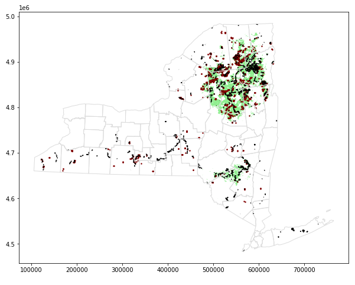


geopandas에서 세계 지도를 자체적으로 지원하므로 잘 이용하면 좋을 것 같다.

```python
world_filepath = gpd.datasets.get_path('naturalearth_lowres')
world = gpd.read_file(world_filepath)

ax = world.plot(figsize=(20,20), color='whitesmoke', linestyle=':', edgecolor='black')
world_loans.plot(ax=ax, markersize=2)
```

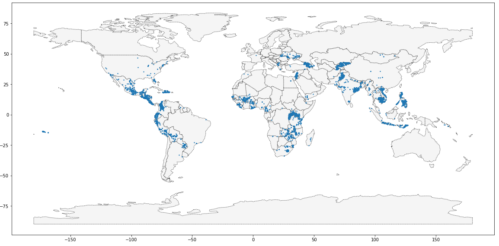


## Coordinate Reference System

구인 지구를 평면으로 바꾸는 좌표계에는 여러 가지가 있으며 이를 CRS라고 부르며 EPSG로 참조된다.

geopandas가 아닌 pandas로 csv 파일을 불러올 때는 crs를 설정해줘야 하며 위도, 경도 좌표계는 EPSG 4326을 사용한다.

```python
# Create a DataFrame with health facilities in Ghana
facilities_df = pd.read_csv("../input/geospatial-learn-course-data/ghana/ghana/health_facilities.csv")

# Convert the DataFrame to a GeoDataFrame
facilities = gpd.GeoDataFrame(facilities_df, geometry=gpd.points_from_xy(facilities_df.Longitude, facilities_df.Latitude))

# Set the coordinate reference system (CRS) to EPSG 4326
facilities.crs = {'init': 'epsg:4326'}
```

- pandas로 csv 파일을 읽어들인 뒤 `gpd.GeoDataFrame()`을 이용하여 GeoDataFrame으로 변환
- `gpd.points_from_xy()` 함수는 경도와 위도를 받아 `Point`로 내뱉는다.


여러 지리 파일들을 plot 할 때 좌표계가 같아야 한다. 이 때 좌표계를 바꾸기 위해 `.to_crs()` 메서드를 이용하며 epsg를 동일하게 맞춰주어야 한다.

```python
ax = regions.plot(figsize=(8,8), color='whitesmoke', linestyle=':', edgecolor='black')
facilities.to_crs(epsg=32630).plot(markersize=1, ax=ax)
```

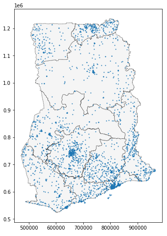


`to_crs()` 메서드는 "geometry" column에만 적용된다. (latitude나 longitude 등의 column에는 적용되지 않는다.)


EPSG 코드를 사용하여 변환이 이루어지지 않는 경우 CRS의 "proj4 string"으로 변환할 수 있다.

```python
# Change the CRS to EPSG 4326
regions.to_crs("+proj=longlat +ellps=WGS84 +datum=WGS84 +no_defs").head()
```


geometry column의 각 값이 Point인 경우 `x`, `y`를 가져올 수 있고 LineString은 `length`, Polygon은 `area`를 가져올 수 있다.

LineString은 Point의 list를 받아 생성할 수 있다.

```python
# GeoDataFrame showing path for each bird
path_df = birds.groupby("tag-local-identifier")['geometry'].apply(list).apply(lambda x: LineString(x)).reset_index()
path_gdf = gpd.GeoDataFrame(path_df, geometry=path_df.geometry)
path_gdf.crs = {'init' :'epsg:4326'}
```


## Interactive Maps

**folium**으로 지도를 띄울 수 있다.

```python
import folium

# Create a map
m_1 = folium.Map(location=[lat, lon], tiles='openstreetmap', zoom_start=10)

# Display the map
m_1
```

- `location` : 지도의 중심
- `tiles` : openstreetmap 외에 다양한 옵션이 있다. ([링크](https://github.com/python-visualization/folium/tree/main/folium/templates/tiles))
- `zoom_start` : 확대 정도


**Marker**로 지점을 표시할 수 있다.

```python
from folium import Marker

# Create a map
m_2 = folium.Map(location=[42.32,-71.0589], tiles='cartodbpositron', zoom_start=13)

# Add points to the map
for idx, row in daytime_robberies.iterrows():
    Marker([row['Lat'], row['Long']]).add_to(m_2)

# Display the map
m_2
```


**MarkerCluster**로 Marker들을 한데 모아 개수로 표시해줄 수 있다.

```python
from folium.plugins import MarkerCluster

# Create the map
m_3 = folium.Map(location=[42.32,-71.0589], tiles='cartodbpositron', zoom_start=13)

# Add points to the map
mc = MarkerCluster()
for idx, row in daytime_robberies.iterrows():
    if not math.isnan(row['Long']) and not math.isnan(row['Lat']):
        mc.add_child(Marker([row['Lat'], row['Long']]))
m_3.add_child(mc)

# Display the map
m_3
```


**Circle**로 Marker 대신 원(또는 점)으로 나타낼 수 있다.

```python
from folium import Circle

# Create a base map
m_4 = folium.Map(location=[42.32,-71.0589], tiles='cartodbpositron', zoom_start=13)

def color_producer(val):
    if val <= 12:
        return 'forestgreen'
    else:
        return 'darkred'

# Add a bubble map to the base map
for i in range(0,len(daytime_robberies)):
    Circle(
        location=[daytime_robberies.iloc[i]['Lat'], daytime_robberies.iloc[i]['Long']],
        radius=20,
        color=color_producer(daytime_robberies.iloc[i]['HOUR'])).add_to(m_4)

# Display the map
m_4
```


**HeatMap**으로 density(개수)를 지도에 표시할 수 있다.

```python
from folium.plugins import HeatMap

# Create a base map
m_5 = folium.Map(location=[42.32,-71.0589], tiles='cartodbpositron', zoom_start=12)

# Add a heatmap to the base map
HeatMap(data=crimes[['Lat', 'Long']], radius=10).add_to(m_5)

# Display the map
m_5
```


**Choropleth**로 각 구역(Polygon)을 색칠할 수 있다.

```python
from folium import Choropleth

# GeoDataFrame with geographical boundaries of Boston police districts
districts_full = gpd.read_file('../input/geospatial-learn-course-data/Police_Districts/Police_Districts/Police_Districts.shp')
districts = districts_full[["DISTRICT", "geometry"]].set_index("DISTRICT")

# Number of crimes in each police district
plot_dict = crimes.DISTRICT.value_counts()

# Create a base map
m_6 = folium.Map(location=[42.32,-71.0589], tiles='cartodbpositron', zoom_start=12)

# Add a choropleth map to the base map
Choropleth(geo_data=districts.__geo_interface__, 
           data=plot_dict, 
           key_on="feature.id", 
           fill_color='YlGnBu', 
           legend_name='Major criminal incidents (Jan-Aug 2018)'
          ).add_to(m_6)

# Display the map
m_6
```

- `geo_data`는 GeoJSON FeatureCollection 형태로 된 boundary를 필요로 하며, 위 코드에서는 `__geo_interface__` 속성으로 GeoDataFrame을 GeoJSON FeatureCollection으로 변환하였다.
- `data`는 각 지역에 할당할 값
- `key_on`은 geo_data와 data를 이어주는 column을 뜻하며, 위 코드에서는 index끼리 묶기 위하여 `feature.id`를 사용


## Manipulating Geospatial Data

**Geocoding**을 사용하기 위해 `geopy` 라이브러리를 이용, 랜드 마크 등 고유 명사나 주소를 string으로 입력하면 끝.

```python
from geopy.geocoders import Nomiatim

geolocator = Nominatim(user_agent="kaggle_learn")
location = geolocator.geocode("Pyramid of Khufu")

print(location.point)
print(location.address)

"""
29 58m 44.9758s N, 31 8m 3.17634s E
هرم خوفو, شارع ابو الهول السياحي, نزلة البطران, الجيزة, محافظة الجيزة, 12556, مصر
"""
```


```python
point = location.point
print("Latitude:", point.latitude)
print("Longitude:", point.longitude)

"""
Latitude: 29.97915995
Longitude: 31.134215650388754
"""
```


이를 이용하여 null값을 채울 수 있다.

```python
# Create the geocoder
geolocator = Nominatim(user_agent="kaggle_learn")

def my_geocoder(row):
    point = geolocator.geocode(row).point
    return pd.Series({'Latitude':point.latitude, 'Longitude':point.longitude})

berkeley_locations = rows_with_missing.apply(lambda x: my_geocoder(x['Address']), axis=1)
starbucks.update(berkeley_locations)
```

- pandas의 update는 index와 column에 맞춰 값을 바꿔준다.


**sjoin**을 이용하여 두 GeoDataFrame을 합칠 수 있다.

```python
european_universities = gpd.sjoin(universities, europe)
```

- `how` : 기본값은 `inner`
- `op` : 결합할 방법으로 기본값은 `intersects`이며 `contains`와 `within`이 있다. `geometry` column이 서로 교차하는지, 어느 한 쪽이 다른 한 쪽을 포함하는지 등을 확인하여 결합한다.


## Proximity Analysis

한 지점과 다른 지점 사이의 거리 재기

```python
# Select one release incident in particular
recent_release = releases.iloc[360]

# Measure distance from release to each station
distances = stations.geometry.distance(recent_release.geometry)
```

```python
# 평균 거리
distances.mean()

# 최소 거리
distances.min()
stations.iloc[distances.idxmin()]
```


**buffer**를 이용하여 한 지점을 기준으로 원형 폴리곤 생성

```python
# crs가 feet 단위이고 1마일=5280피트이므로
two_mile_buffer = stations.geometry.buffer(2*5280)
```

```python
from folium import GeoJson

# Plot each polygon on the map
# 지도에 넣기 위해 위경도 좌표계로 변환하기
GeoJson(two_mile_buffer.to_crs(epsg=4326)).add_to(m)
```


모든 Polygon을 하나로 합치기

```python
my_union = two_mile_buffer.geometry.unary_union
```

```python
# 지점이 포함되는지 확인
my_union.contains(releases.iloc[360].geometry)
```


원을 그려 범위 안에 들어오지 않는 좌표들을 가져오기

```python
coverage = gpd.GeoDataFrame(geometry=hospitals.geometry).buffer(10000) # m 단위이므로 10km
my_union = coverage.geometry.unary_union
outside_range = collisions.loc[~collisions["geometry"].apply(lambda x: my_union.contains(x))]
```


# Machine Learning Explinability

## Use Cases for Model Insights

- 모델이 데이터 속에서 어떤 특성을 가장 중요하다고 보았는가?
- 모델의 단일 예측에서 각 특성은 예측 결과에 어떤 영향을 미치는가?
- 큰 그림 관점에서 봤을 때 각 특성이 모델의 예측에 어떤 영향을 미치는가?

위와 같은 인사이트를 통해 많은 용례를 얻을 수 있다.

- **Dubugging**
- **Informing Feature Engineering** : feature의 숫자가 많을수록 중요해진다.
- **Directing Future Data Collection** : 모든 데이터를 수집하는 것이 아니므로, 인사이트를 통해 새로운 데이터를 수집하는 결정을 내릴 수 있다.
- **Informing Human Decision-Making**
- **Building Trust**


## Permutation Importance

특성의 중요도를 나타내는 개념을 **feature importance**라고 하며 그 중 **Permutation Importance**의 장점은

- 계산이 빠르다
- 널리 사용되며 이해된다
- feature importance 척도가 가지는 속성과 일치한다.

Permutation importance는 모델이 만들어진 뒤에 계산되며 아이디어는 "하나의 feature를 랜덤하게 섞었을 때 정확도 등의 지표가 어떻게 변할까?"이다. 진행 과정은 다음과 같다.

1. 훈련된 모델을 가져온다.
2. 하나의 열을 정해 랜덤으로 섞고 모델로 예측하여 원래의 손실 함수와 비교하여 얼마나 성능이 저하되었는지를 중요도 지표로 삼는다.
3. 원래 데이터로 복구시킨 후 다른 열에 대하여 2번 과정을 반복한다.

**eli5** 라이브러리를 이용하여 구할 수 있다.

```python
import eli5
from eli5.sklearn import PermutationImportance

perm = PermutationImportance(my_model, random_state=1).fit(val_X, val_y)
eli5.show_weights(perm, feature_names = val_X.columns.tolist())
```

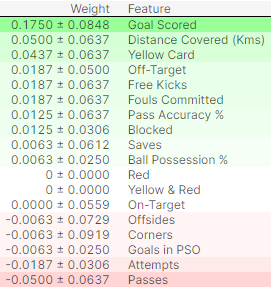

해석 방법

- 위에 있을 수록 중요한 특성이다.
- weight는 섞인 후에 모델의 성능이 얼마나 떨어졌는지를 알려주는 것이며(위 경우에는 정확도) ± 뒤의 숫자는 랜덤으로 섞었기 때문에 발생한 무작위성에 의해 어느 정도까지 바뀌는지 알려주는 것이다.
- 값이 음수가 나오는 것은 작은 데이터셋에서 흔히 등장한다.


## Partial Plots

Feature importance가 어떤 변수가 예측에 가장 영향을 주는지를 보여준다면 partial dependence는 변수가 예측에 *어떻게* 영향을 주는지를 보여준다.

Feature importance와 마찬가지로 모델이 훈련된 뒤에 계산되며 여러 행을 이용, 특정 열의 값이 변화할 때 어떻게 변화하는지를 그래프로 나타내준다.

**pdpbox** 라이브러리를 이용하여 구할 수 있다.

```python
from matplotlib import pyplot as plt
from pdpbox import pdp, get_dataset, info_plots

# Create the data that we will plot
pdp_goals = pdp.pdp_isolate(model=tree_model, dataset=val_X, model_features=feature_names, feature='Goal Scored')

# plot it
pdp.pdp_plot(pdp_goals, 'Goal Scored')
plt.show()
```

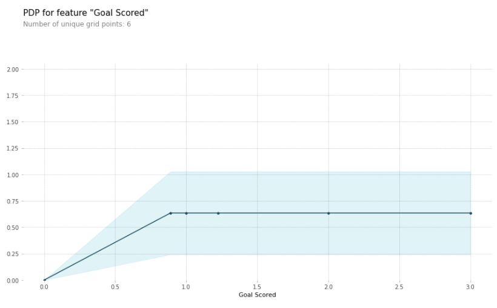

해석 방법

- 파란색 실선은 가장 왼쪽 값 또는 기준값으로부터 예측 값의 변화를 뜻하며 칠해진 부분은 신뢰구간을 뜻함

두 개의 feature의 교호 작용을 확인할 수도 있다.

```python
# Similar to previous PDP plot except we use pdp_interact instead of pdp_isolate and pdp_interact_plot instead of pdp_isolate_plot
features_to_plot = ['Goal Scored', 'Distance Covered (Kms)']
inter1  =  pdp.pdp_interact(model=tree_model, dataset=val_X, model_features=feature_names, features=features_to_plot)

pdp.pdp_interact_plot(pdp_interact_out=inter1, feature_names=features_to_plot, plot_type='contour')
plt.show()
```

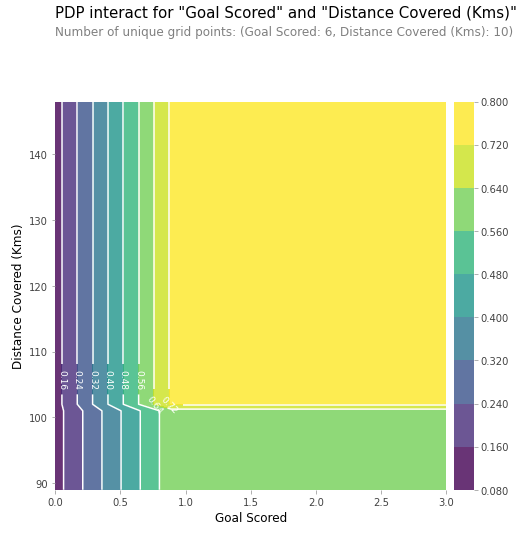

**주의사항**

- Partial plot을 했을 때 `feat_a`가 `feat_b`보다 기울기가 더 크다면 permutation importance도 `feat_a`가 더 클까?
  - 답은 아니다. `feat_a`의 거의 모든 값이 동일하다면 `feat_a`가 변함에 따라 예측 값도 변화하더라도 그 양이 적기 때문에 permutation importance는 작을 것이다.
- 그 반대로 partial plot 결과 기울기가 0이라도 permutation importance는 클 수 있다.

```python
import numpy as np
from numpy.random import rand
import eli5
from eli5.sklearn import PermutationImportance

n_samples = 20000

# Create array holding predictive feature
X1 = 4 * rand(n_samples) - 2
X2 = 4 * rand(n_samples) - 2
# Create y
y = X1 * X2


# create dataframe because pdp_isolate expects a dataFrame as an argument
my_df = pd.DataFrame({'X1': X1, 'X2': X2, 'y': y})
predictors_df = my_df.drop(['y'], axis=1)

my_model = RandomForestRegressor(n_estimators=30, random_state=1).fit(predictors_df, my_df.y)


pdp_dist = pdp.pdp_isolate(model=my_model, dataset=my_df, model_features=['X1', 'X2'], feature='X1')
pdp.pdp_plot(pdp_dist, 'X1')
plt.show()

perm = PermutationImportance(my_model).fit(predictors_df, my_df.y)

# show the weights for the permutation importance you just calculated
eli5.show_weights(perm, feature_names = ['X1', 'X2'])
```

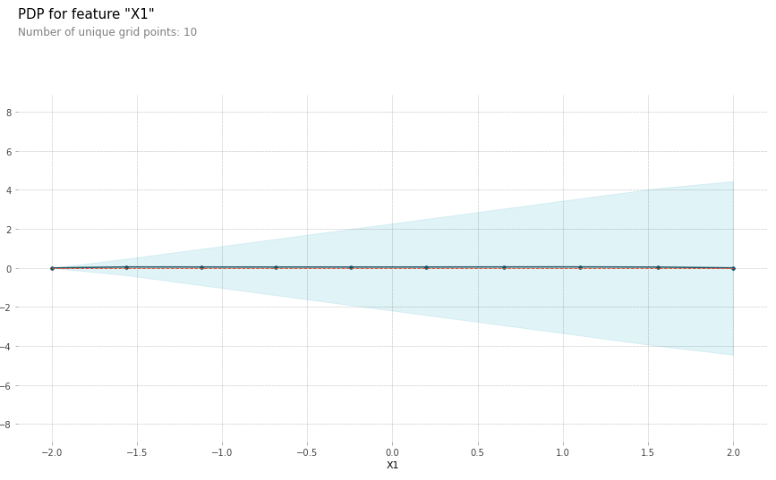

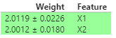


## SHAP Values

SHapley Additive exPlanations의 약자로 특정 feature에 대하여 기준 값을 사용했을 때와 비교하여 예측값을 비교하여 해석한다.

**shap** 라이브러리를 이용하여 구할 수 있다.

```python
import shap  # package used to calculate Shap values

row_to_show = 5
data_for_prediction = val_X.iloc[row_to_show]  # use 1 row of data here. Could use multiple rows if desired

# Create object that can calculate shap values
explainer = shap.TreeExplainer(my_model)

# Calculate Shap values
shap_values = explainer.shap_values(data_for_prediction)


shap.initjs()
shap.force_plot(explainer.expected_value[1], shap_values[1], data_for_prediction)
```

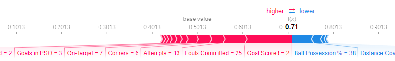

- `shap.TreeExplainer` : 트리 모델에 사용
- `shap.DeepExplainer` : 딥러닝 모델에 사용
- `shap.KernelExplainer` : 모든 모델에 사용 가능하지만 속도가 느리고 정확한 값 대신 추정값을 냄

해석 방법

- 기준값 0.5013, 기대치 0.71. 기준값은 E(y_hat)으로 예측 값의 평균이라고 함.
- 빨간색은 예측값을 증가하게 하는 feature, 파란색은 감소하게 하는 feature, 길이는 영향의 크기.
- 빨간색의 길이-파란색 길이 = 기대치-기준값


Permutation Importance로 어떤 feature의 영향이 가장 큰 지 확인 > 해당 feature에 대하여 Partial Plot을 확인 및 영향이 작은 feature와 비교 > 확인할 특정 데이터에 대하여 SHAP Value 확인


## Advanced Uses of SHAP Values

Permutation importance의 단점은 feature가 어떻게 영향을 주는지 알 수 없다는 점이다. 예를 들어 값이 중간 정도라고 할 때

- 몇몇 예측에서 큰 영향을 주고 나머지는 적은 영향을 주는지
- 전체적으로 중간 정도의 영향을 주는지

알 방법이 없다는 단점이 있다.


**shap** 라이브러리를 이용하여 feature가 전체적으로 어떻게 영향을 줬는지 확인할 수 있다.

```python
import shap  # package used to calculate Shap values

# Create object that can calculate shap values
explainer = shap.TreeExplainer(my_model)

# calculate shap values. This is what we will plot.
# Calculate shap_values for all of val_X rather than a single row, to have more data for plot.
shap_values = explainer.shap_values(val_X)

# Make plot. Index of [1] is explained in text below.
shap.summary_plot(shap_values[1], val_X)
```

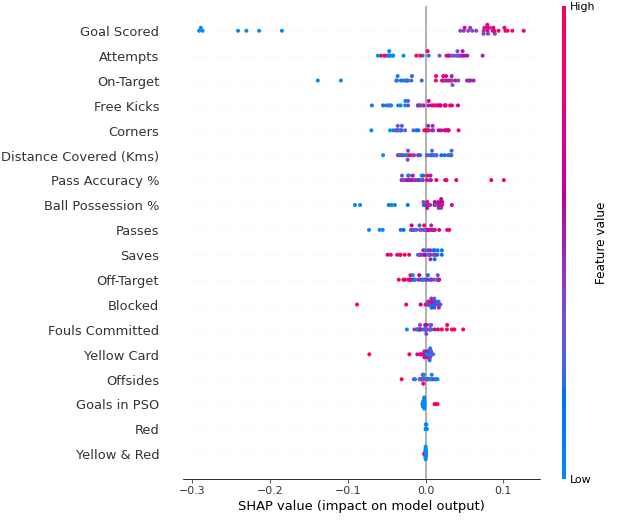

- `shap_values[1]` : 예측 값이 True를 기준으로 plot
- 시간이 오래 걸리는 편이지만 예외적으로 `xgboost`에 최적화되어 있어 xgboost에는 비교적 빠르다.

해석 방법

- 세로축 : feature
- 색 : 데이터셋의 특정 행의 값이 각 열에서 큰지 작은지를 나타냄
- 가로축 : SHAP value로 얼마나 영향을 줬는지를 나타냄
- `Red`와 `Yellow & Red`는 영향을 거의 주지 않음
- `Yellow Card`는 영향을 거의 주지 않는 편이지만 에외적인(값이 높으면서 예측에 마이너스 영향을 주는) 상황이 있다.
- 득점이 높을수록 양의 영향, 낮을수록 음의 영향을 준다.


feature간 상호작용도 확인할 수 있다.

```python
import shap  # package used to calculate Shap values

# Create object that can calculate shap values
explainer = shap.TreeExplainer(my_model)

# calculate shap values. This is what we will plot.
shap_values = explainer.shap_values(X)

# make plot.
shap.dependence_plot('Ball Possession %', shap_values[1], X, interaction_index="Goal Scored")
```

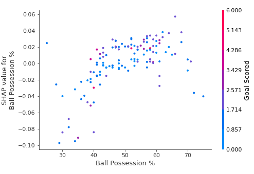

대체적으로 볼 점유율이 높으면 SHAP가 증가하는 걸 볼 수 있으나 득점이 적으면 음수값을 가짐을 확인할 수 있다.


# Natural Language Processing

## Intro to NLP

**spaCy** 라이브러리를 이용하여 영어 NLP 처리를 할 수 있다.

```python
import spacy
nlp = spacy.load('en_core_web_sm') # 영어 모델
```


**Tokenizing**

```python
doc = nlp("Tea is healthy and calming, don't you think?")

for token in doc:
    print(token)
    
"""
Tea
is
healthy
and
calming
,
do
n't
you
think
?
"""
```


원형과 불용어인지 파악할 수 있다.

- `token.lemma_` : 단어(토큰)의 원형을 알려줌
- `token.is_stop` : 단어(토큰)가 불용어인지 True/False로 반환
  - 불용어를 없애는 것이 모델의 예측력을 높일 수도 있으나 항상 그런 것만은 아니다.


`PhraseMatcher`를 이용하여 패턴 매치도 가능하다. (정규식을 이용할 수도 있음)

```python
from spacy.matcher import PhraseMatcher
matcher = PhraseMatcher(nlp.vocab, attr='LOWER') # 소문자로 매치

# 찾을 패턴 만들기
terms = ['Galaxy Note', 'iPhone 11', 'iPhone XS', 'Google Pixel']
patterns = [nlp(text) for text in terms]
matcher.add("TerminologyList", patterns)

# Borrowed from https://daringfireball.net/linked/2019/09/21/patel-11-pro
text_doc = nlp("Glowing review overall, and some really interesting side-by-side "
               "photography tests pitting the iPhone 11 Pro against the "
               "Galaxy Note 10 Plus and last year’s iPhone XS and Google Pixel 3.") 
matches = matcher(text_doc)
print(matches)


"""
[(3766102292120407359, 17, 19), (3766102292120407359, 22, 24), (3766102292120407359, 30, 32), (3766102292120407359, 33, 35)]
"""
```


결과값은 각각 match id, 구문의 시작과 끝 위치이다.

```python
match_id, start, end = matches[0]
print(nlp.vocab.strings[match_id], text_doc[start:end])

"""
TerminologyList iPhone 11
"""
```


## Text Classification

주로 **Bag of Words**나 **TF-IDF**를 이용하여 분류 예측을 한다.

"Tea is life. Tea is love"와 "Tea is healthy, calming, and delicious" 두 문장을 토큰화하면 `{"tea", "is", "life", "love", "healthy", "calming", "and", "delicious"}`이며 BOW로 표현하면
$$
v_1 = [2 \ 2 \ 1 \ 1 \ 0 \ 0 \ 0 \ 0] \\
v_2 = [1 \ 1 \ 0 \ 0 \ 1 \ 1 \ 1 \ 1]
$$
이다.

1. `spacy` 라이브러리의 `add_pipe`를 이용하여 분류할 수 있다.

```python
import spacy

# Create an empty model
nlp = spacy.blank("en")

# Add the TextCategorizer to the empty model
textcat = nlp.add_pipe("textcat")

# Add labels to text classifier
textcat.add_label("ham")
textcat.add_label("spam")
```


2. spacy가 `{'ham': True, 'spam': False}`처럼 True와 False로 분류할 수 있도록 새롭게 dictionary를 만들어야 한다.

```python
train_texts = spam['text'].values
train_labels = [{'cats': {'ham': label == 'ham',
                          'spam': label == 'spam'}} 
                for label in spam['label']]

train_data = list(zip(train_texts, train_labels))
train_data[:3]

"""
[('Go until jurong point, crazy.. Available only in bugis n great world la e buffet... Cine there got amore wat...',
  {'cats': {'ham': True, 'spam': False}}),
 ('Ok lar... Joking wif u oni...', {'cats': {'ham': True, 'spam': False}}),
 ("Free entry in 2 a wkly comp to win FA Cup final tkts 21st May 2005. Text FA to 87121 to receive entry question(std txt rate)T&C's apply 08452810075over18's",
  {'cats': {'ham': False, 'spam': True}})]
"""
```


3. 학습을 위하여 먼저 `nlp.begin_training()`으로 `optimizer`를 생성한 뒤 `minibatch`를 이용하여 `nlp.update`해준다.

```python
from spacy.util import minibatch
from spacy.training.example import Example

spacy.util.fix_random_seed(1)
optimizer = nlp.begin_training()

# Create the batch generator with batch size = 8
batches = minibatch(train_data, size=8)
# Iterate through minibatches
for batch in batches:
    # Each batch is a list of (text, label) 
    for text, labels in batch:
        doc = nlp.make_doc(text)
        example = Example.from_dict(doc, labels)
        nlp.update([example], sgd=optimizer)
```


4. 위 코드는 epoch=1인 경우이다. 아래처럼 여러 번 반복하여 학습시켜야 하며 batch가 반복할 때마다 다르게 되도록 shuffle 해주는 것이 좋다.

```python
import random

random.seed(1)
spacy.util.fix_random_seed(1)
optimizer = nlp.begin_training()

losses = {}
for epoch in range(10):
    random.shuffle(train_data)
    # Create the batch generator with batch size = 8
    batches = minibatch(train_data, size=8)
    # Iterate through minibatches
    for batch in batches:
        for text, labels in batch:
            doc = nlp.make_doc(text)
            example = Example.from_dict(doc, labels)
            nlp.update([example], sgd=optimizer, losses=losses)
    print(losses)
```


5. 예측을 해본다.

```python
texts = ["Are you ready for the tea party????? It's gonna be wild",
         "URGENT Reply to this message for GUARANTEED FREE TEA" ]
docs = [nlp.tokenizer(text) for text in texts]
    
# Use textcat to get the scores for each doc
textcat = nlp.get_pipe('textcat')
scores = textcat.predict(docs)

print(scores)

"""
[[9.9999440e-01 5.5444802e-06]
 [1.6431263e-04 9.9983561e-01]]
"""
```

```python
# From the scores, find the label with the highest score/probability
predicted_labels = scores.argmax(axis=1)
print([textcat.labels[label] for label in predicted_labels])

"""
['ham', 'spam']
"""
```

또는 한 문장만 분류할 때는 아래와 같은 방법도 된다.

```python
text = "This tea cup was full of holes. Do not recommend."
doc = nlp(text)
print(doc.cats)
```


전체를 모으면 다음과 같다.

```python
import pandas as pd

# 데이터를 불러오기
def load_data(csv_file, split=0.9):
    data = pd.read_csv(csv_file)
    
    # Shuffle data
    train_data = data.sample(frac=1, random_state=7)
    
    texts = train_data.text.values
    labels = [{"POSITIVE": bool(y), "NEGATIVE": not bool(y)}
              for y in train_data.sentiment.values]
    split = int(len(train_data) * split)
    
    train_labels = [{"cats": labels} for labels in labels[:split]]
    val_labels = [{"cats": labels} for labels in labels[split:]]
    
    return texts[:split], train_labels, texts[split:], val_labels

train_texts, train_labels, val_texts, val_labels = load_data('../input/nlp-course/yelp_ratings.csv')


# 모델 생성
import spacy

# Create an empty model
nlp = spacy.blank('en')

# Add the TextCategorizer to the empty model
textcat = nlp.add_pipe('textcat')

# Add labels to text classifier
textcat.add_label("NEGATIVE")
textcat.add_label("POSITIVE")


# 훈련 함수 생성 및 훈련
def train(model, train_data, optimizer, batch_size=8):
    losses = {}
    random.seed(1)
    random.shuffle(train_data)

    for batch in minibatch(train_data, size=batch_size):
        for text, labels in batch:
            doc = nlp.make_doc(text)
            example = Example.from_dict(doc, labels)
            # Update model with texts and labels
            model.update([example], sgd=optimizer, losses=losses)

    return losses

# Fix seed for reproducibility
spacy.util.fix_random_seed(1)
random.seed(1)

# This may take a while to run!
optimizer = nlp.begin_training()
train_data = list(zip(train_texts, train_labels))
losses = train(nlp, train_data, optimizer)
print(losses['textcat'])


# 예측 함수 생성 및 예측 테스트
def predict(nlp, texts): 
    # Use the model's tokenizer to tokenize each input text
    docs = [nlp.tokenizer(text) for text in texts]
    
    # Use textcat to get the scores for each doc
    textcat = nlp.get_pipe('textcat')
    scores = textcat.predict(docs)
    
    # From the scores, find the class with the highest score/probability
    predicted_class = scores.argmax(axis=1)
    
    return predicted_class

texts = val_texts[34:38]
predictions = predict(nlp, texts)

for p, t in zip(predictions, texts):
    print(f"{textcat.labels[p]}: {t} \n")
    
    
# 모델 평가 함수 및 정확도 확인
def evaluate(model, texts, labels):
    """ Returns the accuracy of a TextCategorizer model. 
    
        Arguments
        ---------
        model: ScaPy model with a TextCategorizer
        texts: Text samples, from load_data function
        labels: True labels, from load_data function
    
    """
    # Get predictions from textcat model (using your predict method)
    predicted_class = predict(model, texts)
    # From labels, get the true class as a list of integers (POSITIVE -> 1, NEGATIVE -> 0)
    true_class = [int(label['cats']['POSITIVE']) for label in labels]
    
    # A boolean or int array indicating correct predictions
    correct_predictions = predicted_class == true_class
    
    # The accuracy, number of correct predictions divided by all predictions
    accuracy = correct_predictions.mean()
    
    return accuracy

accuracy = evaluate(nlp, val_texts, val_labels)
print(f"Accuracy: {accuracy:.4f}")
```


## Word Vectors

**Word embedding**은 단어를 벡터로 나타낸 것으로 일반적으로 BOW를 사용한 모델보다 더 좋은 성능을 보인다.

이미 잘 학습된 대용량의 영어 모델이 있으므로 `en_core_web_lg`로 불러올 수 있다.

```python
import numpy as np
import spacy

# Need to load the large model to get the vectors
nlp = spacy.load('en_core_web_lg')

# Disabling other pipes because we don't need them and it'll speed up this part a bit
text = "These vectors can be used as features for machine learning models."
with nlp.disable_pipes():
    vectors = np.array([token.vector for token in  nlp(text)])
```

각 벡터는 300차원이며 문장을 쪼개면 12개의 토큰이므로 12x300의 결과가 나온다.


모델에 학습시키기 위하여 조정이 필요하며 가장 간단한 방법은 평균을 내는 것이며 spaCy에서 `doc.vector`가 계산을 해준다.

```python
import pandas as pd

# Loading the spam data
# ham is the label for non-spam messages
spam = pd.read_csv('../input/nlp-course/spam.csv')

with nlp.disable_pipes():
    doc_vectors = np.array([nlp(text).vector for text in spam.text])
    
doc_vectors.shape

"""
(5572, 300)
"""
```

이후에는 사이킷런 모델이나 xgboost 등의 모델을 이용하여 분류를 할 수 있다.


이러한 word vector를 가지고 코사인 유사도를 이용한 문서 유사도를 구할 수 있다.

```python
def cosine_similarity(a, b):
    return a.dot(b)/np.sqrt(a.dot(a) * b.dot(b))

a = nlp("REPLY NOW FOR FREE TEA").vector
b = nlp("According to legend, Emperor Shen Nung discovered tea when leaves from a wild tree blew into his pot of boiling water.").vector
cosine_similarity(a, b)

"""
0.7030031
"""
```


때로는 문서 전체에 대하여 중심 벡터를 구한 뒤 모든 벡터에서 중심 벡터를 빼고, 그 후 코사인 유사도를 측정한다. 왜냐하면 이미 같은 주제를 가진 문서들 안에서 유사도를 측정하면 대부분 0.8~1.0의 유사도가 측정되므로 중심 벡터라는 경향을 뺀 뒤 측정을 한다.

```python
review_vec = nlp(review).vector

## Center the document vectors
# Calculate the mean for the document vectors, should have shape (300,)
vec_mean = vectors.mean(axis=0)
# Subtract the mean from the vectors
centered = vectors - vec_mean

# Calculate similarities for each document in the dataset
# Make sure to subtract the mean from the review vector
sims = np.array([cosine_similarity(review_vec - vec_mean, vec) for vec in centered])

# Get the index for the most similar document
most_similar = sims.argmax()
```


# Intro to Game AI and Reinforcement Learning

## One-Step Lookahead


Connect Four 게임에는 4조 개 그 이상의 경우의 수가 존재하며 강화학습을 위하여 휴리스틱하게 아래와 같이 점수를 부여한다. (이길 가능성이 높은 상황에 점수를 더 많이 주고 질 가능성이 높은 상황에 점수를 빼앗는다.)


점수가 가장 높게 나온 1번 상황을 다음 행동으로 채택한다. 같은 점수인 상황이 있다면 랜덤하게 뽑는다.


2개가 연결된 상황에도 점수를 부여하면 위의 방식으로 놓을 때와 견주어 약 70%의 승률을 보인다.


## N-Step Lookahead

**Minimax** 알고리즘을 이용

1. 내가 놓음
2. 상대가 놓음
3. 다시 내가 놓음

이런 상황에서 나올 수 있는 모든 경우에서 점수를 계산한 뒤

1. 내가 마지막에 놓았을 때 점수가 최대가 되는 경우를 뽑음
2. 상대가 놓았을 때 상대 입장에서 점수가 최대가 되는, 나에게 있어서 점수가 최소가 되는 경우를 뽑음
3. 다시 점수가 최대가 되는 경우를 뽑음


## Deep Reinforcement Learning

앞서 휴리스틱한 방법으로 점수를 주어 경우를 선택했다면, 강화학습을 통해 상황별로 승률이 더 높은 경우를 선택하도록 학습하도록 한다.

**접근 방법**

- 매 이동마다

  - 이동을 통해 이겼다면 `+1`

  - 잘못된 동작을 한다면 `-10`

  - 상대가 이기는 것을 막지 못해서 졌다면 `-1`

  - 그 외에는 `1/42`

- 최종적으로 받은 보상을 모두 합친다.

  - 예를 들어 총 8번(각 선수마다 4번) 이동하여 승리했다면 `3*(1/42) + 1`
  - 총 11번(상대 6번) 이동하여 패배했다면 `5*(1/42) -1`
  - 무승부를 기록했다면 `21*(1/42)`
  - 총 7번(상대 3번) 이동하고 잘못된 동작을 하여 졌다면 `3*(1/42) - 10`

목표는 이 최종 점수를 최대화하는 신경망의 가중치를 찾는 것이다.


**강화 학습** 알고리즘에는 DQN, A2C, PPO 등 다양한 것들이 있으며 비슷한 절차를 밟아 AI를 만든다.

- 첫 가중치는 랜덤으로 배정한다.
- 새로운 가중치를 넣어가며 게임을 계속 플레이하고, 점수를 더 많이 얻는 방향으로 가중치를 계속 수정해간다.
- `1/42`점을 주는 이유는 알고리즘이 더 쉽게 수렴하도록 하기 위함이며 'temporal credit assignment problem'과 'reward shaping'을 더 공부하면 알 수 있다고 한다.


