# Data Leakage

https://www.kaggle.com/alexisbcook/data-leakage

**데이터 누수**란 **훈련 데이터의 정보를 실제 예측에서 사용할 수 없는 경우** 발생하며 타겟 누수(target leakage)와 훈련-테스트 오염(train-test contamination)이 있다.


## Target Leakage

예측 시점에서 사용할 수 없는 데이터가 데이터 셋에 포함되어 있을 때 발생

| got_pneumonia | age  | weight | male  | took_antibiotic_medicine | ...  |
| :-----------: | :--: | :----: | :---: | :----------------------: | :--- |
|     False     |  65  |  100   | False |          False           | ...  |
|     False     |  72  |  130   | True  |          False           | ...  |
|     True      |  58  |  100   | False |           True           | ...  |

폐렴에 걸렸는지(`got_pneumonia`)를 확인하기 위하여 항생제를 복용하는지(`took_antibiotic_medicine`)를 변수로 사용하는 경우 타겟 누수가 발생했다고 할 수 있다.

왜냐하면 시간 순서 혹은 원인과 결과가 반대이기 때문. 즉 항생제를 복용한 후 폐렴(복용했기 때문에 폐렴)이 아닌, 폐렴이 걸렸기 때문에 항생제를 복용한다고 봐야하기 때문이다.

그러므로 타겟 누수를 방지하려면 타겟 값이 결정된(생성된) 이후 파생된 변수를 제거해야한다.


## Train-Test Contamination

훈련-테스트 데이터로 쪼개기 전 scaling을 하는 경우 등에서 발생

실제 예측을 위한 데이터에 대한 기초 통계 정보(평균, 분산 등)이 없음에도 train_test_split을 하기 전 scaling을 한다는 것 자체가 잘못된 것. 즉, train_test_split 이후 test 데이터는 정말 처음 보는 값으로 생각하고 scaling을 train 데이터에만 적용한 뒤(fit_transform) 이후 test 데이터에 적용(transform)하여야 한다는 것.

같은 논리로, 교차검증을 할 때에도 전체 데이터에 대해 scaling을 하는 것이 아닌, train-validation으로 쪼갠 이후 train 데이터에 fit_transform, validation 데이터에 transform하여야 한다.

이에 대하여 잘 설명해놓은 블로그 : https://blog.naver.com/tjdudwo93/221085844907


# Scatter Plots

## scatterplot

산점도를 확인할 때 사용

```python
sns.scatterplot(data=candy_data, x='sugarpercent', y='winpercent')
```

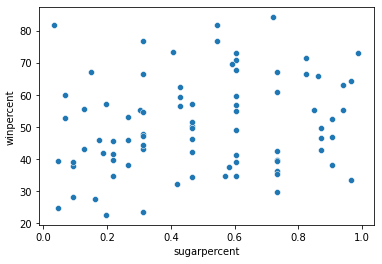


카테고리별로 색을 다르게 하고 싶을 땐 `hue` 파라미터 이용

```python
sns.scatterplot(data=candy_data, x='pricepercent', y='winpercent', hue='chocolate')
```

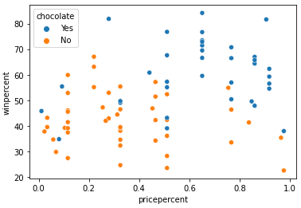


## regplot

산점도에 회귀직선까지 함께 나타내고 싶을 때 사용

```python
sns.regplot(data=candy_data, x='sugarpercent', y='winpercent')
```

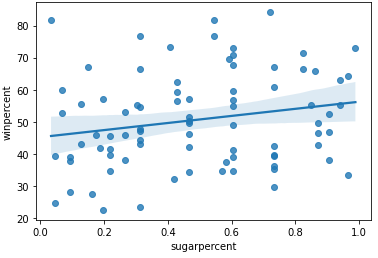


## lmplot

산점도에 회귀직선을 카테고리별로 따로 나타내고 싶을 때 사용

```python
sns.lmplot(data=candy_data, x='pricepercent', y='winpercent', hue='chocolate')
```

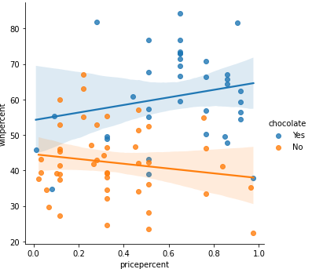


## swarmplot

카테고리 변수마다 수치형 변수가 어떻게 모여있는지 (분포를) 확인하려고 할 때 사용

```python
sns.swarmplot(data=candy_data, x='chocolate', y='winpercent')
```

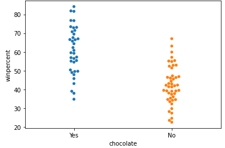


# Distributions

## distplot

값의 분포를 알아보기 위할 때 사용

```python
sns.distplot(a=iris_data['Petal Length (cm)'], kde=False)
```

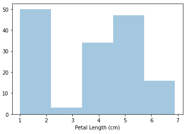


## kdeplot

**kernel density estimate (KDE)**, 값의 분포를 부드러운 곡선으로 나타내기 위할 때 사용

```python
sns.kdeplot(data=iris_data['Petal Length (cm)'], shade=True)
```

- `shade=True` : 곡선 아래 면적을 색칠

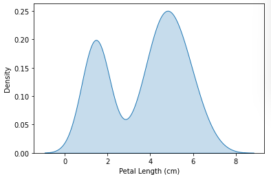


## jointplot

2개의 분포를 겹쳐 등고선을 그리고자 할 때 사용

```python
sns.jointplot(x=iris_data['Petal Length (cm)'], y=iris_data['Sepal Width (cm)'], kind="kde")
```

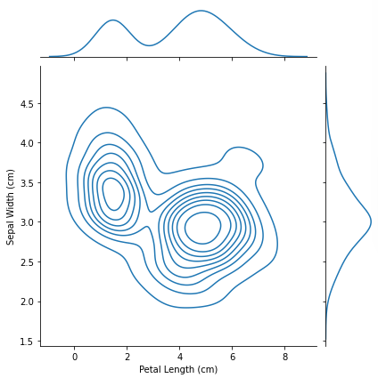


# Custom Styles

```python
sns.set_style("dark")
```

- (1) `"darkgrid"`, (2) `"whitegrid"`, (3) `"dark"`, (4) `"white"`, (5) `"ticks"` 등이 있음


# Creating Features

변수 생성(파생 변수 포함)


## Mathematical Transform

수학적 계산으로 새로운 변수 만들기. 간단한 비율 뿐만 아니라 수학/과학적으로 도출된 수식(원기둥의 부피 등)을 기존 특성으로 계산하여 새로운 특성을 만들기

```python
autos["displacement"] = (
    np.pi * ((0.5 * autos.bore) ** 2) * autos.stroke * autos.num_of_cylinders
)
```


또는 `log`를 취하여 값의 분포를 정규분포 형태로 최대한 가깝게 변형

```python
# If the feature has 0.0 values, use np.log1p (log(1+x)) instead of np.log
accidents["LogWindSpeed"] = accidents.WindSpeed.apply(np.log1p)

# Plot a comparison
fig, axs = plt.subplots(1, 2, figsize=(8, 4))
sns.kdeplot(accidents.WindSpeed, shade=True, ax=axs[0])
sns.kdeplot(accidents.LogWindSpeed, shade=True, ax=axs[1]);
```

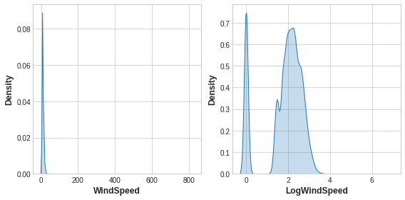


## Counts

특정 조건을 만족하는 변수의 개수를 새로운 특성으로 사용

아래 예시는 값이 0보다 큰 특성의 개수를 세는 것

```python
components = [ "Cement", "BlastFurnaceSlag", "FlyAsh", "Water",
               "Superplasticizer", "CoarseAggregate", "FineAggregate"]
concrete["Components"] = concrete[components].gt(0).sum(axis=1)

concrete[components + ["Components"]].head(10)
```

- `.gt(0)` : 각 위치의 값이 0보다 크면 True, 아니면 False 반환
- `.sum(axis=1)` : 열 방향으로 합

|      | Cement | BlastFurnaceSlag | FlyAsh | Water | Superplasticizer | CoarseAggregate | FineAggregate | Components |
| :--- | :----- | :--------------- | :----- | :---- | :--------------- | :-------------- | :------------ | ---------- |
| 0    | 540.0  | 0.0              | 0.0    | 162.0 | 2.5              | 1040.0          | 676.0         | 5          |
| 1    | 540.0  | 0.0              | 0.0    | 162.0 | 2.5              | 1055.0          | 676.0         | 5          |
| 2    | 332.5  | 142.5            | 0.0    | 228.0 | 0.0              | 932.0           | 594.0         | 5          |
| 3    | 332.5  | 142.5            | 0.0    | 228.0 | 0.0              | 932.0           | 594.0         | 5          |
| 4    | 198.6  | 132.4            | 0.0    | 192.0 | 0.0              | 978.4           | 825.5         | 5          |
| 5    | 266.0  | 114.0            | 0.0    | 228.0 | 0.0              | 932.0           | 670.0         | 5          |
| 6    | 380.0  | 95.0             | 0.0    | 228.0 | 0.0              | 932.0           | 594.0         | 5          |
| 7    | 380.0  | 95.0             | 0.0    | 228.0 | 0.0              | 932.0           | 594.0         | 5          |
| 8    | 266.0  | 114.0            | 0.0    | 228.0 | 0.0              | 932.0           | 670.0         | 5          |
| 9    | 475.0  | 0.0              | 0.0    | 228.0 | 0.0              | 932.0           | 594.0         | 4          |


## Building-Up and Breaking Down Features

값을 분리하여 새로운 특성을 만들거나 여러 특성을 하나의 특성으로 합하는 것

아래는 분리하는 예시

```python
customer[["Type", "Level"]] = (  # Create two new features
    customer["Policy"]           # from the Policy feature
    .str                         # through the string accessor
    .split(" ", expand=True)     # by splitting on " "
                                 # and expanding the result into separate columns
)

customer[["Policy", "Type", "Level"]].head(10)
```

- `.str.split(' ', expand=True)` : `' '` 값을 기준으로 다른 column으로 찢어 놓음

  - `expand=True` : 새로운 열 생성

    - 그러므로 `.str.split(expand=True)[0]`을 하면 새롭게 생성된 열들 중 첫 번째 열이 반환된다.

  - `expand=False` : 값이 리스트 형태로 되어있는 `pd.Series`

    - 예시

      [['Corporate', 'L3'],

       ['Personal', 'L3'],

       ...]

    - 그러므로 `.str.split(expand=False)[0]`을 할 때 첫 번째 값인 `['Corporate', 'L3']`이 반환된다.

  - `n=1` : 여러 개로 찢어질 경우, 맨 앞의 하나만 분리하기

|      | Policy       | Type      | Level |
| :--- | :----------- | :-------- | ----- |
| 0    | Corporate L3 | Corporate | L3    |
| 1    | Personal L3  | Personal  | L3    |
| 2    | Personal L3  | Personal  | L3    |
| 3    | Corporate L2 | Corporate | L2    |
| 4    | Personal L1  | Personal  | L1    |
| 5    | Personal L3  | Personal  | L3    |
| 6    | Corporate L3 | Corporate | L3    |
| 7    | Corporate L3 | Corporate | L3    |
| 8    | Corporate L3 | Corporate | L3    |
| 9    | Special L2   | Special   | L2    |


아래는 합하는 예시

```python
autos["make_and_style"] = autos["make"] + "_" + autos["body_style"]
autos[["make", "body_style", "make_and_style"]].head()
```

|      | make        | body_style  | make_and_style          |
| :--- | :---------- | :---------- | ----------------------- |
| 0    | alfa-romero | convertible | alfa-romero_convertible |
| 1    | alfa-romero | convertible | alfa-romero_convertible |
| 2    | alfa-romero | hatchback   | alfa-romero_hatchback   |
| 3    | audi        | sedan       | audi_sedan              |
| 4    | audi        | sedan       | audi_sedan              |


## Group Transforms

그룹별로 묶어 해당하는 값에 대하여 새로운 특성 생성

아래는 `State`로 묶어`Income`의 평균을 계산한 예

```python
customer["AverageIncome"] = (
    customer.groupby("State")  # for each state
    ["Income"]                 # select the income
    .transform("mean")         # and compute its mean
)

customer[["State", "Income", "AverageIncome"]].head(10)
```

- `.transform('mean')` : 원래의 데이터에 해당하는 값의 열을 추가할 수 있다
  - `max`, `min`, `median`, `var`, `std`, `count` 등의 메서드가 있으며 함수를 직접 생성하여 넣을 수도 있다.

|      | State      | Income | AverageIncome |
| :--- | :--------- | :----- | ------------- |
| 0    | Washington | 56274  | 38122.733083  |
| 1    | Arizona    | 0      | 37405.402231  |
| 2    | Nevada     | 48767  | 38369.605442  |
| 3    | California | 0      | 37558.946667  |
| 4    | Washington | 43836  | 38122.733083  |
| 5    | Oregon     | 62902  | 37557.283353  |
| 6    | Oregon     | 55350  | 37557.283353  |
| 7    | Arizona    | 0      | 37405.402231  |
| 8    | Oregon     | 14072  | 37557.283353  |
| 9    | Oregon     | 28812  | 37557.283353  |


아래는 값의 등장 빈도를 계산한 예

```python
customer["StateFreq"] = (
    customer.groupby("State")
    ["State"]
    .transform("count")
    / customer.State.count()
)

customer[["State", "StateFreq"]].head(10)
```

|      | State      | StateFreq |
| :--- | :--------- | --------- |
| 0    | Washington | 0.087366  |
| 1    | Arizona    | 0.186446  |
| 2    | Nevada     | 0.096562  |
| 3    | California | 0.344865  |
| 4    | Washington | 0.087366  |
| 5    | Oregon     | 0.284760  |
| 6    | Oregon     | 0.284760  |
| 7    | Arizona    | 0.186446  |
| 8    | Oregon     | 0.284760  |
| 9    | Oregon     | 0.284760  |

주의할 점 : train, valid로 나누었을 때 Data Leakage를 주의하여 train에서 생성한 특성을 valid에 붙여야 한다.


# Principal Component Analysis

PCA를 통해 차원 축소, 잡음(노이즈) 제거 등을 할 수도 있고 '이상치 탐지'도 가능하다.

주택 가격 데이터에서 `"GarageArea"`, `"YearRemodAdd"`, `"TotalBsmtSF"`, `"GrLivArea"` feature로 PCA(n_component=4)를 했을 때 각각의 PCA component로 boxplot을 그려보면 다음과 같다.

```python
sns.catplot(
    y="value",
    col="variable",
    data=X_pca.melt(),
    kind='boxen',
    sharey=False,
    col_wrap=2,
);
```

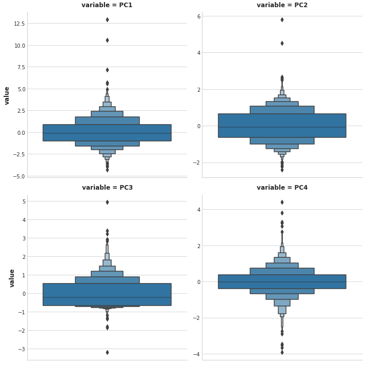


PC1에 대하여 값이 큰 이상치를 뽑았을 때 다음과 같으며

|      | SalePrice | Neighborhood | SaleCondition | GarageArea | YearRemodAdd | TotalBsmtSF | GrLivArea |
| ---: | --------: | -----------: | ------------: | ---------: | -----------: | ----------: | --------- |
| 1498 |    160000 |      Edwards |       Partial |     1418.0 |         2008 |      6110.0 | 5642.0    |
| 2180 |    183850 |      Edwards |       Partial |     1154.0 |         2009 |      5095.0 | 5095.0    |
| 2181 |    184750 |      Edwards |       Partial |      884.0 |         2008 |      3138.0 | 4676.0    |
| 1760 |    745000 |   Northridge |       Abnorml |      813.0 |         1996 |      2396.0 | 4476.0    |
| 1767 |    755000 |   Northridge |        Normal |      832.0 |         1995 |      2444.0 | 4316.0    |

`Edwards` 이웃의 `Partial` 판매 상태인 것은 여러 명이 공동 소유하는 주택인 경우 일부를 판매하는 것이기 때문에 `SalePrice`가 정상가보다 낮을 수밖에 없으며 이는 이상치이고 제거하는 것이 맞다.


# SQL

## Select, From & Where

- `unit`이 ppm인 모든 행의 `country` 열 출력

  ```mysql
  SELECT country
  FROM `bigquery-public-data.openaq.global_air_quality`
  WHERE unit = 'ppm';
  ```

- `unit`이 ppm인 모든 행의 unique `country` 출력

  ```mysql
  SELECT DISTINCT country
  FROM `bigquery-public-data.openaq.global_air_quality`
  WHERE unit = 'ppm';
  ```

- `value`가 0인 모든 열과 행 출력

  ```mysql
  SELECT *
  FROM `bigquery-public-data.openaq.global_air_quality`
  WHERE value = 0;
  ```

- **LIKE** - 특정 텍스트 필터링

  ```mysql
  SELECT *
  FROM `bigquery-public-data.pet_records.pets`
  WHERE Name LIKE 'Ripley';
  ```

- **LIKE '%...%'** - 텍스트가 포함된 행 필터링

  ```mysql
  SELECT *
  FROM `bigquery-public-data.pet_records.pets`
  WHERE Name LIKE '%ipl%';
  ```

  


## Group By, Having & Count

- **COUNT()** - 개수 파악

  ```mysql
  SELECT COUNT(ID)
  FROM `bigquery-public-data.pet_records.pets`;
  ```

  - COUNT() 외에 SUM(), AVG(), MIN(), MAX() 등이 있음

- **GROUP BY** - 그룹으로 묶은 뒤 aggregate function 적용

  ```mysql
  SELECT Animal, COUNT(ID)
  FROM `bigquery-public-data.pet_records.pets`
  GROUP BY Animal;
  ```

- **GROUP BY ... HAVING** - 그룹으로 묶고 함수를 적용한 결과에 대해 필터링

  ```mysql
  SELECT Animal, COUNT(ID)
  FROM `bigquery-public-data.pet_records.pets`
  GROUP BY Animal
  HAVING COUNT(ID) > 1;
  ```

- COUNT column 명을 `NumPosts`로 바꾸고, 같은 column 명(`author`)을 반복하지 않기 위해 다음과 같이 사용할 수 있음

  ```mysql
  SELECT author, COUNT(1) AS NumPosts
  FROM `bigquery-public-data.hacker_news.comments`
  GROUP BY 1
  HAVING COUNT(1) > 10000;
  ```

  - SELECT와 HAVING 문의 **COUNT(1)**은 **COUNT(\*)**와 같다.
  - GROUP BY 문의 **1**은 선택한 **첫 번째 열**을 뜻한다.

## Order By

- **ORDER BY** - `Animal`에 대하여 오름차순 정리

  ```mysql
  SELECT ID, Name, Animal
  FROM `bigquery-public-data.pet_records.pets`
  ORDER BY Animal;
  ```

- **ORDER BY ... DESC** - `Animal`에 대하여 내림차순 정리

  ```mysql
  SELECT ID, Name, Animal
  FROM `bigquery-public-data.pet_records.pets`
  ORDER BY Animal DESC;
  ```

- **EXTRACT(DAY from ...)** - 년-월-일(YYYY-[M]M-[D]D) 데이터에서 일 데이터 추출

  ```mysql
  SELECT Name, EXTRACT(DAY from Date) AS DAY
  FROM `bigquery-public-data.pet_records.pets_with_date`;
  ```

  - `YEAR` : 년도 추출
  - `MONTH` : 월 추출
  - `DAY` : 일 추출
  - `WEEK` : 1년 중 몇 번째 주인지 추출
  - `DAYOFWEEK` : 요일 추출

  요일별로 사고 횟수를 확인하고 많은 순서대로 내림차순 정렬

  ```mysql
  SELECT COUNT(consecutive_number) AS num_accidents, 
         EXTRACT(DAYOFWEEK FROM timestamp_of_crash) AS day_of_week
  FROM `bigquery-public-data.nhtsa_traffic_fatalities.accident_2015`
  GROUP BY day_of_week
  ORDER BY num_accidents DESC;
  ```

- WHERE, GROUP BY ... HAVING과 ORDER BY를 함께 쓰는 경우

  ```mysql
  SELECT indicator_code, indicator_name, COUNT(1) AS num_rows
  FROM `bigquery-public-data.world_bank_intl_education.international_education`
  WHERE year = 2016
  GROUP BY 1, 2
  HAVING num_rows >= 175
  ORDER BY 3 DESC;
  ```

  

## As & With

- **WITH ... AS** - CTE(common table expression)으로 임시 테이블을 일컫는다.

  `Seniors`라는 새로운 TABLE 생성

  ```mysql
  WITH Seniors AS
  (
    SELECT ID, NAME
    FROM `bigquery-public-data.pet_records.pets`
    WHERE Years_old > 5
  )
  SELECT ID
  FROM Seniors;
  ```

  쿼리가 너무 길어질 경우를 생각하여 CTE를 생성한다.

  주의점 : 쿼리 내에서만 호출할 수 있으며 다른 쿼리에서는 호출할 수 없다.

- **DATE()** - 년월일-시간 데이터에서 년월일만 추출

- 아래처럼 복잡할 때 주로 사용한다.

  특정 조건에 해당하는 날짜에 대하여 시간, 마일, 초 데이터를 뽑아낸 뒤 시간으로 묶어서 새로운 데이터 생성

  ```mysql
  WITH RelevantRides AS
  (
     SELECT EXTRACT(HOUR FROM trip_start_timestamp) AS hour_of_day, trip_miles, trip_seconds
     FROM `bigquery-public-data.chicago_taxi_trips.taxi_trips`
     WHERE trip_seconds > 0
       AND trip_miles > 0
       AND trip_start_timestamp > '2017-01-01'
       AND trip_start_timestamp < '2017-07-01'
  )
  SELECT hour_of_day,
  	   COUNT(1) AS num_trips,
  	   3600 * SUM(trip_miles) / SUM(trip_seconds) AS avg_mph
  FROM RelevantRides
  GROUP BY 1
  ORDER BY 1;
  ```

  

## Joining Data

아래와 같이 `owners` 테이블의 `Pet_ID`와 `pets` 테이블의 `ID`가 서로 이어져 있을 때 join을 사용하여 합칠 수 있다.


- **JOIN**

  ```mysql
  SELECT p.Name AS Pet_Name, o.Name AS Owner_Name
  FROM `bigquery-public-data.pet_records.pets` AS p
  INNER JOIN `bigquery-public-data.pet_records.owners` AS o
  	ON p.ID = o.Pet_ID;
  ```


## JOINs and UNIONs

- **JOINs** - 데이터를 (공통)행 기준으로 합침

  - `INNER JOIN` : 공통인 데이터 기준으로 합침
  - `LEFT JOIN` : 왼쪽(FROM 다음에 오는) 테이블 기준으로 합침
  - `FULL JOIN` : 양쪽 테이블 모든 데이터에 대하여 합침

- **UNIONs** - 데이터를 (공통)열(이름) 기준으로 합침

  ```mysql
  SELECT Age FROM `bigquery-public-data.pet_records.pets`
  UNION ALL
  SELECT Age FROM `bigquery-public-data.pet_records.onwers`;
  ```

  - 중복되는 데이터를 제거하고 싶은 경우 `UNION ALL` 대신 `UNION DISTINCT` 사용

- JOIN을 여러 번 반복할 수 있음

  

  ```mysql
  SELECT o.Name AS Owner_Name,
  	   p.Name AS Pet_Name,
  	   t.Treat AS Fav_Treat
  FROM `bigquery-public-data.pet_records.pets` AS p
  FULL JOIN `bigquery-public-data.pet_records.owners` AS o
  	ON p.ID = o.Pet_ID
  LEFT JOIN `bigquery-public-data.pet_records.treats` AS t
  	on p.ID = t.Pet_ID;
  ```

  


## Analytic Functions


- **Syntax** - **OVER** 문을 사용하며 세 가지 파트가 있다.
  - **PARTITION BY** : 서로 다른 그룹으로 나눔
  - **ORDER BY** : 정렬
  - **window frame** : 계산에 쓰이는 행을 정의


- **(More on) window frame clauses**
  - 아래 예시 모두 `partition by`로 나뉜 그룹 내에서 계산
  - `ROWS BETWEEN 1 PRECEDING AND CURRENT ROW` - 현재 행과 그 행 기준 하나 전 값에 대한 결과. 위의 예시에서 두 번째 행의 `avg_time`(28) = 현재 행의 값(26)과 이전 하나 행의 값(30)의 평균. 세 번째 행도 같은 논리로 24 = 26과 22의 평균
  - `ROWS BETWEEN 3 PRECEDING AND 1 FOLLOWING` - 현재 행 기준 세 개의 전 값과 다음 하나 값에 대한 결과
  - `ROWS BETWEEN UNBOUNDED PRECEDING AND UNBOUNDED FOLLOWING` - 모든 행
  - `ROWS BETWEEN UNBOUNDED PRECEDING AND CURRENT ROW` - 누적 행(기본값)
- **Three types of anayltic functions**
  1. **Analytic aggregate functions**
     - **MIN()** (or **MAX()**)
     - **AVG()** (or **SUM()**)
     - **COUNT()**
  2. **Analytic navigation functions**
     - **FIRST_VALUE()** (or **LAST_VALUE()**)
     - **LEAD()** (and **LAG()**) - 다음(또는 이전) 행의 값 반환
       - `LAG(column_name, 1)`처럼 얼마나 이전인지 표기를 해줘야 한다.
       - `LAG(column_name, 1, 'value')`로 쓰면 `NaN` 대신 `'value'`를 채운다.
  3. **Analytic numbering functions**
     - **ROW_NUMBER()** - 몇 번째 행인지 반환(`1`부터 시작)
     - **RANK()** - 순위 반환(같은 값이면 같은 순위, 다음은 그 수만큼 더해진 값)


## Nested and Repeated Data

- **Nested Data** : python의 dictionary처럼 중괄호(\{\})로 이루어진 데이터

  

  - 데이터를 불러올 땐 `Toy.Name`처럼 "Toy" 열의 "Name" 값을 참조한다.

    

- **Repeated Data** : python의 list처럼 대괄호(\[\])로 이루어진 데이터

  

  - 데이터를 불러올 땐 repeated data를 **UNNEST()** 함수로 감싸준다.

    

- **Nested and repeated data**

  

  - 데이터를 불러오는 방식은 nested와 repeated를 섞어놓은 것과 같다.

    

  - Nested 안에 또다른 Nested가 있는 경우

    - "hits" 열이 repeated 되어 있고
    - "hits" 열 안에 "hitNumber", "page", "type"이 nested 되어 있으며
    - "page" 필드 안에 "pagePath"가 nested 되어 있음

    ```mysql
    SELECT hits.page.pagePath as path,
    	COUNT(hits.page.pagePath) as counts
    FROM `bigquery-public-data.google_analytics_sample.ga_sessions_20170801`, 
    	UNNEST(hits) as hits
    WHERE hits.type="PAGE" and hits.hitNumber=1
    GROUP BY path
    ORDER BY counts DESC;
    ```

    |      | path                                        | counts |
    | :--- | :------------------------------------------ | ------ |
    | 0    | /home                                       | 1257   |
    | 1    | /google+redesign/shop+by+brand/youtube      | 587    |
    | 2    | /google+redesign/apparel/mens/mens+t+shirts | 117    |
    | 3    | /signin.html                                | 78     |
    | 4    | /basket.html                                | 35     |

- 장점 : 수행 비용이 비싼 JOIN에 비하여 가볍다.


## Writing Efficient Queries

- SELECT * FROM ... 대신 필요한 column만 출력하기

- 적은 데이터만 불러오기

  - `station_id`와 `station_name`이 1:1로 이루어진 데이터인 경우, 둘 중 무언가를 요청했다면 다음에도 불러왔던 것에 대하여 계산하도록 해야함

  ```mysql
  # 좋지 않은 예시
  # station_name column을 선택했으면서 where와 group by에서 station_id로 검색하여 불필요한 데이터를 호출하였음
  SELECT MIN(start_station_name) AS start_station_name,
  	MIN(end_station_name) AS end_station_name,
  	AVG(duration_sec) AS avg_duration_sec
  FROM `bigquery-public-data.san_francisco.bikeshare_trips`
  WHERE start_station_id != end_station_id 
  GROUP BY start_station_id, end_station_id
  LIMIT 10;
  
  # 올바른 예시
  SELECT start_station_name,
  	end_station_name,
  	AVG(duration_sec) AS avg_duration_sec                  
  FROM `bigquery-public-data.san_francisco.bikeshare_trips`
  WHERE start_station_name != end_station_name
  GROUP BY start_station_name, end_station_name
  LIMIT 10;
  ```

- N:N JOIN을 피하기

  - 1:1 JOIN이나 1:N JOIN의 수행시간은 짧은 편이지만 N:N JOIN은 길기 때문에 주의

  

  - JOIN하기 이전에 필터링할 수 있다면 우선적으로 필터링하기(특정 ID의 데이터만 뽑아낸 뒤 JOIN하기)


# Stochastic Gradient Descent

**learning rate**와 **batch size**를 바꿔가며 학습했을 때 어떤 차이가 있는지 확인

- `steps=50`, `true_w=3.0`, `true_b=2.0`

1. **learning rate**를 바꿔가며 학습
   - 값이 너무 작으면 오랜 학습 시간이 걸리며 너무 크면 학습이 이루어지지 않음(발산)

| `learning_rate` | `batch_size` | `num_examples` | animate_sgd                                               | 원본과의 차이                                                |
| --------------- | ------------ | -------------- | --------------------------------------------------------- | ------------------------------------------------------------ |
| 0.05            | 32           | 256            | 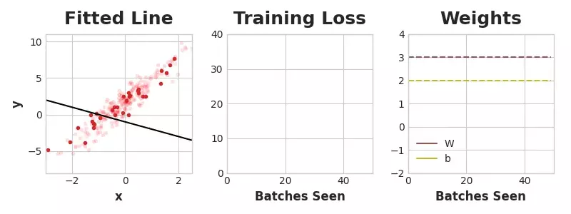                   | -                                                            |
| 0.02            | 32           | 256            | 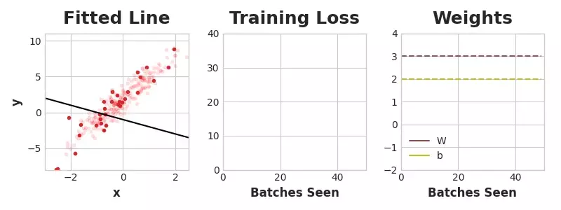 | 학습률을 낮춤<br />→ W와 b를 찾는데 오래 걸림                |
| 0.2             | 32           | 256            | 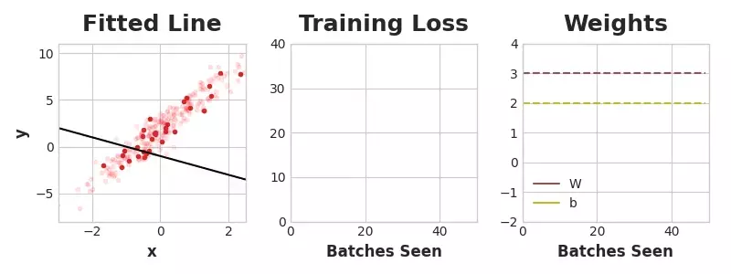 | 학습률을 약간 높임<br />→ W와 b를 찾는 것은 빠르지만 불안정함 |
| 1               | 32           | 256            | 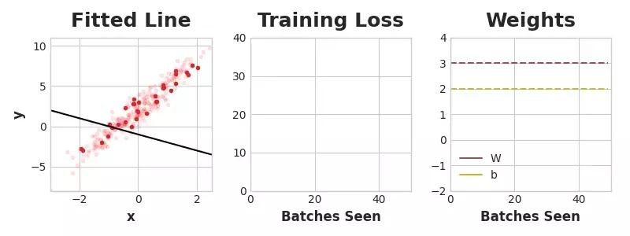   | 학습률을 매우 높임<br />→ 매우 불안정하여 어느 순간 loss가 매우 커짐 |


2. **learning rate**를 바꿔가며 학습 (다른 예시)
   - 두 번째와 세 번째는 학습률이 0.09 차이인데 결과가 많이 다름(불안정하지만 학습이 됨 vs 매우 불안정하여 학습이 되지 않음)

| `learning_rate` | `batch_size` | `num_examples` | animate_sgd                                                  | 원본과의 차이 |
| --------------- | ------------ | -------------- | ------------------------------------------------------------ | ------------- |
| 0.05            | 4096         | 8192           | 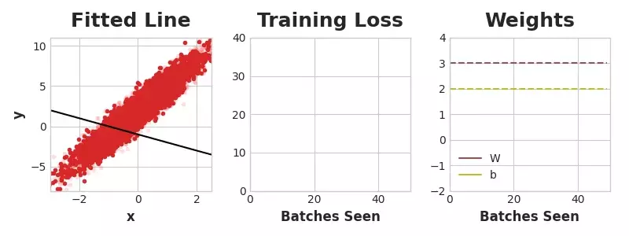                   | -             |
| 0.9             | 4096         | 8192           |   |               |
| 0.99            | 4096         | 8192           |  |               |


3. **batch size**를 바꿔가며 학습

- 배치 사이즈는 크면 클수록 안정적이고 약간 빨리 학습하기 때문에 클수록 좋다. (그러나 메모리의 제약이 있다.)

| `learning_rate` | `batch_size` | `num_examples` | animate_sgd                                              | 원본과의 차이                                         |
| --------------- | ------------ | -------------- | -------------------------------------------------------- | ----------------------------------------------------- |
| 0.05            | 32           | 256            |                   | -                                                     |
| 0.05            | 2            | 256            | 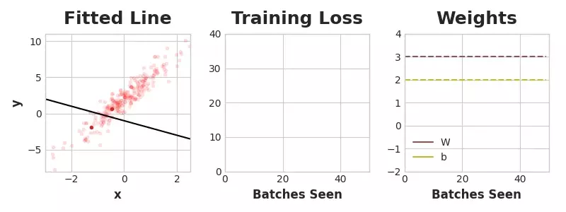    | 배치 사이즈를 줄임<br />→ 학습이 되긴 하지만 불안정함 |
| 0.05            | 128          | 256            | 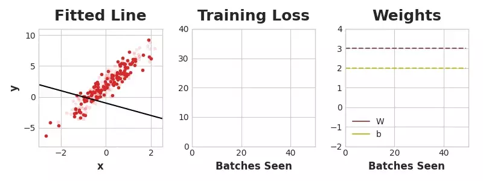 | 배치 사이즈를 늘림<br />→ 안정적으로 학습             |
| 0.05            | 256          | 256            | 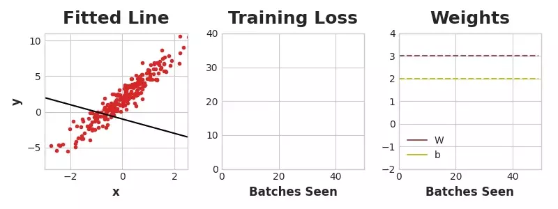 | 배치 사이즈=샘플 사이즈<br />→ 매우 안정적으로 학습   |


# Computer Vision

## Convolution and ReLU

**Feature extraction**의 구성 요소

1. **Filter** - 이미지로부터 특정한 요소를 걸러냄 (convolution)
2. **Detect** - 필터링된 이미지로부터 특징을 찾음 (ReLU)
3. **Condense** - 특징을 강조하기 위하여 이미지를 응축 (maximum pooling)


## Maximum Pooling

**Translation Invariance** : Maxpooling을 하면서 **zero-pixels**를 제거하기 때문에 특성 맵에서 위치 정보도 같이 제거하여, input의 위치가 달라져도 output은 같음을 의미한다.

**Global Average Pooling** : `Flatten()` 대신 `GlobalAvgPool2D()`를 하는 경우도 있다. Filter마다 평균값을 내어 그 값에 따라 특정 feature의 유무를 파악할 수 있다(크면 존재, 작으면 존재하지 않음 등)는 관점에서 `Flatten()` 대신 종종 쓰인다고 함.


# Time Series

## Trend

시계열에 대하여 고차원 다항 회귀 테이블을 만들어주는 메서드

```python
from statsmodels.tsa.deterministic import DeterministicProcess

dp = DeterministicProcess(
    index=tunnel.index,  # dates from the training data
    constant=True,       # dummy feature for the bias (y_intercept)
    order=1,             # the time dummy (trend)
    drop=True,           # drop terms if necessary to avoid collinearity
)
# `in_sample` creates features for the dates given in the `index` argument
X = dp.in_sample()

X.head()
```

|            | const | trend |
| :--------- | :---- | :---- |
| Day        |       |       |
| 2003-11-01 | 1.0   | 1.0   |
| 2003-11-02 | 1.0   | 2.0   |
| 2003-11-03 | 1.0   | 3.0   |
| 2003-11-04 | 1.0   | 4.0   |
| 2003-11-05 | 1.0   | 5.0   |

```python
X = dp.out_of_sample(steps=30)
```

훈련 데이터에서 벗어난 날짜만큼 생성


**이동 평균** 계산하기 (pandas의 `rolling` 메서드 이용)

```python
trend = food_sales.rolling(
    window=12, # 평균을 계산할 데이터의 개수
    center=True, # 라벨을 붙일 위치(데이터의 센터)
    min_periods=6, # 계산에 필요한 최소한의 데이터 개수
).mean()
```


**스플라인 곡선(Spline Curve; 각 구간마다 다른 다항식을 적용하여 원래 함수와 최대한 비슷하게 만드는 것)**을 쉽게 구해주는 라이브러리인 `pyearth`로 Trend 계산하기

```python
from pyearth import Earth

# Target and features are the same as before
y = average_sales.copy()
dp = DeterministicProcess(index=y.index, order=1)
X = dp.in_sample()

# Fit a MARS model with `Earth`
model = Earth()
model.fit(X, y)

y_pred = pd.Series(model.predict(X), index=X.index)

ax = y.plot(**plot_params, title="Average Sales", ylabel="items sold")
ax = y_pred.plot(ax=ax, linewidth=3, label="Trend")
```

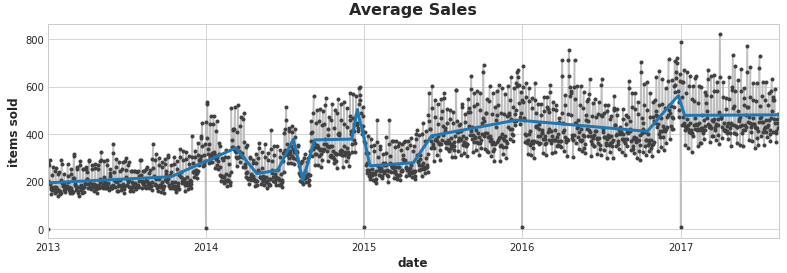

`order`에 따라 trend의 모양이 달라진다.


## Seasonality

**Furier feature**를 정하기 위한 방법으로 **periodogram**을 이용할 수 있다. x축에 주기를 놓고 a와 b를 각각 sine, cosine 함수의 계수라고 했을 때 y축에 `(a ** 2 + b ** 2) / 2`를 놓은 것이 periodogram으로, 값이 클수록 해당 주기에 영향을 많이 받는 것으로 생각할 수 있다.


(참고) python으로 preiodogram 그리기

```python
def plot_periodogram(ts, detrend='linear', ax=None):
    from scipy.signal import periodogram
    fs = pd.Timedelta("1Y") / pd.Timedelta("1D")
    freqencies, spectrum = periodogram(
        ts,
        fs=fs,
        detrend=detrend,
        window="boxcar",
        scaling='spectrum',
    )
    if ax is None:
        _, ax = plt.subplots()
    ax.step(freqencies, spectrum, color="purple")
    ax.set_xscale("log")
    ax.set_xticks([1, 2, 4, 6, 12, 26, 52, 104])
    ax.set_xticklabels(
        [
            "Annual (1)",
            "Semiannual (2)",
            "Quarterly (4)",
            "Bimonthly (6)",
            "Monthly (12)",
            "Biweekly (26)",
            "Weekly (52)",
            "Semiweekly (104)",
        ],
        rotation=30,
    )
    ax.ticklabel_format(axis="y", style="sci", scilimits=(0, 0))
    ax.set_ylabel("Variance")
    ax.set_title("Periodogram")
    return ax
```


**Furier feature 생성 방법**

1. 직접 만들기

   ```python
   import numpy as np
   
   
   def fourier_features(index, freq, order):
       time = np.arange(len(index), dtype=np.float32)
       k = 2 * np.pi * (1 / freq) * time
       features = {}
       for i in range(1, order + 1):
           features.update({
               f"sin_{freq}_{i}": np.sin(i * k),
               f"cos_{freq}_{i}": np.cos(i * k),
           })
       return pd.DataFrame(features, index=index)
   ```

2. `statsmodels` 라이브러리 이용하기

   ```python
   from statsmodels.tsa.deterministic import CalendarFourier, DeterministicProcess
   
   fourier = CalendarFourier(freq="A", order=10)  # 10 sin/cos pairs for "A"nnual seasonality
   
   dp = DeterministicProcess(
       index=tunnel.index,
       constant=True,               # dummy feature for bias (y-intercept)
       order=1,                     # trend (order 1 means linear)
       seasonal=True,               # weekly seasonality (indicators)
       additional_terms=[fourier],  # annual seasonality (fourier)
       drop=True,                   # drop terms to avoid collinearity
   )
   
   X = dp.in_sample()  # create features for dates in tunnel.index
   ```

   |            | const | trend | s(2,7) | s(3,7) | s(4,7) | s(5,7) | s(6,7) | s(7,7) | sin(1,freq=M) | cos(1,freq=M) | sin(2,freq=M) | cos(2,freq=M) | sin(3,freq=M) | cos(3,freq=M) | sin(4,freq=M) | cos(4,freq=M) |
   | ---------: | ----: | ----: | -----: | -----: | -----: | -----: | -----: | -----: | ------------: | ------------: | ------------: | ------------: | ------------: | ------------: | ------------: | ------------: |
   |       date |       |       |        |        |        |        |        |        |               |               |               |               |               |               |               |               |
   | 2017-01-01 |   1.0 |   1.0 |    0.0 |    0.0 |    0.0 |    0.0 |    0.0 |    0.0 |      0.000000 |      1.000000 |      0.000000 |      1.000000 |      0.000000 |      1.000000 |      0.000000 |      1.000000 |
   | 2017-01-02 |   1.0 |   2.0 |    1.0 |    0.0 |    0.0 |    0.0 |    0.0 |    0.0 |      0.201299 |      0.979530 |      0.394356 |      0.918958 |      0.571268 |      0.820763 |      0.724793 |      0.688967 |
   | 2017-01-03 |   1.0 |   3.0 |    0.0 |    1.0 |    0.0 |    0.0 |    0.0 |    0.0 |      0.394356 |      0.918958 |      0.724793 |      0.688967 |      0.937752 |      0.347305 |      0.998717 |     -0.050649 |
   | 2017-01-04 |   1.0 |   4.0 |    0.0 |    0.0 |    1.0 |    0.0 |    0.0 |    0.0 |      0.571268 |      0.820763 |      0.937752 |      0.347305 |      0.968077 |     -0.250653 |      0.651372 |     -0.758758 |
   | 2017-01-05 |   1.0 |   5.0 |    0.0 |    0.0 |    0.0 |    1.0 |    0.0 |    0.0 |      0.724793 |      0.688967 |      0.998717 |     -0.050649 |      0.651372 |     -0.758758 |     -0.101168 |     -0.994869 |


## Cycle

**Cycle** : 계절성과는 별개로 고정된 빈도가 아닌 형태로 증가나 감소하는 것

- 계절성은 매년 1~2월에 최저기온을 찍는다는 패턴이라면 주기성은 한 번씩 변동이 있으나 그 주기가 일정치 않을 때(19년 1월> 20년 2월 > 20년 12월 등)

**Autocorrelation(자기상관)** : 시계열 데이터에서 과거의 값과 현재의 값이 밀접한 연관을 가질 때를 일컫는다.

**Correlogram** : 자기상관을 그래프로 나타낸 것


파란색 범위는 상관관계가 없다고 가정했을 때 95% 신뢰 구간


## Hybrid Models

```python
series = trend + seasons + cycles + error
```


**모델 설계 시 주의점** : **Feature-transforming algorithm**인지 **target-transforming algorithm**인지에 따라 결과가 달라지므로 주의해야한다.

- Feature-transforming algorithm : feature를 변화시켜 target을 찾는 알고리즘으로 회귀나 신경망 등이 있다.
- Target-transforming algorithm : target에 맞춰 훈련 세트를 그룹화하는 알고리즘으로 랜덤 포레스트나 그레디언트 부스팅 등이 있다.
- 이 때, target-transforming 알고리즘은 target이 한정되어 있기 때문에 훈련 세트의 범위를 넘어서지 못한다는 단점이 있다.
- 의사결정나무로 예측한 CO2 량은 일정 범위를 넘어서지 못한다.


- 결론 : 선형 회귀로 트렌드를 찾고 제거한 뒤 XGBoost 등의 알고리즘을 사용, 또는 어느 하나의 알고리즘 결과를 새로운 feature로 하여 신경망 등으로 학습(**boosted** hybrids 또는 **stacked** hybrids라고 불림)
- 참고 : Linear Regressor는 복수의 output을 예측하도록 학습할 수 있으나 XGBoost는 그렇지 않기 때문에 stack을 하여 하나의 column으로 만든 뒤 학습하여야 함.


Kaggle Hybrid Model 예제

- `X_1` : Linear Regression을 위한 feature(Trend+Seasonality)
- `X_2` : XGBoost를 위한 feature

```python
class BoostedHybrid:
    def __init__(self, model_1, model_2):
        self.model_1 = model_1
        self.model_2 = model_2
        self.y_columns = None  # store column names from fit method
        
def fit(self, X_1, X_2, y):
    self.model_1.fit(X_1, y)

    y_fit = pd.DataFrame(
        # make predictions with self.model_1
        self.model_1.predict(X_1),
        index=X_1.index, columns=y.columns,
    )

    # compute residuals
    y_resid = y - y_fit
    y_resid = y_resid.stack().squeeze() # wide to long

    # fit self.model_2 on residuals
    self.model_2.fit(X_2, y_resid)

    # Save column names for predict method
    self.y_columns = y.columns
    
# Add method to class
BoostedHybrid.fit = fit

def predict(self, X_1, X_2):
    y_pred = pd.DataFrame(
        # predict with self.model_1
        self.model_1.predict(X_1),
        index=X_1.index, columns=self.y_columns,
    )
    y_pred = y_pred.stack().squeeze()  # wide to long

    # add self.model_2 predictions to y_pred
    y_pred += self.model_2.predict(X_2)
    
    return y_pred.unstack()  # long to wide

# Add method to class
BoostedHybrid.predict = predict
```

```python
# Target series
y = family_sales.loc[:, 'sales']


# X_1: Features for Linear Regression
dp = DeterministicProcess(index=y.index, order=1)
X_1 = dp.in_sample()


# X_2: Features for XGBoost
X_2 = family_sales.drop('sales', axis=1).stack()  # onpromotion feature

# Label encoding for 'family'
le = LabelEncoder()  # from sklearn.preprocessing
X_2 = X_2.reset_index('family')
X_2['family'] = le.fit_transform(X_2['family'])

# Label encoding for seasonality
X_2["day"] = X_2.index.day  # values are day of the month
```


## Forecasting With Machine Learning

### Multistep Forecasting Strategies

미래의 어느 특정 일이 아닌 특정 구간의 값을 예측하려고 할 때

1. **Multioutput model** : 선형 회귀나 신경망 등의 여러 output을 내주는 알고리즘을 사용하기

   

   - 장단점 : 간단하고 효율적이나 XGBoost 등의 알고리즘을 사용할 수 없음

2. **Direct strategy** : 구간 각각마다 다른 모델을 세워서 예측하기

   

   - 단점 : 많은 모델을 학습해야하기 때문에 계산 비용이 비싸다.

3. **Recursive strategy** : single one-step 모델을 학습한 뒤 다음 값을 예측하고, 예측한 값을 새로운 feature로 넣어 그 다음 값을 예측하기를 반복

   

   - 장단점 : 하나의 모델로도 만들 수 있으나 단계가 계속될수록 오류(error)가 전파(propagate)되기 때문에 먼 미래에 대한 예측이 부정확할 수 있다.

4. **DirRec strategy** : direct와 recursive를 합친 방법으로, 각 단계에 대한 모델을 학습하고 그에 대한 예측값을 다음 단계에서 *새로운* lag feature로 사용

   

   - 장단점 : Direct보다 serial dependence를 더 잘 파악하지만 recursive처럼 여전히 오류가 전파된다.


# Data Cleaning

## Handling Missing Values

결측치가 "왜" 나왔는지를 파악하기 위해서는 분석하려는 대상의 분야에 대하여 잘 알아야하는 것이 우선이며 다음과 같은 질문을 던질 수 있다.

> **결측치가 발생한 이유가 기록하지 않아서 그런 건지 존재하지 않는 값이라서 그런 건지?**

- 후자의 경우 `NaN`으로 두어야하며 전자의 경우는 **imputation**을 통해 값을 채워야 한다.

1. **Drop missing values** : 시간이 부족하거나 결측치의 원인을 파악할 수 없을 때 사용하는 방법. 그러나 유용한 정보를 잃을 가능성이 높다.

   ```python
   df.dropna() # row 기준
   
   df.dropna(axis=1) # column 기준
   ```

2. **Filling in missing values automatically**

   ```python
   df.fillna(0) # 0으로 채움
   
   df.fillna(method='bfill', axis=0).fillna(0) # 다다음 row의 값으로 채움 # 이전 row 값은 ffill
   ```


## Scaling and Normalization

**Scaling** : 0-100 또는 0-1 등 특정 스케일로 변환하는 작업. SVM이나 KNN 등 알고리즘을 사용하기 위하여 사전 작업을 할 때 사용.

```python
from mlxtend.preprocessing import minmax_scaling

scaled_data = minmax_scaling(original_data, columns=[0]) # columns=컬럼 명 또는 indices
# min_val, max_val로 범위 지정 가능
```


**Normalization** : 일반적으로 데이터가 정규 분포를 따른다고 가정하는 머신 러닝이나 통계 기법을 사용할 때 전처리 작업 용도로 사용. LDA(linear discriminanat analysis)나 Gaussian naive Bayes 등이 있음.

```python
from scipy import stats

normalized_data = stats.boxcox(original_data) # original_data의 모든 값이 0보다 커야함
```


## Parsing Dates

**`datetime`으로 date column을 변경하기**

```python
import pandas as pd

pd.to_datetime(df['date'], format="%m/%d/%y")
```

- 1/17/07의 format은 "%m/%d/%Y"
- 17-1-2007의 format은 "%d-%m-%Y"
- `infer_datetime_format=True` 옵션으로 자동으로 포맷을 찾을 수 있을 수도 있으나 1. 항상 제대로 된 포맷을 찾을 수 있다고 보장할 수 없으며 2. 속도가 느리다.


## Character Encodings

어떤 것으로 인코딩되었는지 확인하는 방법

```python
import chardet

# look at the first ten thousand bytes to guess the character encoding
with open("filename.csv", 'rb') as rawdata:
    result = chardet.detect(rawdata.read(10000))

# check what the character encoding might be
print(result)
```

```
{'encoding': 'Windows-1252', 'confidence': 0.73, 'language': ''}
```

때로는 10000 줄만 읽어서 안 되므로 더 큰 값을 넣어 확인할 필요도 있다.


## Inconsistent Data Entry

데이터에 일관성이 없는 경우에 데이터를 처리하는 방법

- 아래 예시에서 같은 독일이라도 ' Germany', 'Germany', germany'의 세 종류가 있고 한국도 'South Korea'와 'SouthKorea' 두 종류가 있다.

```python
countries = professors['Country'].unique()

countries.sort()
countries
```

```
array([' Germany', ' New Zealand', ' Sweden', ' USA', 'Australia',
       'Austria', 'Canada', 'China', 'Finland', 'France', 'Greece',
       'HongKong', 'Ireland', 'Italy', 'Japan', 'Macau', 'Malaysia',
       'Mauritius', 'Netherland', 'New Zealand', 'Norway', 'Pakistan',
       'Portugal', 'Russian Federation', 'Saudi Arabia', 'Scotland',
       'Singapore', 'South Korea', 'SouthKorea', 'Spain', 'Sweden',
       'Thailand', 'Turkey', 'UK', 'USA', 'USofA', 'Urbana', 'germany'],
      dtype=object)
```

1. 직접 수정

```python
# convert to lower case
professors['Country'] = professors['Country'].str.lower()
# remove trailing white spaces
professors['Country'] = professors['Country'].str.strip()
```

```
array(['australia', 'austria', 'canada', 'china', 'finland', 'france',
       'germany', 'greece', 'hongkong', 'ireland', 'italy', 'japan',
       'macau', 'malaysia', 'mauritius', 'netherland', 'new zealand',
       'norway', 'pakistan', 'portugal', 'russian federation',
       'saudi arabia', 'scotland', 'singapore', 'south korea',
       'southkorea', 'spain', 'sweden', 'thailand', 'turkey', 'uk',
       'urbana', 'usa', 'usofa'], dtype=object)
```


2. `fuzzywuzzy` 패키지를 사용하여 유사한 단어를 하나로 합치기

```python
import fuzzywuzzy
from fuzzywuzzy import process

# get the top 10 closest matches to "south korea"
matches = fuzzywuzzy.process.extract("south korea", countries, limit=10, scorer=fuzzywuzzy.fuzz.token_sort_ratio)

matches
```

```
[('south korea', 100),
 ('southkorea', 48),
 ('saudi arabia', 43),
 ('norway', 35),
 ('austria', 33),
 ('ireland', 33),
 ('pakistan', 32),
 ('portugal', 32),
 ('scotland', 32),
 ('australia', 30)]
```

