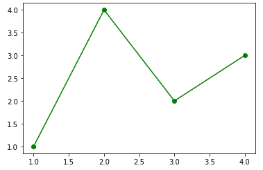
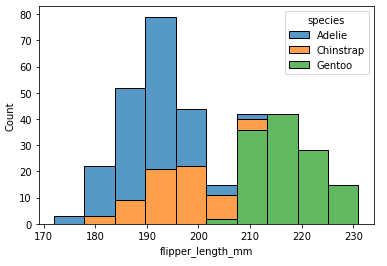
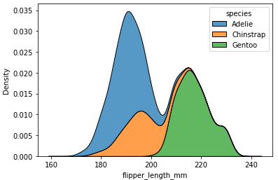
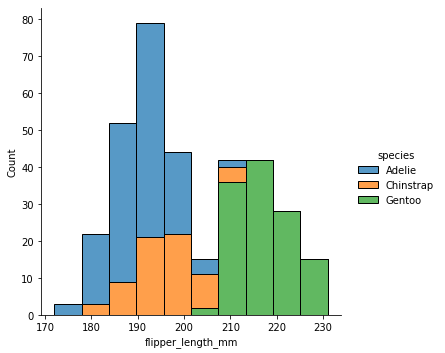
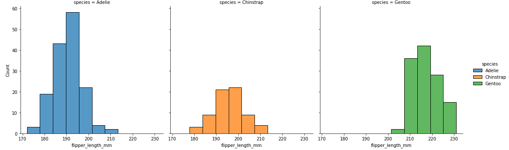
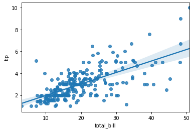
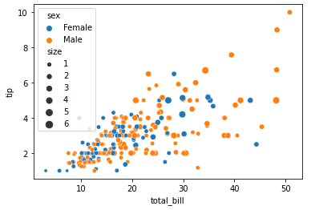

# Matplotlib

```python
import matplotlib.pyplot as plt

%matplotlib inline
```

```python
fig, ax = plt.subplots()
x_set, y_set = [1, 2, 3, 4], [1, 4, 2, 3]
ax.plot(x_set, y_set, color='green')
ax.scatter(x_set, y_set, color='green')
plt.show()
```




- `plot`, `scatter` 외에 많은 그래프 종류가 있다.
- https://matplotlib.org/


# Seaborn

- https://seaborn.pydata.org/index.html


## histplot

```python
import seaborn as sns

penguins = sns.load_dataset("penguins")
```

```python
sns.histplot(data=penguins, x="flipper_length_mm", hue="species", multiple="stack")
```




## kdeplot

```python
sns.kdeplot(data=penguins, x="flipper_length_mm", hue="species", multiple="stack")
```




## displot

```python
sns.displot(data=penguins, x="flipper_length_mm", hue="species", multiple="stack")
```



## displot (`col=`)

```python
sns.displot(data=penguins, x="flipper_length_mm", hue="species", col="species")
```




```python
import pandas as pd
tips = pd.read_csv('../tips.csv')
tips.head()
```

## regplot

```python
sns.regplot(x="total_bill", y="tip", data=tips)
```



- regression line과 함께 보여주는 그래프


## scatterplot

```python
sns.scatterplot(data=tips, x='total_bill', y='tip', 
                hue='sex', size='size')
```




# plotly

- 지도 그리기

예제 : https://www.kaggle.com/erikbruin/covid-19-the-story-of-the-vaccines/#data

